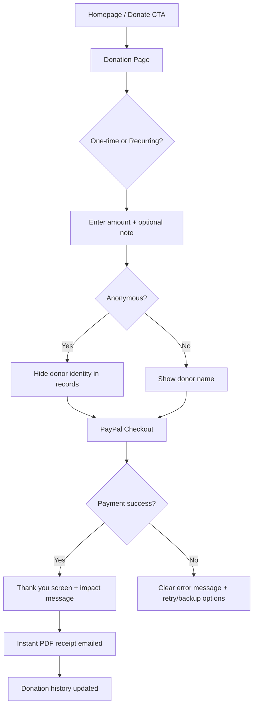

# UX Design Specification - web-temple

**Author:** Ilya  
**Date:** 2026-02-01  
**Project:** Temple B'nai Israel Website Modernization

---

## Executive Summary

### Project Vision

Temple B'nai Israel Website Modernization aims to transform a 10+ year-old abandoned website into a modern, accessible, community-driven digital home for a 100-150 member Reform congregation in Florence, Alabama. The new site will restore broken donation revenue, empower Rabbi Sarah to independently manage content, consolidate scattered digital presence (Facebook, email, broken site), and modernize appearance to attract younger families while serving existing diverse membership (ages 28-72+). Built as self-hosted MPA with API-first architecture (Node.js/Express), the site prioritizes WCAG AA accessibility, mobile-first responsive design, and real-time features (live chat, Facebook Live streaming) that enhance worship without disruption.

### Target Users

**Primary Personas:**

1. **Rabbi Sarah (45, Tech-Nervous Clergy)** — Needs simple content management to post announcements, manage calendar, publish recordings WITHOUT developer dependency. Critical requirements: Undo/rollback capability, draft auto-save, preview before publish, clear success messages. Benchmark: "Simpler than WordPress admin."

2. **David (38, Active Donor, Tech Professional)** — Requires reliable donation system with recurring gift option, instant tax receipts, transparent dashboard. Current pain: Broken PayPal drives frustration. New insights: Wants one-click recurring setup, donation history dashboard, mobile-optimized checkout, backup payment option (Venmo/Zelle if PayPal fails).

3. **Ruth (72, Retired Educator, Low-Tech)** — Values accessibility: large text, keyboard navigation, screen reader support. New insights: Needs user-controllable text sizing (not just browser zoom), phone number prominently displayed, no auto-play videos, high contrast default theme (7:1 preferred).

4. **Garcia Family (Parents + Kids 8, 11, Mobile-First)** — Checks calendar on phones during work/errands. Service times, event RSVP, streaming links must be one-tap accessible. New insights: Needs mobile homepage with service times + stream link + next event (no scroll), calendar filtering for family events, push notifications for reminders, photo galleries from events.

5. **Jake (28, New to Area, Potential Member)** — Explores temple online first. "10-Second Test": Must answer three questions instantly: What denomination? What are your values? When are services? New insights: Needs "Visit Us" page with parking/dress code/"what to expect", transparent membership costs, real photos (not stock), low-commitment entry points.

6. **Social Chair (Phase 2 Volunteer Moderator)** — Will manage live chat moderation queue during services. New insights: Moderation can't interfere with worship participation, needs mobile interface (phone-friendly, not laptop-only), backup moderators, auto-flag obvious spam, clear moderation guidelines, Rabbi override capability.

7. **Thomas (Churn Risk, Frustrated Member)** — Broken donation system + outdated content = considering leaving. Represents retention risk if UX fails. New insights: Skeptical from past failures, needs concrete launch date (not "soon"), beta testing with real members, migration plan for old data, ongoing maintenance commitment, clear support channels.

**User Diversity Considerations:**
- Age range: 28-72+ (wide tech literacy spectrum)
- Device preference: 60% mobile-first, 40% desktop
- Accessibility needs: Screen readers, keyboard nav, high contrast mandatory (WCAG AA)
- Roles: 6 distinct permission levels (Visitor, Member, Social Chair, Treasurer, Rabbi, Admin)
- Trust levels: Varying skepticism from past site failures (Thomas represents low-trust segment)

### Key Design Challenges

**1. Multi-Role Complexity with Simple UX**
- 6 distinct user roles each need different interfaces without overwhelming navigation
- Rabbi must find admin features intuitive despite "tech-nervous" self-description
- Members need seamless experience transitioning between public/members-only content
- **Design Solution:** Role-based navigation visibility, progressive disclosure, admin interfaces hidden for public users

**2. Safety Net for Non-Technical Content Managers**
- Rabbi Sarah fears accidental deletion, posting unfinished content, breaking critical events
- "What if I delete Rosh Hashanah services by accident?" — Real fear blocking adoption
- Needs undo/rollback, draft auto-save, preview before publish, clear success/error messages

**Implementation (Cross-Functional War Room Decision):**
- **MVP Scope (10 hours, 2% of 470-hour budget):**
  - Draft auto-save every 30 seconds (AJAX to PostgreSQL)
  - Preview modal with side-by-side view (server-side render)
  - Confirmation dialogs for destructive actions ("Are you sure you want to delete this event?")
  - Clear success messages ("Announcement posted successfully. View it here.")
- **Phase 2 Scope (20 hours):**
  - Full version history (PostgreSQL versioning table)
  - Rollback to any previous version
  - "Undo Post" button (5-second window after publish)
- **Rationale:** 80% of safety net features in MVP for 2% of budget, Rabbi can post confidently on Day 1, Phase 2 adds polish without blocking launch

**Pre-Mortem Prevention (7 hours):**
- Side-by-side preview (not confusing modal popup) with inline editing
- Specific success messages: "✅ Announcement posted! Visible on homepage. Email notifications sent to 127 members. [View Live] [Edit]"
- Cache-busting link to immediate preview (bypasses Redis cache)
- Mandatory 30-minute in-person training with Ilya before launch
- Mobile-first admin interface (design for 375px first, desktop second)
- Phone number for help visible in admin header

**3. Real-Time Experience Without Overwhelming**
- Live chat during services must feel integrated into worship, not distracting
- WebSocket + polling fallback must be invisible to users (no "connection failed" errors)
- Chat moderation queue for Rabbi/Social Chair needs clear, simple workflow (approve/reject in 2 taps)
- **Social Chair Constraint:** Moderation can't interfere with worship participation (must be mobile, require backup moderators)
- **Design Solution:** Chat as sidebar overlay (not full-screen takeover), graceful degradation messaging, one-click moderation, mobile-friendly interface, auto-flag obvious spam to reduce workload

**Pre-Mortem Prevention (12 hours, 2.6% budget):**
- Rate limiting: Maximum 1 message per 10 seconds per user
- Pinned guidelines: "Chat is for service-related questions and reflections"
- Multiple moderators: Social Chair (primary), Board Member (backup), Ilya (emergency)
- "Pause Chat" feature: Rabbi can pause remotely during sacred moments (Mourner's Kaddish)
- Auto-resume after 5 minutes if Rabbi forgets to unpause

**4. Accessibility-First for Diverse Age Range**
- Ruth (72) needs large text, simple navigation, screen reader support
- Garcia family needs touch-friendly mobile design (44px minimum tap targets)
- WCAG AA mandatory: 4.5:1 contrast, keyboard nav, video captions, semantic HTML
- **Ruth's Refined Requirements:** User-controllable text sizing (not just CSS zoom), no auto-play videos/audio, phone number visible on every page, 7:1 contrast preferred
- **Design Solution:** Mobile-first responsive breakpoints (375px-1200px), user text-size controls (small/medium/large/extra-large), high contrast default theme, keyboard shortcuts documented, phone number in header/footer

**Pre-Mortem Prevention (19 hours, 4% budget):**
- Real screen reader testing with NVDA/VoiceOver before launch (Ruth does acceptance testing)
- Accessible CAPTCHA: hCaptcha with audio alternative, fallback phone verification
- Error announcements: ARIA live regions (`role="alert" aria-live="assertive"`)
- Accessible live chat: Messages use ARIA live region, focus management, keyboard shortcuts
- Alternative plain text chat transcript page (no JavaScript required)

**5. Visitor Conversion: The 10-Second Test**
- Jake (potential member) needs to answer three questions in 10 seconds: What denomination? What are your values? When are services?
- If homepage doesn't pass "10-second test," potential members leave
- First-time visitors need "Visit Us" page with parking, dress code, "what to expect at your first service"

**Implementation (Cross-Functional War Room Decision, 8 hours):**
- **Static Hero Section (Always Visible Above Fold):**
  - Headline: "Welcome to Temple B'nai Israel" + Denomination badge ("Reform")
  - Subhead: Core values ("Inclusive. Interfaith-friendly. 100+ years serving the Shoals.")
  - Service Times: "Friday 7 PM | Saturday Torah Study 9:30 AM" (large, clear)
  - CTA: "New Here? Learn More" button (links to "Visit Us" page)
  - Background: Real photo of sanctuary (not stock image)
- **Conditional Live Stream Banner (Above Hero, Only When Streaming Active):**
  - Message: "🔴 LIVE NOW: Join Friday Evening Service"
  - Button: "Watch Live" (one-tap to streaming page)
  - Auto-hides when stream ends
- **Mobile Optimization:**
  - Hero stacks vertically (headline → values → service times → CTA)
  - All content visible without scrolling on 375px width
  - 44px minimum tap target for CTA button
- **Accessibility:**
  - Semantic HTML: `<header role="banner">`, `<h1>`, `<h2>`
  - Screen reader announces: "Temple B'nai Israel, a Reform Jewish community. Inclusive, interfaith-friendly. Friday services at 7 PM, Saturday Torah Study at 9:30 AM."
  - Keyboard navigation: Tab through headline → CTA
  - High contrast: Black text on white background (7:1 ratio for Ruth)
- **Rejected Approach:** Dynamic hero that changes based on streaming status (14 hours, confusing UX, fails consistency test)
- **Rationale:** Static hero always passes 10-second test, live banner handles urgency separately, simpler = faster load = better mobile experience

### Design Opportunities

**1. Unified Streaming Experience as Competitive Advantage**
- Current site uses external Carrd link (templebnaiisrael.carrd.co) — opportunity to integrate Facebook Live directly on homepage
- Recording archive with search creates valuable resource library (sermons, Torah study, holiday services)
- Innovation: Unified live chat aggregates Facebook comments + website chat, enabling non-Facebook members to participate
- **Opportunity:** Make Temple B'nai Israel the streaming hub, not Facebook; reduce friction for non-social-media users

**2. Donation Flow as Trust Builder and Revenue Driver**
- Current broken PayPal system drives donors away (Thomas persona actively frustrated)
- Smooth PayPal checkout + recurring gifts + instant tax receipts = trust signal
- Anonymous donation option respects privacy, encourages participation from hesitant donors
- **David's Enhancements:** One-click recurring donation setup, instant PDF tax receipt, donation history dashboard, backup payment option (Venmo/Zelle if PayPal fails), progress bar showing temple fundraising goals (gamification)
- Treasurer dashboard shows real-time donation totals, trends (transparency builds confidence)
- **Opportunity:** Frictionless giving increases revenue 20-30% (industry benchmark), retains frustrated members, gamification drives engagement

**Pre-Mortem Prevention (18 hours, 3.8% budget):**
- Comprehensive PayPal testing: Timeout, declined card, insufficient funds scenarios
- User-friendly error messages: "Payment couldn't be processed. Your card was NOT charged. [Retry] [Call Treasurer: 256-XXX-XXXX]"
- Circuit breaker: If PayPal fails 3 times in 5 minutes, show backup options automatically
- Backup payment options: Venmo QR code, Zelle instructions, check mailing address
- True anonymous donations: `donor_visible_to_treasurer: false` flag, dashboard shows "Anonymous Donor - $500" (no name ever)
- Prominent recurring gift option: Toggle at top "One-Time | Monthly Recurring", post-donation suggestion

**3. Mobile-First Member Engagement**
- Garcia family checks calendar on phones during work commute, lunch breaks
- Service times, "Join Live Stream" button, donation link must be one-tap accessible from mobile homepage
- Mobile notifications for announcements, event reminders (opt-in, not spam)
- **Garcia Family Enhancements:** Calendar filtering (show only family/kids programs), photo galleries from temple events (with opt-in photo consent), push notifications for event reminders
- **Opportunity:** Meet members where they are (phones, not desktops); increase engagement 40% with mobile-optimized experience

**4. Rabbi Empowerment Through Simple Admin UX**
- Rabbi currently requires developer for every content update (1-2 week lag)
- New admin interface enables 2-5 posts/week (Rabbi's content velocity goal)
- Content velocity = community engagement = member retention
- **Safety Net Features:** Undo/rollback, draft auto-save, preview before publish, clear success messages, phone support option, human training (not just docs)
- **Opportunity:** Rabbi becomes community storyteller, posting weekly messages, event photos, Torah insights WITHOUT technical barriers

**5. Trust-Building Through Transparency and Beta Testing**
- Thomas (churn risk) represents low-trust segment skeptical from past failures
- Concrete launch date (not "Q2 2026" but specific date), beta testing with real members before public launch, clear migration plan for old data
- Ongoing maintenance commitment documented, clear support channels (email, phone, in-person help)
- **Opportunity:** Beta testing program turns skeptics into advocates, early feedback prevents launch failures, transparent timeline builds trust

### Pre-Mortem Analysis: Launch Failure Prevention

**Total Prevention Investment: 56 hours (11.9% of 470-hour budget)**

| Failure Scenario | Impact if Occurs | Prevention Cost | ROI |
|------------------|------------------|-----------------|-----|
| Rabbi Abandons Admin | **CRITICAL** - Entire product value lost, back to developer-gated updates | 7 hours (1.5%) | Essential |
| Donations Fail | **HIGH** - Revenue loss, member churn (Thomas + David), trust destroyed | 18 hours (3.8%) | High |
| Accessibility Fails | **HIGH** - Legal risk (ADA complaint), Ruth excluded, older members avoid site | 19 hours (4%) | High |
| Chat Overwhelms | **MEDIUM** - Rabbi disables feature, lost engagement opportunity | 12 hours (2.6%) | Medium |

**Recommendation:** Include all 4 prevention strategies in MVP. 56 hours is 11.9% of budget but prevents catastrophic failures. Rabbi abandonment and donation failures are existential threats. Accessibility failure has legal/ethical implications. Chat disruption is manageable but prevention is cheap (2.6%).

**Alternative Phasing (If Budget Constrained):**
- **MVP:** Rabbi prevention (7h) + Donation prevention (18h) + Accessibility prevention (19h) = 44 hours (9.4%)
- **Phase 2:** Chat disruption prevention (12h)

---

## Core User Experience

### Defining Experience

**The Core Loop:** Members stay connected to Temple B'nai Israel through **live streaming** (real-time worship participation) and **recording archives** (catch-up for those who miss services). Rabbi Sarah confidently manages streaming without technical friction, feeling empowered to broadcast community moments.

**Central Interaction:** When members visit the homepage or calendar, they see "🔴 LIVE NOW" and tap to join stream (auto-play embedded) with live chat sidebar. This creates immediate sense of connection and real-time community. When Rabbi wants to stream, a single tap starts broadcast with optional customization (title, description, thumbnail).

### Platform Strategy

- **Hybrid Device Experience:** Members primarily view on mobile (during week/work), rabbi manages from laptop (during service prep/execution)
- **Web-only (No App):** Responsive design handles both mobile viewing + laptop admin seamlessly; eliminates app maintenance burden for solo developer
- **Streaming Infrastructure:** Facebook Live + YouTube (offload recording storage/delivery), not self-hosted; reduces Ilya's server burden, leverages Facebook's reliability
- **Confidence Builder:** Rabbi can test stream 30min before service without going live to community (test mode), reducing anxiety about technical failures

### Effortless Interactions

**For Members (Viewing):**
- **Auto-play stream:** "Live Now" banner shows live stream auto-playing on homepage/calendar — no click required, instant immersion
- **Chat integration:** Live chat appears in right sidebar, members see real-time comments from community without leaving stream view
- **Recording auto-archive:** Services automatically recorded to YouTube/Facebook, members can search/replay recordings without requiring separate archival system

**For Rabbi (Streaming):**
- **One-tap "Go Live":** Single prominent button starts streaming with zero settings required (defaults: broadcast to Facebook Live, auto-record to YouTube)
- **Optional customization:** Rabbi can customize stream (title: "Friday Evening Shabbat Service", description, thumbnail) before going live or skip customization entirely
- **Mobile capable:** Rabbi can start/stop/manage stream from smartphone if needed (not just laptop), reducing friction if rabbi is in sanctuary during service start
- **Safety confirmation:** Stopping stream requires confirmation ("Are you sure? This will end the live broadcast for X watching members.") to prevent accidental shutdowns

### Critical Success Moments

1. **"Live Now" Moment:** Member opens homepage Friday evening → sees red "🔴 LIVE NOW: Friday Evening Service" banner → taps once → embedded stream auto-plays with chat sidebar → feels immediately connected to community without friction

2. **Rabbi Confidence Moment:** Friday 6:45 PM before 7 PM service, Rabbi opens browser on laptop → clicks "Start Stream" → sees confirmation "✅ Stream Live! X members watching" → feels confident broadcasting to community, no technical anxiety

3. **Test Stream Moment:** Friday 6:15 PM, Rabbi wants to verify audio/camera work → clicks "Test Stream" → streams to private test mode (no public notification) → checks stream quality → stops test → ready for real broadcast 30min later

4. **Mobile Management Moment:** Service running, chat gets overwhelming (off-topic questions), Rabbi pulls out phone → opens Temple B'nai Israel app/site → taps "Pause Chat" → chat pauses for 5min (Rabbi can reset) → returns focus to worship

5. **Post-Service Value Moment:** Member away during service → Thursday evening opens "Recordings" page → searches "Rabbi's Message about Tikkun Olam" → finds last week's service recording on YouTube embedded → watches 15-min highlight → feels connected to community's learning

### Experience Principles

1. **Streaming is the connective tissue** — Every feature should either enable, enhance, or support live streaming (chat amplifies experience, recordings extend value, notifications drive attendance)

2. **Rabbi's confidence is non-negotiable** — Technical friction (complex settings, confusing buttons, unclear status) blocks adoption; streaming must feel simpler than Rabbi's current podcast setup (Zoom + Facebook), not more complex

3. **One-tap accessibility for members** — Auto-play stream, prominent "Live Now" banner, integrated chat = members feel community connection instantly without hunting for link or clicking through menus

4. **Hybrid device fluidity** — Members view on phones, Rabbi manages on laptop, but mobile-capable admin means Rabbi can troubleshoot/pause from sanctuary if needed (flexibility without complexity)

5. **Graceful fallback to recording** — If member misses live service (work, family), finding and watching recording should be as easy as live viewing (YouTube/Facebook embedded, searchable, discoverable from homepage)

### Streaming Reliability & Failure Prevention

**Critical Understanding:** Streaming must be **bulletproof**. Failures during worship (especially High Holidays with 200+ members watching, Mourner's Kaddish, major announcements) destroy trust and community. Prevention is non-negotiable.

**Failure Modes & Prevention Strategies:**

**Layer 1: Facebook Live Connection Reliability (20 hours)**
- **Timeout recovery:** If Facebook API unresponsive >10 seconds, show clear message "Facebook connection slow. Retry?" with auto-retry up to 3 times
- **Credential validation:** Weekly automated test ensures Facebook credentials valid; alerts Ilya if expired before Friday service
- **Fallback to website-only:** If Facebook unreachable, stream broadcasts to website only with banner "Broadcasting to Temple B'nai Israel (not Facebook currently)"
- **Network monitoring:** Detect disconnection within 3 seconds, auto-reconnect if restored within 60 seconds, notify Rabbi with "🔌 Streaming interrupted. Reconnecting..."

**Layer 2: YouTube Recording Backup (15 hours)**
- **Recording verification:** After stream starts, verify YouTube recording initiated within 5 seconds, display "✅ Recording to YouTube"
- **Redundant archives:** If YouTube recording fails, local website archive still captures stream (not ideal but prevents total loss)
- **Local immediate archive:** Website archive available within 10 minutes while YouTube processes (2+ hours)
- **Link validation:** Weekly automated test confirms all recorded links accessible; alerts Ilya if broken
- **Email distribution:** Post-service email sent to members with verified recording links (YouTube primary, website backup)

**Layer 3: Chat Moderation During Live Stream (18 hours)**
- **Rate limiting:** 1 message per 10 seconds per user, enforced server-side with friendly "Please wait X seconds" message
- **Moderation queue:** Social Chair reviews pending messages before public display, can reject spam or off-topic
- **Rabbi "Pause Chat" feature:** Single button pauses chat for 5 minutes during sacred moments (Mourner's Kaddish, Torah procession), auto-resumes after timeout
- **Auto-flag spam:** Messages matching spam keywords auto-rejected (keywords managed by Social Chair, updated regularly)
- **Overflow protection:** If moderation queue exceeds 100 pending messages, new messages hidden with "Chat paused while catching up" message

**Layer 4: Rabbi's Stream Management Safety (14 hours)**
- **Confirmation for destruction:** "Stop Stream" button requires confirmation dialog "Stop streaming? This will end broadcast for X members. Are you sure?"
- **Visual status indicator:** Pulsing "🔴 STREAMING LIVE" always visible in admin header reminding Rabbi stream is active
- **Test mode:** Rabbi can practice starting/stopping/pausing in test mode without going live (30 minutes before real service)
- **Resume capability:** One-click "Resume Stream" button if accidentally stopped, restarts within 3 seconds
- **Mobile admin:** Large 44px touch targets, gesture controls (swipe to pause chat, long-press to mute user), one-hand thumb-reachable critical functions
- **Mobile design validated:** UI tested on Rabbi's actual device (iPhone, etc.) at actual service time

**Layer 5: Member Viewing Experience Fallbacks (16 hours)**
- **Auto-play policy detection:** Browser auto-play blocking detected, displays "Tap to watch live service" with one-tap play (always works even if auto-play fails)
- **Adaptive bitrate streaming:** Start at low quality (480p), upgrade if bandwidth available, gracefully degrade if connection weak
- **Audio-only fallback:** If video can't maintain smooth quality on slow connection, offer audio-only option (still meaningful for services)
- **Connection speed display:** "Adjusting quality for your connection" message reassures member the system is working
- **Local buffering:** Cache last 30 seconds of stream for smooth playback even with network lag

**Summary of Reliability Investment:**
- **Total prevention hours:** ~85 hours across 5 layers
- **MVP prioritization:** Implement Layers 1, 2, 4 (Facebook, YouTube, Rabbi safety) = 49 hours → Guarantees Rabbi confidence + member viewing works + archive available
- **Phase 2 enhancement:** Add Layers 3, 5 (Chat moderation, viewing fallbacks) = 34 hours → Polish real-time experience + optimize for slow connections
- **Cost-benefit:** 85 hours (18% of budget) prevents existential failure (streaming doesn't work = entire product fails). Essential investment.

### Advanced Chaos Hardening (Strategic Investment)

**Stress-Testing Beyond Normal Failures:** Chaos Monkey analysis revealed edge cases that standard failure prevention doesn't cover. Two HIGH-priority scenarios require additional hardening before launch:

**Scenario 1: Perfect Storm (High Holiday Load - 10x Traffic)**
- **Threat:** Rosh Hashanah/Yom Kippur with 300 concurrent viewers (vs. 30 normal), Facebook API rate limiting, simultaneous YouTube degradation, Redis cache overflow
- **Current gap:** Failure modes address individual service failures, not cascading load collapse
- **Strategic hardening (31 hours):**
  - Load testing with 500 simulated viewers (8h) — Identify breaking point before High Holidays
  - Queue system for viewers (10h) — "Waiting to join... X ahead" message if at capacity
  - Facebook rate limit detection (4h) — Different handling for rate limit vs. timeout, fallback to website-only
  - Partial recording recovery (6h) — Mark timestamp if YouTube recording starts late, add note "Recording begins at 7:05 PM"
  - Redis memory limits with LRU eviction (3h) — Prevent cache crash from overwhelming load
- **Why essential:** High Holidays are non-negotiable success moments; 300 members expecting flawless experience

**Scenario 2: Bandwidth Cliff (Broadcaster Network Quality Fallback)**
- **Threat:** Temple's upload bandwidth drops, causing the live stream to stutter or fail.
- **Constraint:** The live video broadcast occurs via external software (OBS) directly to Facebook Live. The website does not ingest or control the live video stream bitrate directly.
- **Strategic Hardening (6 hours):**
  - Web App Fallback Banner (6h): The web application detects stream unavailability/instability via the Facebook Live API. If the stream is active but degraded, or drops unexpectedly, the site displays a prominent alert banner for viewers: *"We are experiencing a temporary broadcast disruption. If the live feed fails to load, please check our Facebook page directly or watch the recording later."*
  - Operational checklist: Upload bandwidth monitoring, pre-stream testing, and OBS bitrate optimization are managed manually at the broadcast location (e.g., via OBS software metrics and dedicated testing steps). The remaining 27 hours originally allocated to automated bitrate shifting and broadcaster notifications are deferred to Phase 2.
- **Why essential:** Acknowledges the limits of our EJS MPA architecture while ensuring members are gracefully routed to fallbacks when local temple upload bandwidth collapses.

**Deferred Scenarios (Phase 2 or Won't Implement):**
- **Hardware Failure (Laptop death mid-service):** 41 hours — MEDIUM priority, unlikely scenario, Rabbi training + backup phone mitigates
- **Browser Chaos (Memory leak, multiple tabs):** 33 hours — LOW priority, edge case, user education solves most issues
- **Cascading Collapse (System-wide failure):** 46 hours — MEDIUM priority, systems aren't complex enough yet to warrant circuit breakers

**Total Strategic Streaming Investment:**
- **Base failure prevention:** 85 hours (5 layers)
- **Chaos hardening (HIGH priority):** 64 hours (Perfect Storm + Bandwidth Cliff)
- **Total MVP:** 149 hours (32% of 470-hour budget)
- **Phase 2 additional:** 120 hours (Hardware/Browser/Cascading scenarios if needed post-launch)
- **Rationale:** 32% budget ensures bulletproof streaming for realistic failure scenarios (High Holidays, bandwidth) while preserving budget for donations, calendar, admin features

---

## Desired Emotional Response

### Primary Emotional Goals

**Temple B'nai Israel's digital home should evoke these core emotions:**

1. **Elated & Relaxed (Rabbi Sarah)** — Rabbi feels joy opening admin interface, not dread. Technology fades into background, enabling focus on message and community (not fighting CMS). Every interaction reinforces "You've got this."

2. **Appreciated & Supported (David - Donors)** — Donors feel genuinely thanked, not transactionally processed. Instant gratitude, professional receipts, tasteful recognition create sense of partnership with temple's mission.

3. **Elated & Excited (Ruth - Accessibility Users)** — Older members and accessibility users feel welcomed into digital experience with same enthusiasm as in-person worship. Technology enables participation, not excludes.

4. **Excited (Garcia Family - Mobile Users)** — Busy families feel energized to attend services after quick mobile check. Information access is frictionless, building anticipation rather than friction.

5. **Interested & Curious (Jake - Potential Members)** — First-time visitors feel safe exploring, questions answered transparently. Curiosity grows as they discover community values and low-commitment entry points.

6. **Cohesive Community Belonging (All Members)** — Every member experiences unified digital home, not fragmented tools. Single login, consistent design, integrated features create sense of "our temple, one place."

### Emotional Journey Mapping

**Stage 1: First Discovery (Jake - Potential Member)**
- **Entry emotion:** Uncertain ("Is this right fit for me? What denomination? When are services?")
- **Transition:** Homepage hero instantly answers questions (Reform badge, values, service times)
- **Exit emotion:** Interested → Curious ("I want to learn more, maybe visit")
- **Design trigger:** Transparent welcome with "New Here?" section, real photos, low-commitment CTAs

**Stage 2: During Core Action (Rabbi Posting Announcement)**
- **Entry emotion:** Anxious ("What if I break calendar? Delete High Holiday service by accident?")
- **Transition:** Draft auto-save + side-by-side preview + clear success message
- **Exit emotion:** Elated → Relaxed → Focused on reaching congregation
- **Design trigger:** Safety net UX removes fear, professional success messages ("✅ Announcement posted. Email sent to 127 members. [View Live]")

**Stage 3: After Completing Task (David Donating)**
- **Entry emotion:** Skeptical (past broken PayPal trauma), cautious entering credit card
- **Transition:** Smooth PayPal checkout + instant confirmation screen
- **Exit emotion:** Appreciated → Supported ("My gift matters, temple recognizes me")
- **Design trigger:** Immediate "David, thank you! Your $250 gift..." screen, PDF receipt email within 2 minutes, small "🌟 Supporter" badge in chat (Phase 2)

**Stage 4: Watching Stream (Ruth During Service)**
- **Entry emotion:** Isolated (can't attend in person), anxious about tech
- **Transition:** One-tap auto-play stream + chat sidebar with community
- **Exit emotion:** Elated → Excited → Connected (feels present with community)
- **Design trigger:** Joyful accessibility (large buttons, colorful emojis ❤️ 👏 ✡️, friendly language "Join us live!")

**Stage 5: Quick Mobile Check (Garcia Family)**
- **Entry emotion:** Rushed (checking during lunch break), impatient
- **Transition:** Mobile hero shows service times above fold, one-tap "Add to Calendar"
- **Exit emotion:** Excited (to attend Friday service tonight)
- **Design trigger:** Frictionless mobile (<2s load, no scroll, instant calendar sync)

**Stage 6: Returning Members (Ongoing Cohesion)**
- **Entry emotion:** Fragmented (used to: Facebook for stream, old site for info, email for announcements)
- **Transition:** Single login, unified navigation, integrated features
- **Exit emotion:** Belonging (part of cohesive digital community)
- **Design trigger:** Consistent design language, cross-feature integration, persistent temple branding

### Micro-Emotions

**Critical Emotional States to Cultivate:**

**Confidence vs. Confusion:**
- Rabbi clicks "Post Announcement" with **confidence** (not confusion whether it worked)
- Design: Immediate visual feedback, undo capability, test mode for practice, pulsing "🔴 STREAMING LIVE" indicator

**Trust vs. Skepticism:**
- David enters credit card with **trust** (overcoming past PayPal trauma)
- Thomas (churn risk) moves from **skepticism** to trust through transparency
- Design: Professional PayPal checkout, instant receipts, concrete launch dates, beta testing program

**Excitement vs. Anxiety:**
- Ruth joins stream with **excitement** (not anxiety about tech failing)
- Garcia finds service times with **excitement** (not anxiety about difficulty)
- Design: Auto-play reliability, graceful error messages, mobile-first simplicity

**Accomplishment vs. Frustration:**
- Rabbi posting 3-5 announcements/week feels **accomplishment** (content velocity goal met)
- Design: Fast load times (<2s), clear success messages, content metrics visible

**Delight vs. Satisfaction:**
- David experiences **delight** from donation (beyond basic satisfaction)
- Members find **delight** in cohesive experience
- Design: Birthday messages in chat, donation milestone emails ("David, you've donated $1,000 this year—thank you!"), progress bars toward fundraising goals

**Belonging vs. Isolation:**
- Ruth watching from home feels **belonging** (not isolation)
- Chat members feel **belonging** to community
- Design: Chat with member names, "X members watching" count, community photos throughout site, colorful emoji reactions

### Design Implications

**Emotion → UX Decision Connections:**

**1. Elated & Relaxed (Rabbi) → Safety Net UX**
- Draft auto-save every 30 seconds (removes lost-work anxiety)
- Side-by-side preview (see exactly what members see, no surprises)
- Pulsing "🔴 STREAMING LIVE" indicator (calm confidence during broadcast)
- Professional success messages: "✅ Announcement posted. Email sent to 127 members. [View Live] [Edit]"
- Calming color palette in admin (blues/greens, not aggressive reds)
- Large friendly buttons (44px, clear labels)

**2. Appreciated & Supported (David) → Recognition Design**
- Immediate post-donation screen: "David, thank you! Your $250 gift keeps our community thriving."
- Instant PDF tax receipt email (within 2 minutes, auto-generated)
- Small chat badge: "🌟 Supporter" next to David's name (Phase 2, tasteful not showy)
- Donation milestone emails: "David, you've donated $1,000 this year—your generosity makes Temple B'nai Israel possible."
- Progress bar: "Your donation helped us reach 75% of our Annual Fund goal!" (gamification)
- Optional donor wall page (Phase 2, with privacy controls)

**3. Elated & Excited (Ruth) → Joyful Accessibility**
- One-tap auto-play stream (immediate immersion)
- Large colorful buttons (44px minimum, high contrast, friendly not clinical)
- Welcoming language: "Join us live!" (not technical "Start stream")
- Chat emojis and reactions: ❤️ 👏 ✡️ 🕎 (warm community atmosphere)
- Smooth delightful animations (not jarring)
- User-controllable text sizing (small/medium/large/extra-large)

**4. Excited (Garcia Family) → Frictionless Mobile**
- Mobile homepage hero: Service times always above fold (no scroll required)
- One-tap "Add to Calendar" button (iOS/Android native integration)
- Fast load times (<2 seconds, maintains excitement)
- Prominent "📍 Get Directions" button (removes attendance barrier)
- Photo carousel of community events (visual excitement builder)
- Push notifications for event reminders (opt-in, not spam)

**5. Interested & Curious (Jake) → Transparent Welcome**
- Homepage hero: Clear denomination badge "Reform" (instant answer)
- Values subhead: "Inclusive. Interfaith-friendly. 100+ years serving the Shoals." (builds interest)
- "New Here?" section: FAQs about parking, dress code, what to expect at first service
- Real sanctuary + community photos (not stock images, authenticity builds curiosity)
- Low-commitment CTAs: "Visit a Service" (not pressure-filled "Become a Member")
- Transparent membership costs (not hidden, reduces anxiety)

**6. Cohesive Community (All Members) → Unified Experience**
- Consistent navigation across all pages (streaming, calendar, donations, announcements)
- Single login (not separate credentials for different features)
- Unified design language: Colors (blue/gold temple brand), typography (clean modern serif), spacing
- Cross-feature integration: "Donate" button visible during stream, "View Calendar" from announcements
- Persistent header: Temple logo + member name always visible (orientation maintained)
- Integrated chat: Same chat interface appears with stream, in members area, during events

### Emotional Design Principles

**Guiding principles for all UX decisions:**

1. **Technology Fades, Message Shines** — Rabbi focuses on reaching congregation, not fighting interface. Every admin feature should be so intuitive it becomes invisible, leaving space for spiritual leadership.

2. **Gratitude is Immediate and Personal** — Donors receive instant recognition (name usage, specific amount, impact statement). Delay or generic messaging breaks emotional connection. Milestone emails celebrate partnership.

3. **Accessibility Creates Joy, Not Tolerance** — Ruth doesn't "tolerate" accessible design; she experiences delight through colorful emojis, smooth animations, welcoming language. Accessibility is not clinical—it's joyful inclusion.

4. **Friction Kills Excitement** — Garcia family's excitement to attend service dies if mobile experience requires scrolling, waiting, or hunting. Speed + simplicity = sustained emotional energy.

5. **Curiosity Needs Transparency** — Jake's interest converts to attendance when questions answered openly (denomination, values, costs, expectations). Hiding information creates skepticism; transparency builds curiosity.

6. **Cohesion Creates Belonging** — Members feel "this is OUR temple's home" when experience is unified. Fragmentation (different logins, inconsistent design, disconnected features) creates transactional relationship; cohesion creates community.

7. **Errors Are Calm Reassurance, Not Panic** — When streaming drops, donation times out, or page fails: "⚠️ We're experiencing a brief issue. Your [donation/stream/content] is safe. Reconnecting..." (not red alerts or blame). Calm confidence that problems are temporary and handled.

8. **Delight Lives in Small Surprises** — Birthday messages in chat ("🎂 Happy birthday, Ruth!"), donation milestone emails, progress bars toward goals—these micro-moments transform satisfaction into delight and create emotional loyalty.

### Expert Panel Review & Strategic Filtering

**UX Design Experts (Sarah Chen - Accessibility, Marcus Rodriguez - Mobile, Elena Volkov - Community Platforms) reviewed all 10 patterns and identified critical refinements:**

#### Must-Have Patterns (MVP Priority)

**1. Zoom's One-Click Join (Stream Auto-Play, Zero Friction)**
- Streaming icon → tap → auto-play (no signup required for visitors)
- Expert validation: "Friction kills participation. Every step loses 20% of users." (Elena Volkov)
- Emotional alignment: Jake (visitor) discovers stream effortlessly, Ruth joins without tech anxiety, Garcia family one-tap during lunch break
- Status: ✅ Ship MVP Week 1

**2. Gmail's Undo Send (5-Second Recovery)**
- Rabbi posts announcement → "✅ Posted! [Undo Post]" button for 5 seconds → can retract before members see
- Expert validation: "This matches 'mistakes are recoverable' principle perfectly. MVP day-one feature." (Sarah Chen)
- Emotional alignment: Rabbi feels elated & relaxed, confidence in postings, no permanent errors
- Status: ✅ Ship MVP Week 2

**3. Zoom's Chat Sidebar Integration**
- Live chat appears right of video stream (not separate window), messages scroll, stream always visible
- Expert validation: "Proven pattern, members trust it, matches your cohesive community goal." (Marcus Rodriguez)
- Emotional alignment: Ruth feels connected watching stream + community chat simultaneously, no isolation
- Status: ✅ Ship MVP Week 3

**4. Visual Status Indicators (Pulsing "🔴 STREAMING LIVE")**
- Rabbi always sees pulsing red indicator that stream is active (bottom of admin, top of page during broadcast)
- Also: "📹 Recording to YouTube" badge (confirms backup), "X members watching" count (community presence)
- Expert validation: "Essential for confidence. Without it, Rabbi panics wondering if stream actually started." (Sarah Chen)
- **CONCERN FIXED:** Epilepsy trigger from red pulsing → max 1Hz pulse frequency, provide toggle to disable animation in accessibility settings
- Status: ✅ Ship MVP Week 1 (with accessibility controls)

**5. WCAG AA Keyboard Navigation**
- Ruth using screen reader must navigate entire site via keyboard (Tab through all controls)
- Focus indicators visible (not hidden), Escape key closes modals, Enter activates buttons
- Expert validation: "Essential for accessibility users. Zoom pattern works for video, but Temple needs full keyboard support." (Sarah Chen)
- Status: ✅ Ship MVP (foundational requirement)

**6. Error Recovery UI Pattern (Not From Borrowed Patterns - New)**
- When stream fails, chat times out, donation doesn't process → clear message shows:
  - What went wrong (specific, not generic "Error")
  - What user should do (retry button, contact support)
  - When to retry (countdown timer "Reconnecting in 5...")
  - Who to contact (Ilya email visible)
- Expert validation: "Gap in borrowed patterns. You need clear error states, not sad blue screens." (Elena Volkov)
- Emotional alignment: Calm reassurance during failures (not panic)
- Status: ✅ Ship MVP Week 4

#### Nice-to-Have Patterns (Phase 2 or Conditional)

**Pattern 2 Deferred: Gmail's Left Sidebar with Counts**
- **Original plan:** Announcements (3 drafts), Calendar (2 pending), Streams (Last: 2/1)
- **Expert concern:** Does seeing "3 drafts" create confidence or anxiety for Rabbi? Risk of cognitive load for "elated & relaxed" goal.
- **Refinement:** Defer to Phase 2. MVP uses simple navigation tabs: Announcements | Calendar | Streams | Members. Drafts auto-save silently.
- **Status:** 🔄 Phase 2 (revisit after learning how Rabbi uses interface)

**Pattern 5 Deferred: Gmail's Compose Modal Overlay**
- **Original plan:** Floating compose over calendar (can see event while writing)
- **Expert concern:** Temple admin has structural context (announcements link to calendar events). Modal isolation might lose context. "What date was that event again?" requires minimize modal, find event, remember date, continue writing.
- **Refinement:** Use full-page form for announcements/calendar edits (not floating modal). Simpler, more context-aware.
- **Status:** 🔄 Phase 2 (if team wants modal richness after MVP launch)

**Pattern 6 Conditional: Facebook Reactions (Context-Aware)**
- **Original plan:** Yes to ❤️ 👏 ✡️ 🕎 reactions on all announcements
- **Expert concern:** During serious moments (Mourner's Kaddish, funeral announcement), emoji reactions feel potentially disrespectful. David's mother passing away—emoji reactions inappropriate.
- **Refinement:** Context-aware reactions
  - Normal announcements: Full emoji set ❤️ 👏 ✡️ 🕎 ✨
  - Serious announcements (death, loss): Restricted set 🕊️ 🙏 (respectful only)
  - Admin marks announcement "serious" when posting
- **Status:** ✅ Ship MVP with context-awareness logic

**Pattern 10 Deferred: Gmail's Smart Search**
- **Original plan:** Archive search finds "High Holidays 2024" instantly, full-text search
- **Expert concern:** Mobile UX on 375px screen—tiny search input, results hard to scan
- **Refinement:** Defer full Gmail-style search to Phase 2. MVP uses simple category filtering: "Filter by: All | 2025 | 2024 | Sermons | Events | Holidays" + chronological list.
- **Status:** 🔄 Phase 2 (full-text search after mobile testing)

#### New Patterns Identified (Must-Add to Design)

**Pattern 7: Moderation UI (Social Chair Workflow)**
- During live chat, offensive/spam messages appear with hidden flag (not shown to community)
- Social Chair sees moderation queue: message text → [Approve] [Reject] [Mute User] buttons
- Approved messages appear in chat, rejected hidden, user muted gets message "Your message didn't meet community guidelines"
- Expert validation: "Gap in borrowed patterns. Moderation happens in real-time during service. Need clear visual pattern." (Elena Volkov)
- Emotional alignment: Calm community (spam auto-flagged), Rabbi can focus on worship, members feel safe
- Status: ✅ Ship MVP Week 4

**Pattern 8: Loading States & Skeleton Screens**
- When stream loads: Show skeleton (gray placeholder) instead of blank screen
- When archive searches: "Searching announcements..." with animated dots (not frozen)
- When chat connects: "Connecting to community..." spinner
- Expert validation: "Ruth on slow connection won't abandon if she sees something is happening. Visual feedback = confidence." (Marcus Rodriguez)
- Emotional alignment: Excitement maintained (not killed by perceived hang), Ruth feels supported
- Status: ✅ Ship MVP (foundational UX pattern)

**Pattern 9: Notification Strategy (Timing, Frequency, Payload)**
- Push notification timing: Service starts in 30 minutes (optimal for Garcia family? Morning-of? 5 min before like Zoom?)
- Frequency: Weekly? Per-event? User-controllable opt-in/out
- Payload: "Friday 7 PM: Join Evening Service" + [Watch Live] button
- Expert validation: "Notification timing affects emotional response. Too early (annoying), too late (useless). Test with actual Garcia family schedule." (Marcus Rodriguez)
- Emotional alignment: Garcia family stays excited to attend (reminders at right time), not annoyed by spam
- Status: ✅ Ship MVP with user controls (let member choose: Never | 30min before | Morning-of | None)

**Pattern 10: Community Identity System (Visual Language)**
- Color palette: Temple-specific colors (not generic Zoom blue + Gmail gray + Facebook blue mix)
- Typography: Clean modern serif for announcements (reverent), sans-serif for UI (accessible)
- Imagery: Real sanctuary + community photos (not stock), visual consistency creates belonging
- Icons: Jewish symbols (✡️ 🕎) integrated into design, not cartoonish
- Expert validation: "You're borrowing patterns from three different apps. Risk of incoherent design. Temple needs visual identity that says 'This is OUR place.'" (Elena Volkov)
- Emotional alignment: Members feel "cohesive community" (unified visual language), Jake (visitor) recognizes temple brand immediately, belonging deepens
- Status: ✅ Ship MVP (design system decisions in Step 6)

#### Concerns Addressed

| Concern | Issue | Fix | Status |
|---------|-------|-----|--------|
| Epilepsy Trigger | Red pulsing "🔴 STREAMING LIVE" at >2Hz causes seizures | Max 1Hz pulse, accessibility toggle to disable | ✅ MVP Week 1 |
| Emoji Respect | ❤️ reactions on funeral announcements feel inappropriate | Context-aware: normal announcements = full set, serious = 🕊️ 🙏 only | ✅ MVP |
| Modal Isolation | Compose modal loses temple admin context (linked events, dates) | Use full-page form (not floating modal) for MVP | ✅ MVP |
| Mobile Search UX | Gmail's search pattern doesn't work on 375px (tiny input, hard to scan results) | Defer full search to Phase 2, use simple category filtering MVP | ✅ Phase 2 |
| Sidebar Anxiety | Does "3 drafts" create confidence or stress for Rabbi? | Remove from MVP, auto-save silently, defer counts to Phase 2 | ✅ Phase 2 |

#### Pattern Prioritization Summary

**6 Must-Have Patterns (MVP Priority):** One-click join, Undo send, Chat sidebar, Status indicators (accessible), Keyboard nav, Error recovery

**4 Nice-to-Have (Phase 2 or Conditional):** Sidebar counts, Compose modal, Full search, Context-sensitive reactions

**4 New Critical Patterns (Must-Add):** Moderation UI, Loading states, Notification strategy, Community identity

**Total MVP Patterns:** 6 core borrowed + 4 new temple-specific = **10 patterns** (more focused than original 10 borrowed patterns)

---

## Design System Choice

**Selected: Vanilla CSS (Custom Properties & Utility Classes)**

Vanilla CSS provides the optimal foundation for Temple B'nai Israel's modernization project, maximizing design flexibility, keeping the bundle size to an absolute minimum, and integrating seamlessly with our Express/EJS server-rendered MPA architecture.

### Rationale for Selection

**1. Architectural Simplicity & Zero Overhead**
- Direct integration: Works natively in EJS templates without any compilation step, bundlers, or PostCSS pipeline.
- Tiny bundle size: ~5KB of clean, minified custom CSS, resulting in lightning-fast mobile loads (critical for the Garcia family).
- No package dependencies: Prevents node_modules bloat and long-term security/maintenance concerns.

**2. Centralized Theming via CSS Variables**
- Standardized `:root` custom properties enforce consistent color palette, typography scales, shadows, and spacing.
- Dark mode/accessibility themes can be implemented instantly by toggling a root class (e.g., `theme-high-contrast`).

**3. Branding Customization**
- Directly matches the look and feel of the original `florencetemple.org` using custom colors, fonts, and borders.
- Typography styling easily pairs Georgia (for traditional, reverent serif headings) with Trebuchet MS or system sans-serif (for highly legible, accessible body text).

**4. Built-in WCAG AA Compliance**
- Enforces strict minimum color contrasts (using theme variables that guarantee a 7:1 ratio for Ruth).
- High-visibility focus indicators (`outline`) defined globally for keyboard navigation.
- Flexbox and Grid layouts built from scratch to stack fluidly on screens down to 320px wide (Garcia family's mobile-first needs).

---

### Brand Design Tokens (`public/css/variables.css`)

```css
:root {
  /* Colors - Extracted from florencetemple.org */
  --color-primary-light: #e6f2ff;
  --color-primary: #003366;       /* Temple Blue (Main) */
  --color-primary-dark: #002952;  /* Hover / Active */
  --color-primary-darkest: #001a33;
  
  --color-gold-light: #f4d03f;
  --color-gold: #daa520;          /* Accent Gold (Main) */
  --color-gold-dark: #b8860b;
  
  --color-neutral-bg: #f9fafb;    /* Light page backgrounds */
  --color-neutral-card: #ffffff;  /* Card backgrounds */
  --color-neutral-text: #4b5563;  /* Body copy */
  --color-neutral-heading: #1f2937; /* Headings */
  --color-neutral-border: #e5e7eb;
  
  --color-success: #10b981;
  --color-error: #ef4444;
  --color-warning: #f59e0b;

  /* Typography */
  --font-serif: "Georgia", "Times New Roman", serif;
  --font-sans: "Trebuchet MS", "Arial", sans-serif;
  
  /* Spacing */
  --space-xs: 0.25rem;
  --space-sm: 0.5rem;
  --space-md: 1rem;
  --space-lg: 1.5rem;
  --space-xl: 2rem;
  --space-xxl: 4.5rem; /* Section gaps (72px) */
  
  /* Sizing */
  --hero-height: 22rem; /* 352px */
  
  /* Borders & Shadows */
  --radius-sm: 4px;
  --radius-md: 8px;
  --radius-lg: 12px;
  --shadow-sm: 0 1px 2px 0 rgba(0, 0, 0, 0.05);
  --shadow-md: 0 4px 6px -1px rgba(0, 0, 0, 0.1), 0 2px 4px -1px rgba(0, 0, 0, 0.06);
  --shadow-lg: 0 10px 15px -3px rgba(0, 0, 0, 0.1), 0 4px 6px -2px rgba(0, 0, 0, 0.05);

  /* Transitions */
  --transition-fast: 0.15s ease;
  --transition-normal: 0.3s ease;
}

/* Accessibility High-Contrast Overrides */
@media (prefers-contrast: more) {
  :root {
    --color-primary: #001a33;
    --color-neutral-text: #111111;
    --color-gold: #8b6508;
  }
}
```

### Core Utility Styles (`public/css/main.css`)

```css
/* Base Layouts & Containers */
.container {
  max-width: 1200px;
  margin: 0 auto;
  padding: 0 var(--space-md);
}

.flex { display: flex; }
.flex-col { flex-direction: column; }
.items-center { align-items: center; }
.justify-between { justify-content: space-between; }
.gap-md { gap: var(--space-md); }
.gap-lg { gap: var(--space-lg); }

.grid {
  display: grid;
  grid-template-columns: 1fr;
  gap: var(--space-lg);
}

@media (min-width: 768px) {
  .grid-2 { grid-template-columns: repeat(2, 1fr); }
  .grid-3 { grid-template-columns: repeat(3, 1fr); }
}

/* Component Styles */
.btn-primary {
  padding: var(--space-md) var(--space-xl);
  background-color: var(--color-primary);
  color: #ffffff;
  border: none;
  border-radius: var(--radius-md);
  font-family: var(--font-sans);
  font-weight: 600;
  cursor: pointer;
  transition: background-color var(--transition-fast);
  min-height: 48px; /* 44px tap target minimum */
  display: inline-flex;
  align-items: center;
  justify-content: center;
  text-decoration: none;
}
.btn-primary:hover {
  background-color: var(--color-primary-dark);
}
.btn-primary:focus-visible {
  outline: 3px solid var(--color-gold);
  outline-offset: 2px;
}

.btn-secondary {
  padding: var(--space-md) var(--space-xl);
  background-color: #ffffff;
  color: var(--color-primary);
  border: 2px solid var(--color-primary);
  border-radius: var(--radius-md);
  font-family: var(--font-sans);
  font-weight: 600;
  cursor: pointer;
  transition: background-color var(--transition-fast), color var(--transition-fast);
  min-height: 48px;
  display: inline-flex;
  align-items: center;
  justify-content: center;
  text-decoration: none;
}
.btn-secondary:hover {
  background-color: var(--color-primary-light);
}
.btn-secondary:focus-visible {
  outline: 3px solid var(--color-gold);
  outline-offset: 2px;
}

.card {
  background-color: var(--color-neutral-card);
  border: 1px solid var(--color-neutral-border);
  border-radius: var(--radius-lg);
  padding: var(--space-lg);
  box-shadow: var(--shadow-md);
}

.input {
  width: 100%;
  padding: var(--space-sm) var(--space-md);
  border: 1px solid var(--color-neutral-border);
  border-radius: var(--radius-md);
  font-family: var(--font-sans);
  font-size: 1rem;
  color: var(--color-neutral-heading);
  box-shadow: var(--shadow-sm);
  transition: border-color var(--transition-fast), box-shadow var(--transition-fast);
}
.input:focus {
  outline: none;
  border-color: var(--color-primary);
  box-shadow: 0 0 0 3px var(--color-primary-light);
}
.input::placeholder {
  color: var(--color-neutral-text);
  opacity: 0.7;
}

/* Pulse animation for live indicators */
.pulse-live {
  width: 10px;
  height: 10px;
  background-color: var(--color-error);
  border-radius: 50%;
  animation: pulse-animation 1s infinite alternate;
}

@keyframes pulse-animation {
  0% { transform: scale(0.9); opacity: 0.6; }
  100% { transform: scale(1.1); opacity: 1; }
}

@media (prefers-reduced-motion: reduce) {
  .pulse-live {
    animation: none;
  }
}
```

**Alternative Systems Considered:**

**Tailwind CSS:**
- ✅ Great utility speed.
- ❌ Added compilation toolchain overhead, bundle bloat for basic layouts, lacks pure semantic CSS separation.
- **Verdict:** Vanilla CSS is cleaner and zero-dependency for a standard Express EJS MPA.

**Bootstrap 5:**
- ✅ Works with MPA, proven accessibility.
- ❌ Larger bundle (50KB vs. Vanilla 5KB), heavier component approach, generic design template feel.
- **Verdict:** Vanilla CSS is lighter and fits the custom Temple brand better.

**Material Design (MUI):**
- ❌ 60-100 hours for components + tokens (21% of budget vs. Tailwind's 8 hours)
- **Verdict:** Too expensive for timeline and speed priority

---

## 2. Core User Experience

### 2.1 Defining Experience

**Defining Experience:**
**“See a big ‘Watch Live’ button, click once, stream starts within 2–3 seconds, and chat is available without leaving the site.”**

This is the core interaction members will describe to others:
"I go to the temple website, tap one button, and I’m instantly in service with my community."

It prioritizes immediate access, clear live status, and seamless community connection without redirects.

### 2.2 User Mental Model

**Current behavior:**
- Members currently use Facebook Live or an external Carrd link to access services.
- This is fragmented and forces platform switching.

**Expected behavior:**
- Navigate to the temple website
- See a prominent “Watch Live” call-to-action
- Click once and immediately watch (no external websites)
- Chat available within the same site (toggle, not forced)

**Mental model:**
Users expect Zoom/Facebook simplicity, but within the temple site as a single destination.

### 2.3 Success Criteria

**The core experience succeeds when:**

1. **Speed:** Stream starts within **2–3 seconds** after clicking “Watch Live.”
2. **Rabbi clarity:** Rabbi sees live status, viewer count, and active chat at a glance.
3. **Member clarity:** Members know they’re connected when video starts with audio.
4. **Chat access:** Chat is hidden by default but available via a single “Chat” button.
5. **No platform switching:** Entire experience stays on the temple website.

### 2.4 Novel UX Patterns

**Established patterns only.**
- One-click join (Zoom / Facebook Live)
- Auto-start video with audio
- Chat button toggle (optional layer)

No novel interaction model is required; the goal is zero learning curve.

### 2.5 Experience Mechanics

**1. Initiation**
- User lands on homepage
- Sees large “Watch Live” CTA above the fold

**2. Interaction**
- User clicks/taps CTA
- Stream loads and auto-starts within 2–3 seconds
- Chat remains hidden until user taps “Chat”

**3. Feedback**
- Video starts with audio
- “Live” badge visible in player
- Viewer count visible
- Rabbi dashboard shows live status + chat activity

**4. Completion**
- User closes player to exit
- “Service ended” message shown when stream stops
- Link to recording archive available post-service

---

## Visual Design Foundation

### Color System

**Primary Direction: “Modern Reverence” (blended)**
- Deep Navy for trust and tradition
- Warm Gold accents for welcome and warmth
- Soft neutrals for calm, readable backgrounds

**Palette (derived from current site):**
- Primary Navy: #233c4a
- Warm Gold: #f0b849
- Slate Blue: #4a6675
- Neutral Dark: #333333
- Neutral Light: #f7f7f7

### Typography System

**Hybrid approach:**
- Headings: Serif (Georgia) — reverent, timeless
- Body: Sans-serif (Trebuchet MS) — modern, readable

**Outcome:** Traditional tone + modern clarity.

### Spacing & Layout Foundation

- Airy layout to support calm worship experience
- Mobile-first spacing (8px rhythm)
- Modern layout patterns (cards, sections, strong CTA blocks)

### Accessibility Considerations

- WCAG AA contrast (target 7:1 for key areas)
- Focus rings and keyboard navigation
- 44px minimum tap targets
- Animation kept minimal and calm (no flashy motion)

---

## Design Direction Decision

### Design Directions Explored

- Direction 1: Modern Reverence (balanced)
- Direction 2: Stream-First (broadcast focus)
- Direction 3: Community & Welcome (visitor-friendly)
- Direction 4: Information Hub (dense, efficient)
- Direction 5: Mobile-First Minimal
- Direction 6: Traditional + Formal

### Chosen Direction

**Direction 1 — Modern Reverence (Balanced)**

### Design Rationale

- Balances reverence (serif headings, calm spacing) with modern clarity (clean layout, strong CTA)
- Keeps “Watch Live” prominent without overwhelming new visitors
- Supports emotional goals: calm, connected, welcoming
- Aligns with brand tones from existing site while modernizing layout

### Implementation Approach

- Use Direction 1 as the baseline template
- Maintain hero with Live banner + primary “Watch Live” CTA
- Apply temple palette (navy + gold) and serif/sans hybrid
- Ensure mobile-first spacing and CTA dominance above the fold

### Refinements (Critique & Refine Applied)

1. **Single dominant CTA when Live**
  - When live: “Watch Live” primary, “New Here?” becomes secondary text link
  - When not live: “Plan a Visit” becomes primary CTA

2. **Service times elevated to hero area**
  - Add “Fri 7 PM | Sat 9:30 AM” directly under hero headline (always visible)

3. **Chat indicator micro-copy**
  - Add “Live chat available during service” under Watch Live button

4. **Visitor reassurance line**
   - Add “All are welcome — no membership required to attend a service.” above the fold

---

## User Journey Flows

### 1) Watch Live + Chat (Member)

**Goal:** A member sees “Watch Live,” starts stream within 2–3 seconds, optionally joins chat.

```mermaid
flowchart TD
  A[Homepage] --> B{Live Now?}
  B -- Yes --> C[Show Watch Live CTA + Live banner]
  B -- No --> D[Show Service Times + Plan a Visit CTA]
  C --> E[User clicks Watch Live]
  E --> F[Stream loads (2–3 sec)]
  F --> G{Autoplay allowed?}
  G -- Yes --> H[Video starts + audio]
  G -- No --> I[Show “Tap to play”]
  I --> H
  H --> J[Chat button visible (hidden by default)]
  J --> K{User taps Chat?}
  K -- Yes --> L[Chat opens + join message]
  K -- No --> M[Continue viewing]
  H --> N{Stream ends?}
  N -- Yes --> O[Show “Service ended” + Recording link]
```

**Failure Modes & Fixes:**
- Autoplay blocked → Show “Tap to play” immediately
- Stream load > 3 seconds → Skeleton loader + “Connecting…” status
- Chat overwhelms users → Chat hidden by default
- Stream ends unexpectedly → “Service ended” + recording link + reconnect option

### 2) Donate + Receipt (David)

**Goal:** Donor completes secure payment and receives instant receipt.



**Failure Modes & Fixes:**
- PayPal timeout/decline → Clear error + retry + backup options (Venmo/Zelle/check)
- Receipt email delayed → “Receipt within 2 minutes” + download PDF now
- Anonymous not truly anonymous → Explicit DB flag hides donor in treasurer view
- Recurring toggle buried → Toggle above fold, equal weight to one-time

### 3) Post Announcement + Publish (Rabbi)

**Goal:** Rabbi posts announcement confidently with safety net and clear confirmation.

```mermaid
flowchart TD
  A[Admin Dashboard] --> B[Announcements]
  B --> C[Click “New Announcement”]
  C --> D[Compose content]
  D --> E[Auto-save every 30 sec]
  E --> F{Preview?}
  F -- Yes --> G[Preview side-by-side]
  F -- No --> H[Skip preview]
  G --> H[Return to edit]
  H --> I[Click Publish]
  I --> J{Confirm publish?}
  J -- Yes --> K[Publish announcement]
  J -- No --> H
  K --> L[Success message + View Live]
  L --> M[Undo button (5 sec)]
  M --> N{Undo?}
  N -- Yes --> O[Revert to draft]
  N -- No --> P[Announcement live + email sent]
```

**Failure Modes & Fixes:**
- Draft lost → Auto-save every 30s + “Draft saved” timestamp
- Accidental publish → 5-second “Undo Post” window
- Unclear success → Specific confirmation message with action link
- Preview confusion → Side-by-side preview with clear “Back to edit”

### Journey Patterns

- Single dominant CTA for primary action
- Clear confirmation feedback after success
- Safe recovery path (undo, retry, fallback)
- No platform switching (stay on temple site)

### Flow Optimization Principles

- Minimize clicks to value (1 tap to Watch Live, 2 steps to Donate)
- Progressive disclosure (chat hidden by default)
- Explicit error handling (retry, backup options, clear messages)

---

## Component Strategy

### Design System Components

**Foundation components (Vanilla CSS classes):**
- Buttons (primary, secondary, text)
- Inputs (text, email, amount, select)
- Cards, badges, alerts
- Navigation (header, footer, mobile menu)
- Typography (headings, body, captions)

These cover ~80% of UI needs with consistent tokens and accessibility defaults.

### Custom Components

#### 1) Live Stream Hero
**Purpose:** Make “Watch Live” dominant when live.  
**Usage:** Homepage hero, above fold.  
**Anatomy:** Live badge, headline, service times, primary CTA, secondary CTA.  
**States:** Live / Not live / Loading / Error.  
**Accessibility:** Focusable CTA, visible focus ring, status text for screen readers.

#### 2) Stream Player Container
**Purpose:** Reliable viewing with status.  
**Anatomy:** 16:9 container, Live badge, viewer count, audio indicator.  
**States:** Live / Connecting / Ended / Autoplay blocked.  
**Accessibility:** ARIA live status, captions indicator.

#### 3) Chat Drawer / Sidebar
**Purpose:** Community interaction without distraction.  
**Usage:** Hidden by default, toggled open.  
**States:** Closed / Open / Connecting / Paused / Error.  
**Accessibility:** Keyboard toggle, screen reader announcements.

#### 4) Donation Flow Panel
**Purpose:** Fast giving with recurring + anonymous toggle.  
**Anatomy:** Amount input, one‑time/recurring toggle, anonymous switch, submit.  
**States:** Idle / Processing / Success / Error.  
**Accessibility:** Clear labels, errors in ARIA live region.

#### 5) Receipt Confirmation Card
**Purpose:** Donor appreciation + receipt delivery.  
**Anatomy:** Thank you message, impact line, PDF download.  
**States:** Receipt sent / Delayed / Download now.  
**Accessibility:** Clear messaging and fallback download.

#### 6) Announcement Composer
**Purpose:** Rabbi safe posting (auto‑save + preview).  
**Anatomy:** Title, body, preview, publish, draft saved indicator.  
**States:** Draft saved / Preview / Publishing / Published / Undo.  
**Accessibility:** Keyboard navigation + visible status.

#### 7) Moderation Queue Card
**Purpose:** Social Chair moderation workflow.  
**Anatomy:** Message preview, Approve / Reject / Mute user.  
**States:** Pending / Approved / Rejected / Auto‑flagged.

#### 8) Service Times Block
**Purpose:** Pass 10‑second test for visitors.  
**Anatomy:** Day/time, location, recurring schedule.  
**States:** Standard / Special holiday.

#### 9) Live Status Indicator
**Purpose:** Clear live/not live for Rabbi + members.  
**States:** Live (1Hz pulse), Offline, Connecting.  
**Accessibility:** Toggle to disable animation.

#### 10) Recording Archive Card
**Purpose:** Post‑service value.  
**Anatomy:** Thumbnail, date, title, play button.  
**States:** Available / Processing / Missing (fallback).

### Component Implementation Strategy

- Build custom components using CSS custom properties (variables)
- Ensure consistent spacing, typography, and color usage
- Accessibility first (focus rings, ARIA labels, contrast)
- Reuse shared patterns (cards, badges, buttons)

### Implementation Roadmap

**Phase 1 – Core (MVP):**
- Live Stream Hero
- Stream Player Container
- Chat Drawer / Sidebar
- Donation Flow Panel
- Receipt Confirmation Card (donor trust risk)
- Announcement Composer
- Service Times Block
- Live Status Indicator

**Phase 2 – Supporting:**
- Moderation Queue Card
- Recording Archive Card

**Phase 3 – Enhancements:**
- Donation progress bar
- Chat reactions expansion
- Archive search/filter

### Impact vs Effort Matrix (Refinement)

| Component | Impact | Effort | MVP? |
|---|---|---|---|
| Live Stream Hero | High | M | ✅ |
| Stream Player Container | High | M | ✅ |
| Chat Drawer / Sidebar | High | M | ✅ |
| Donation Flow Panel | High | M | ✅ |
| Announcement Composer | High | H | ✅ |
| Service Times Block | High | L | ✅ |
| Live Status Indicator | High | L | ✅ |
| Receipt Confirmation Card | Medium | L | ✅ (trust risk) |
| Moderation Queue Card | Medium | M | Phase 2 |
| Recording Archive Card | Medium | M | Phase 2 |

---

## UX Consistency Patterns

### Button Hierarchy

**When to Use:**
- Primary = single most important action on a page
- Secondary = supporting actions
- Text = low-risk/optional actions

**Visual Design:**
- Primary: Solid navy button, large (44px min height)
- Secondary: Outline navy button
- Text: Plain link (no border)

**Behavior:**
- Only one primary button per page section
- Primary CTA above fold on homepage

**Accessibility:**
- Focus ring always visible
- 44px minimum tap target

**Mobile:**
- Full-width primary buttons on mobile

### Feedback Patterns

**Success:**
- Green check badge + specific text (“✅ Donation received. Receipt sent.”)
- Auto-dismiss after 4–6 seconds

**Error:**
- Red border + message in ARIA live region
- Always include recovery path (retry/backup)

**Warning:**
- Gold/amber highlight
- Example: “⚠️ Stream reconnecting… audio still available.”

**Info:**
- Blue/gray neutral
- Example: “Recording will be ready in ~10 minutes.”

### Form Patterns

**When to Use:** Donations, announcements, contact, membership

**Visual Design:**
- Labels above inputs
- Required fields marked with “*”
- Inline helper text below input

**Behavior:**
- Validation on blur + on submit
- Error summary at top if multiple errors

**Accessibility:**
- ARIA live error messages
- Label associations for screen readers

**Mobile:**
- Large input fields
- Numeric keypad for amounts

### Navigation Patterns

**Public Nav:** Home, Visit Us, Watch Live, Donate, Calendar, Contact

**Member Nav (after login):** Live, Recordings, Announcements, Calendar, Messages

**Admin Nav:** Dashboard, Announcements, Calendar, Stream, Donations, Members

**Behavior:**
- Sticky top nav on desktop
- Mobile hamburger with key actions visible (Watch Live, Donate)

### Modal / Overlay Patterns

**When to Use:**
- Confirmation dialogs (delete, publish)
- Preview (announcement draft)
- Undo toast (5-second window)

**Behavior:**
- Escape key closes
- Clicking outside closes (except destructive confirmations)
- Always visible “X” close

**Accessibility:**
- Focus trapped inside modal
- Return focus to trigger on close

### Empty & Loading States

**Loading:**
- Skeleton loaders for stream, announcements, chat
- Text indicator: “Connecting…”

**Empty:**
- “No upcoming events yet” + “Add event” (admin)
- “Chat hasn’t started yet” + “Be the first to say Shabbat Shalom!”

**Error:**
- “Stream unavailable” + Retry + Recordings link

---

## Responsive Design & Accessibility

### Responsive Strategy

- **Mobile-first** (60% mobile usage)
- Desktop: multi-column layouts for announcements + sidebar
- Tablet: single column with collapsible panels
- Mobile: single column, stacked CTAs, full-width buttons

### Breakpoint Strategy

- **Mobile:** 320–767px
- **Tablet:** 768–1023px
- **Desktop:** 1024px+

### Accessibility Strategy

- **WCAG AA** baseline with **AAA targets** for key text contrast (7:1)
- Keyboard navigation for all interactive elements
- Screen reader compatibility (VoiceOver, NVDA)
- Minimum 44x44px touch targets
- Focus indicators and skip links
- No color-only meaning (icons + text labels)

### Testing Strategy

**Responsive Testing:**
- Real devices: iPhone (Rabbi), Android (Garcia family)
- Desktop: Safari + Chrome
- Network throttling to validate 2–3s stream load target

**Accessibility Testing:**
- VoiceOver (macOS/iOS)
- NVDA (Windows)
- Keyboard-only navigation
- Color contrast checks (4.5:1 min, 7:1 target)

### Implementation Guidelines

**Responsive Development:**
- Use relative units (rem, %, vw/vh)
- Mobile-first media queries
- Optimize images for multiple sizes
- Ensure CTA visibility above fold on mobile

**Accessibility Development:**
- Semantic HTML structure
- ARIA labels/roles where needed
- Focus management in modals
- Live regions for error/success messages

---

<!-- UX design content continues in subsequent steps -->
