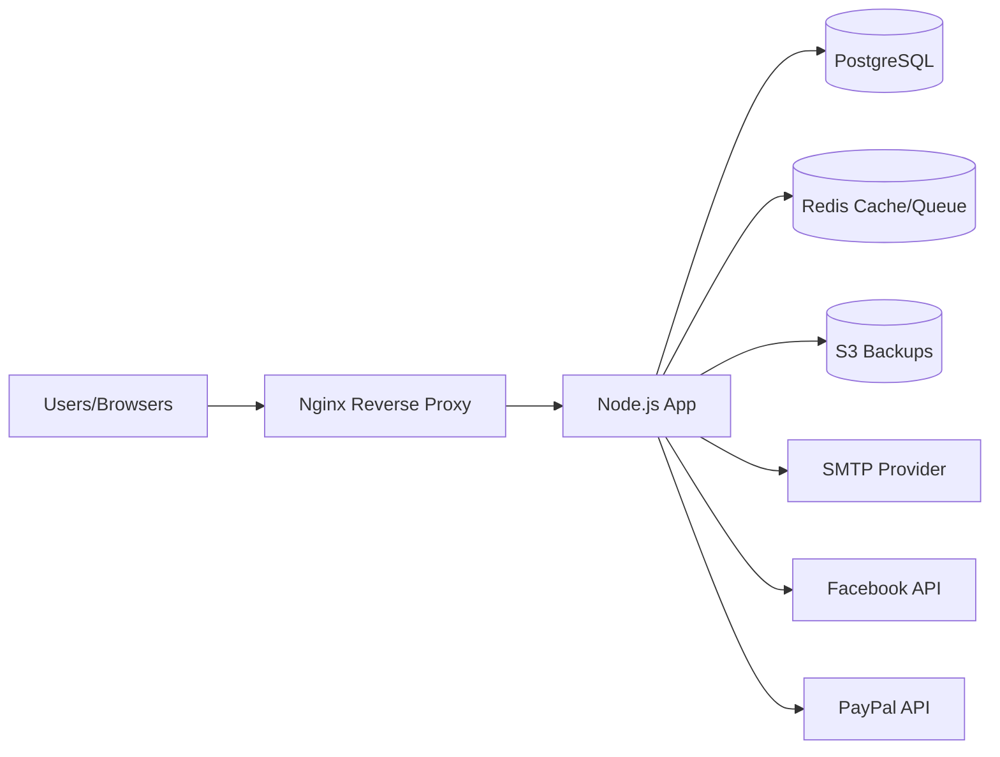
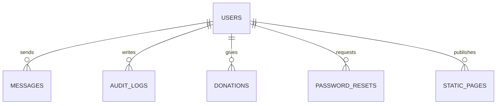

# Operational Runbook - Temple B'nai Israel Website

**Last Updated:** February 7, 2026  
**Version:** 1.1  
**Maintainer:** System Administrator

## Table of Contents

1. [Server Access](#1-server-access)
2. [Application Management](#2-application-management)
3. [Backup & Restore Procedures](#3-backup--restore-procedures)
4. [Monitoring & Logs](#4-monitoring--logs)
5. [Database Operations](#5-database-operations)
6. [SSL/TLS Certificate Management](#6-ssltls-certificate-management)
7. [Architecture & Schema Diagrams](#7-architecture--schema-diagrams)
8. [Emergency Contacts](#8-emergency-contacts)

---

## 1. Server Access

### 1.1 SSH Access

**Production Server:**
```bash
ssh temple-admin@temple-server.local
# OR via IP
ssh temple-admin@192.168.1.100
```

**SSH Key Location:**
- Keys stored in: `/home/temple-admin/.ssh/`
- Authorized keys: `/home/temple-admin/.ssh/authorized_keys`

**Firewall Rules:**
- SSH Port: 22 (default)
- HTTP Port: 80 (redirects to HTTPS)
- HTTPS Port: 443
- Internal services only accessible via localhost

### 1.2 Server Information

**Operating System:** Linux (Ubuntu/Debian)  
**Application User:** `temple-admin`  
**Application Path:** `/opt/temple` (standard installation path - adjust commands if using different location)  
**Node.js Version:** 18.0.0+  
**Package Manager:** npm

---

## 2. Application Management

### 2.1 Using Node.js Directly (Development/Manual)

**Start Application:**
```bash
cd /opt/temple
npm start
```

**Start in Development Mode (with auto-reload):**
```bash
npm run dev
```

**Stop Application:**
```bash
# Find Node process
ps aux | grep node
# Kill process
kill <PID>
```

### 2.2 Using PM2 (Production - Recommended)

**Check Application Status:**
```bash
pm2 status
# OR for specific app
pm2 status web-temple
```

**Start Application:**
```bash
pm2 start npm --name "web-temple" -- start
# OR if ecosystem file exists
pm2 start ecosystem.config.js
```

**Stop Application:**
```bash
pm2 stop web-temple
```

**Restart Application:**
```bash
pm2 restart web-temple
```

**Reload Application (Zero-Downtime):**
```bash
pm2 reload web-temple
```

**View Logs:**
```bash
# Real-time logs
pm2 logs web-temple

# Last 100 lines
pm2 logs web-temple --lines 100

# Error logs only
pm2 logs web-temple --err
```

**Monitor Resources:**
```bash
pm2 monit
```

**Save PM2 Process List:**
```bash
pm2 save
```

**Setup PM2 Startup (Auto-start on Boot):**
```bash
pm2 startup
# Follow the command output instructions
pm2 save
```

### 2.3 Service Restarts

**Complete Application Restart:**
```bash
cd /opt/temple
pm2 restart web-temple
```

**Restart After Configuration Changes:**
```bash
# 1. Update .env file
vi /opt/temple/.env

# 2. Restart application
pm2 restart web-temple

# 3. Verify
pm2 logs web-temple --lines 20
```

**Restart After Code Deployment:**
```bash
cd /opt/temple
git pull origin main
npm install  # If dependencies changed
pm2 reload web-temple  # Zero-downtime reload
```

### 2.4 Health Checks

**Check Application Status:**
```bash
# Via PM2
pm2 status

# Via curl
curl http://localhost:3000
curl https://temple-domain.com
```

**Check Port Binding:**
```bash
# Check if port 3000 is in use
netstat -tulpn | grep 3000
# OR
lsof -i :3000
```

**Check System Resources:**
```bash
# Memory usage
free -h

# Disk usage
df -h

# CPU usage
top
# OR
htop
```

---

## 3. Backup & Restore Procedures

### 3.1 Automated Backups
- **Schedule:** Runs daily at 2:00 AM EST via cron with `CRON_TZ=America/New_York` (configured by `scripts/setup-cron.sh`).
- **Location:** AWS S3 Bucket (defined in `S3_BACKUP_BUCKET`).
- **Retention:**
    - Local: 30 days of encrypted backups.
    - Cloud: 30 daily backups under `backups/daily/` and 12 monthly backups under `backups/monthly/` (see `docs/S3_LIFECYCLE.json`).
- **Monitoring:**
    - Admin Dashboard: `/admin`
    - API Endpoint: `GET /api/admin/backups/status`
    - Logs: `/var/log/temple/backups.log`

### 3.2 Manual Backup
To trigger an immediate backup:
```bash
/opt/temple/scripts/backup.sh
```

### 3.3 Restore Procedure
**WARNING:** Restore overwrites the current database. Ensure you have a fresh backup before proceeding.

**A. Restore Testing (Staging/Dry-Run)**
Use the automated test script to verify restore integrity without affecting production:
```bash
./scripts/test-restore-staging.sh
```

**B. Production Restore**
1.  **Download Backup:**
    ```bash
    aws s3 cp s3://temple-backups/backups/daily/db_backup_YYYYMMDD_HHMMSS.sql.enc .
    ```

2.  **Decrypt Backup:**
    ```bash
    openssl enc -d -aes-256-cbc -pbkdf2 -in temple_YYYYMMDD_HHMMSS.sql.enc -out db_restore.sql -pass env:BACKUP_ENCRYPTION_KEY
    ```

3.  **Restore Database:**
    ```bash
    # Stop application
    pm2 stop web-temple
    # OR if using docker-compose
    docker-compose stop app
    
    # Restore (adjust command based on your database setup)
    psql -U temple_user -d web_temple < db_restore.sql
    # OR if using docker-compose
    cat db_restore.sql | docker-compose exec -T db psql -U postgres web_temple
    
    # Restart application
    pm2 start web-temple
    # OR
    docker-compose start app
    ```

### 3.4 Failure Recovery
If automated backups fail (alert received):
1.  Check `logs/backups.log` for error details.
2.  Common issues:
    - **S3 Upload Failed:** Check AWS credentials and internet connectivity.
    - **Encryption Failed:** Check `BACKUP_ENCRYPTION_KEY`.
    - **Disk Space:** Ensure server has enough space for dump file.

---

## 4. Monitoring & Logs

### 4.1 Application Logs

**Log Locations:**
- **Application Logs:** `/opt/temple/logs/application-YYYY-MM-DD.log`
- **Error Logs:** `/opt/temple/logs/error-YYYY-MM-DD.log`
- **System Logs:** `/var/log/temple/` (if configured)
- **PM2 Logs:** `~/.pm2/logs/`

**View Real-Time Logs:**
```bash
# Application logs
tail -f /opt/temple/logs/application-$(date +%Y-%m-%d).log

# Error logs only
tail -f /opt/temple/logs/error-$(date +%Y-%m-%d).log

# PM2 logs
pm2 logs web-temple --lines 100
```

**Search Logs:**
```bash
# Search for errors
grep -i "error" /opt/temple/logs/application-*.log

# Search for specific request ID
grep "req-12345" /opt/temple/logs/application-*.log

# Count errors in last 24 hours
find /opt/temple/logs -name "error-*.log" -mtime -1 -exec grep -c "ERROR" {} \;
```

### 4.2 System Metrics

**Monitor System Metrics:**
```bash
# View metrics from logs (logged every 5 minutes)
grep "System Metrics" /opt/temple/logs/application-*.log | tail -10

# Memory usage
free -h

# Disk usage
df -h

# CPU load
uptime

# Process list
ps aux | grep node
```

**View Metrics Dashboard:**
- Access `/admin` dashboard (requires authentication)
- View `GET /api/admin/metrics` endpoint

### 4.3 Log Rotation

Logs are automatically rotated daily with compression after 1 day. Retention:
- **Online:** 30 days
- **Archive:** 1 year (in logs/archive/)

**Manual Log Cleanup:**
```bash
# Clean logs older than 30 days
find /opt/temple/logs -name "*.log" -mtime +30 -delete

# Compress old logs
find /opt/temple/logs -name "*.log" -mtime +1 -exec gzip {} \;
```

---

## 5. Database Operations

### 5.1 Database Connection

**Connection Details:**
- **Host:** localhost or database container
- **Port:** 5432 (PostgreSQL default)
- **Database:** web_temple
- **User:** Configured in `.env`

**Connect to Database:**
```bash
# Direct connection
psql -U temple_user -d web_temple

# Via docker-compose
docker-compose exec db psql -U postgres web_temple
```

### 5.2 Common Database Commands

**List Tables:**
```sql
\dt
```

**Check Database Size:**
```sql
SELECT pg_size_pretty(pg_database_size('web_temple'));
```

**View Active Connections:**
```sql
SELECT * FROM pg_stat_activity;
```

**Kill Long-Running Query:**
```sql
SELECT pg_terminate_backend(pid)
FROM pg_stat_activity
WHERE pid = <PID>;
```

### 5.3 Database Maintenance

**Vacuum Database (Reclaim Space):**
```bash
psql -U temple_user -d web_temple -c "VACUUM ANALYZE;"
```

**Check Database Health:**
```bash
psql -U temple_user -d web_temple -c "SELECT version();"
psql -U temple_user -d web_temple -c "SELECT current_database(), current_user;"
```

---

## 6. SSL/TLS Certificate Management

### 6.1 Certificate Renewal (Let's Encrypt)

**Auto-Renewal:**
Certificates auto-renew via certbot cron job. Check renewal status:
```bash
sudo certbot renew --dry-run
```

**Manual Renewal:**
```bash
sudo certbot renew
sudo systemctl reload nginx  # If using Nginx
```

**Check Certificate Expiry:**
```bash
echo | openssl s_client -servername temple-domain.com -connect temple-domain.com:443 2>/dev/null | openssl x509 -noout -dates
```

### 6.2 Certificate Locations

- **Certificate:** `/etc/letsencrypt/live/temple-domain.com/fullchain.pem`
- **Private Key:** `/etc/letsencrypt/live/temple-domain.com/privkey.pem`

See [docs/SSL_TLS_SETUP.md](SSL_TLS_SETUP.md) for detailed SSL/TLS configuration.

---

## 7. Architecture & Schema Diagrams

### 7.1 System Architecture (High-Level)



### 7.2 Core Schema (Simplified)



---

## 8. Emergency Contacts

### 8.1 Escalation Path

**Critical Issues (System Down):**
1. **Primary Contact:** Ilya (System Administrator)
   - Email: ilya@temple-domain.com
   - Phone: [UPDATE WITH ACTUAL PHONE NUMBER]

2. **Secondary Contact:** Temple Board President
   - Email: president@temple-domain.com
   - Phone: [UPDATE WITH ACTUAL PHONE NUMBER]

**⚠️ ACTION REQUIRED:** Update phone numbers above with actual emergency contacts before deploying to production.

### 8.2 External Service Contacts

**Hosting/Infrastructure:**
- **Internet Provider:** 5G Provider - Contact: [UPDATE WITH ISP SUPPORT NUMBER]
- **Domain Registrar:** [UPDATE PROVIDER NAME] - Support: [UPDATE WITH SUPPORT CONTACT]
- **AWS Support (Backups):** https://aws.amazon.com/support/

**Third-Party Services:**
- **PayPal Integration:** PayPal Business Support
- **Email Service:** [Email Provider] Support
- **SSL Certificates:** Let's Encrypt Community Support

### 8.3 Incident Response

**For Critical System Outages:**
1. Check system status: `pm2 status` and `systemctl status`
2. Check logs: `pm2 logs web-temple --err`
3. Check connectivity: `ping google.com` and `curl localhost:3000`
4. Restart application: `pm2 restart web-temple`
5. If unresolved, contact primary administrator
6. Document incident in `/var/log/temple/incidents.log`

**For Data Loss/Corruption:**
1. STOP all write operations immediately
2. Contact primary administrator before any restore
3. Follow restore procedure in Section 3.3
4. Document incident

---

## Appendix: Quick Reference Commands

### Application Control
```bash
pm2 start web-temple      # Start application
pm2 stop web-temple       # Stop application
pm2 restart web-temple    # Restart application
pm2 logs web-temple       # View logs
pm2 monit                 # Monitor resources
```

### Health Checks
```bash
curl http://localhost:3000  # Check local
pm2 status                  # Check PM2 status
netstat -tulpn | grep 3000  # Check port
```

### Log Management
```bash
tail -f logs/application-$(date +%Y-%m-%d).log  # Real-time logs
grep "ERROR" logs/error-*.log                   # Find errors
```

### Database
```bash
psql -U temple_user -d web_temple  # Connect to DB
```

### Backup
```bash
/opt/temple/scripts/backup.sh  # Manual backup
```

---

**Document Version History:**
- v1.1 (2026-02-07): Added comprehensive server access, PM2 commands, monitoring, and emergency contacts
- v1.0 (Initial): Basic backup/restore procedures
