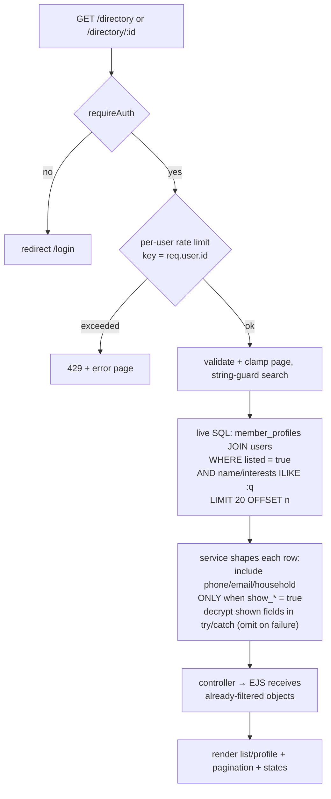

# feat: Member Directory

## Summary

Build an authenticated-members-only directory for the temple site: members fill
out a profile, opt in to be listed (private by default), control which contact
fields are shown, and browse/search the opted-in list by name or interest. The
plan reuses the existing account-settings, recordings-search, encryption, RBAC,
audit, and cache patterns; the net-new pieces are a `member_profiles` table,
server-side visibility enforcement, a per-user rate limiter, and a directory-admin
permission. Scope is the full requirements doc (R1–R20).

---

## Problem Frame

florencetemple.org gives members no way to find or reach each other; the directory
is the owner-defined MVP's community feature (the PRD had deferred member profiles
to Phase 2 — see origin: `docs/brainstorms/2026-06-14-member-directory-requirements.md`).
The hard constraints are privacy — invisible by default and server-enforced
visibility — and an end-of-July deadline that favors reuse over net-new
infrastructure. The directory's value is a network effect, so launch includes a
deliberate opt-in nudge (R20) to avoid an empty directory.

**On exposure of third parties named in a profile** (e.g., a spouse or minor named
in `household`): this is *mitigated, not technically enforced*. Three layers reduce
it — `household` is hidden by default (opt-in per field), the edit UI carries
consent guidance with an explicit acknowledgement when enabling `show_household`,
and admins can reactively moderate — but a member can still type another person's
name into a free-text field. Reviewers and the owner should accept this as a known
residual risk (see Risks).

---

## Requirements Trace

**Legend:** each unit's `Requirements:` line lists *every* aspect that unit touches
(schema, service, UI, or tests); this table shows the *primary delivery point(s)*
per requirement. The two are consistent by this convention — a unit may appear on a
requirement's `Requirements:` line (e.g., U1 for R1's storage) without being its
primary delivery row here.

| Req (origin) | Primary delivery |
|---|---|
| R1 edit own profile fields | U2, U4 |
| R2 initials avatar, no upload/third-party | U5 |
| R3 length-limited, escaped free text + consent acknowledgement | U2, U4 |
| R4 interests free-text + `ILIKE` search | U1, U2, U5 |
| R5 opt-in, private by default | U2, U4 |
| R6 per-field visibility (phone/email/household hideable) | U2, U4 |
| R7 visibility enforced server-side | U2, U8 |
| R8 query-layer `listed` filter; unlist immediate (live reads) | U2, U8 |
| R9 leave directory, data retained | U2, U4 |
| R10 toggles saved together + opt-in confirmation | U4 |
| R11 paginated browse | U5 |
| R12 search by name + interest, listed-only | U2, U5 |
| R13 rate-limited reads, no bulk export | U5 |
| R14 contact via shown tel:/mailto: only | U5 |
| R15 auth-only directory | U5 |
| R16 admin sees all members | U3, U6 |
| R17 standalone audit-logged moderation | U3, U6 |
| R18 interaction & empty/error states | U4, U5 |
| R19 WCAG AA + toggle state labels | U4, U5, U8 |
| R20 activation nudge | U7 |

Actors: A1 Member (U4, U5), A2 Listed member (U2, U5), A3 Rabbi/Admin (U3, U6).
Acceptance examples AE1–AE5 are enforced as tests in U8.

---

## Key Technical Decisions

- **KTD1 — Dedicated `member_profiles` table (1:1 with `users`), not JSONB-on-users.**
  The `listed` flag is the hot predicate for every browse/search query (R8); a
  btree index on a real column serves it cleanly, where a JSONB blob indexes
  awkwardly. Searchable name stays on `users` (already plaintext); searchable
  `interests` lives plaintext on `member_profiles`.
- **KTD2 — Encrypt phone and household at rest** via `src/utils/encryptionHelper.js`
  (AES-256-CBC), mirroring the donations pattern. `interests` and `bio` stay
  plaintext (interest is searched; bio is displayed and escaped). The helper uses a
  random IV per value, so ciphertext is non-deterministic — encrypted columns must
  never appear in `WHERE`/`ILIKE`/`ORDER BY`. The directory's name+interest-only
  search already respects this (tested in U8). **Decryption is failure-tolerant**:
  the service decrypts shown fields inside a per-field `try/catch` and omits a field
  that fails to decrypt (logging via `logger`), so a single corrupted or
  stale-key-encrypted row degrades to a missing field rather than throwing and
  taking down the whole listing render. Trade-off: encrypted columns inherit the
  downtime-bound key-rotation procedure in `docs/SECURITY_ENCRYPTION.md`; no
  plaintext shadow column (the donations review lesson).
- **KTD3 — Server-side visibility enforcement in the service layer, with no
  caller-supplied bypass.** The service shapes the returned object per the viewer;
  an unlisted profile or a hidden field is excluded from the data the
  controller/EJS ever receives. Member-facing reads call methods that *always*
  enforce `listed` + per-field visibility; the admin "see everything" path is a
  *separate method* (`getProfileForAdmin` / `listAllMembersForAdmin`) reachable only
  from a `requirePermission(MANAGE_DIRECTORY)`-gated controller. There is no
  `asAdmin` boolean parameter — the member-facing API surface cannot be coaxed into
  returning hidden data (R7).
- **KTD4 — Reuse the account-settings architecture** for self-service editing: an
  SSR page that renders forms + a small external `public/js/` module that `PUT`s
  JSON to `/api/account/directory` (gated by `requireAuthSession`). CSP forbids
  inline JS/CSS; success/error UX uses the `role="alert"` client-message pattern
  (there is no server-side flash helper).
- **KTD5 — Reuse the recordings search/pagination trio and pre-bake its
  already-paid-for review fixes:** string-guard query params before `.trim()`/SQL,
  validate `page` with a regex and cap (1..1000), `encodeURIComponent` filters in
  pagination links, null-safe count, and render an error *page* (not JSON) on
  failure.
- **KTD6 — Per-user rate limiting** on *all three* directory read paths (browse,
  search, and single profile `GET /directory/:id`) — R13. No shared limiter
  abstraction exists; add a new inline `express-rate-limit` instance in the
  directory route file. It is mounted **after `requireAuth`** so `req.user.id` is
  guaranteed, and its `keyGenerator` keys *purely* on `req.user.id` (no `req.ip`
  fallback). This avoids two traps the existing IP-keyed limiters don't face: an
  `undefined` key collapsing all users into one global bucket, and the
  `express-rate-limit` v8 `ERR_ERL_PERMISSIVE_TRUST_PROXY` validator that fires
  because `app.enable('trust proxy')` sets trust-proxy to `true`. Use
  `skip: () => process.env.NODE_ENV === 'test'` to protect the deterministic suite.
  Note: R13's "existing Redis infrastructure" phrasing is aspirational — rate
  limiting in this repo is in-memory `express-rate-limit` today (no Redis store is
  wired for limiters, per `authLimiter`/`chatPostLimiter`); the directory follows
  that actual pattern. A Redis-backed shared limiter is deferred. No bulk-export
  endpoint exists.
- **KTD7 — New in-memory `MANAGE_DIRECTORY` permission** in
  `src/config/roles-permissions.js`, granted to `admin` and `rabbi`, gating the
  admin view and moderation via `requirePermission` (not a broad role check — the
  Rabbi over-privilege lesson from story 2.4).
- **KTD8 — The MVP browse/search path is uncached and reads live**, mirroring
  `RecordingService.getArchiveRecordings` (which queries the DB directly with no
  read-through cache). Because every request re-queries `WHERE listed = true`,
  **unlisting takes effect on the very next request** (R8 / AE5) without any cache
  coordination. Directory listing caching (a read-through path *plus* its
  invalidation) is deferred to follow-up; it must not ship half-wired, because a
  populated cache with only best-effort invalidation (`CacheService.invalidatePattern`
  swallows Redis errors and returns success) could serve a stale unlisted member and
  silently defeat the privacy guarantee. Until then there is no `directory:*` cache.
- **KTD9 — Moderation is silent for MVP** (no member notification), audit-logged
  via new `AUDIT_ACTIONS.DIRECTORY_*` actions. `clearFields` is validated against a
  fixed `MODERATABLE_FIELDS` allow-list (`bio`, `interests`, `household_encrypted`)
  so moderation can never null non-free-text columns. Member notification is
  deferred (see Open Questions).

---

## High-Level Technical Design

Data model (new table + reused `users`):

```mermaid
erDiagram
    users ||--o| member_profiles : "1:1 (user_id FK, ON DELETE CASCADE)"
    users {
        uuid id PK
        text first_name "plaintext, searchable"
        text last_name "plaintext, searchable"
        text email "existing; shown via toggle"
    }
    member_profiles {
        uuid user_id PK_FK
        boolean listed "default false, btree index"
        boolean show_phone "default false"
        boolean show_email "default false"
        boolean show_household "default false"
        text phone_encrypted "AES-256-CBC, never searched"
        text household_encrypted "AES-256-CBC, never searched"
        text bio "plaintext, displayed (escaped)"
        text interests "plaintext, ILIKE-searched"
        timestamptz created_at
        timestamptz updated_at
    }
```

Browse read-path — server-side visibility enforcement (R7) is the load-bearing
shape, and the path is uncached (reads live):



The invariant: hidden values are dropped in step **S**, before the controller or
EJS sees them — so view-source/network-tab cannot leak them (AE2). Admin views call
separate `*ForAdmin` methods (not this path) behind `requirePermission`.

---

## Implementation Units

### U1. Schema and migration

- **Goal:** Create the `member_profiles` table and its indexes.
- **Requirements:** R1, R4, R5, R6 (storage), R8 (indexable `listed`)
- **Dependencies:** none
- **Files:** `migrations/018_create_member_profiles.sql`,
  `__tests__/scripts/memberProfilesMigration.test.js`
- **Approach:** Idempotent `CREATE TABLE IF NOT EXISTS member_profiles` with
  `user_id UUID PRIMARY KEY REFERENCES users(id) ON DELETE CASCADE`, boolean flags
  (`listed`, `show_phone`, `show_email`, `show_household`, all `DEFAULT false`),
  `phone_encrypted TEXT`, `household_encrypted TEXT`, `bio TEXT`, `interests TEXT`,
  `created_at`/`updated_at TIMESTAMPTZ DEFAULT NOW()`. `CREATE INDEX IF NOT EXISTS`
  on `listed`. Standard header comment + `COMMENT ON COLUMN` noting the two
  encrypted columns. Next number is 018; never touch 000–006. No `prompt_dismissed`
  column — the activation-nudge dismissal flag lives in `notification_preferences`
  (see U7), so this migration needs no awareness of it.
- **Patterns to follow:** `migrations/009_add_notification_preferences_to_users.sql`,
  `migrations/013_add_service_type_and_indexes.sql`, `migrations/004` (encrypted
  TEXT columns); migration-test shape in
  `__tests__/scripts/notificationPreferencesMigration.test.js`.
- **Test scenarios:** migration parses and contains `IF NOT EXISTS`; `user_id` PK
  with `ON DELETE CASCADE`; all booleans default `false` (byte-aligned with code
  defaults — the 009 drift lesson); `listed` index present.
- **Verification:** `npm run migrate` creates the table with expected columns/indexes;
  re-running is a no-op.
- **Note on search index:** plain `ILIKE '%term%'` on `interests`/name is a
  sequential scan; acceptable at congregation scale (matches recordings). A
  `pg_trgm` index is deferred (Scope Boundaries).

### U2. MemberDirectoryService

- **Goal:** The data + privacy core: read/write a member's own profile, list/search
  listed profiles with server-side visibility applied, single public profile, admin
  all-members view, and moderation.
- **Requirements:** R1, R3, R4, R5, R6, R7, R8, R9, R12, R16, R17
- **Dependencies:** U1
- **Files:** `src/services/MemberDirectoryService.js`,
  `__tests__/services/MemberDirectoryService.test.js`; extend
  `src/services/auditService.js` (`AUDIT_ACTIONS.DIRECTORY_LISTING_UPDATED`,
  `DIRECTORY_MODERATED`)
- **Approach:**
  - `getMyProfile(userId)` — returns the owner's full profile, decrypting phone/
    household for the edit view (failure-tolerant per KTD2).
  - `saveMyProfile(userId, input)` — validate (length caps: bio ≤ 500, interests ≤
    200, household ≤ 200, phone ≤ 32; booleans coerced via a normalize-merge over
    frozen defaults, mirroring `userService.normalizePreferences`; the accepted-input
    allow-list excludes any nudge/dismissal key so a member can't reset it here);
    encrypt phone/household; `UPSERT`; `logAudit(DIRECTORY_LISTING_UPDATED)`. If a
    future change also writes a `users` column in the same call, wrap both in one
    transaction (no partial-save window).
  - `listListedProfiles({ search, page, limit })` — live query
    `member_profiles JOIN users WHERE listed = true` plus name/interest `ILIKE`;
    separate count + data queries; `LIMIT/OFFSET`. **Shape each row server-side:**
    include `phone`/`email`/`household` only when the matching `show_*` flag is true,
    decrypting only shown encrypted fields inside a per-field `try/catch` (omit on
    decrypt failure). Returns `{ profiles, totalCount, totalPages, currentPage }`.
    Encrypted columns never appear in any `WHERE`/`ILIKE`/`ORDER BY`.
  - `getListedProfile(userId)` — single profile for member callers; always applies
    `listed` + visibility; returns null/not-found for an unlisted member.
  - `getProfileForAdmin(userId)` / `listAllMembersForAdmin({...})` — admin-only
    methods that bypass `listed`/visibility (R16). No member-facing controller may
    call these; they exist as distinct methods so the bypass has no boolean-flag
    trust surface.
  - `moderateProfile(targetUserId, { unlist, clearFields })` — set `listed=false`
    and/or null only the columns in `MODERATABLE_FIELDS = ['bio', 'interests',
    'household_encrypted']` (validate `clearFields` against this allow-list, drop
    anything else); `logAudit(DIRECTORY_MODERATED)`.
- **Patterns to follow:** `userService.js` (normalize-merge, audit `.catch`),
  `RecordingService.getArchiveRecordings` (dynamic WHERE + count/data + offset,
  live read), `donationController` (encrypt-before-insert).
- **Test scenarios:**
  - Happy: `saveMyProfile` persists, encrypts phone/household (stored ≠ plaintext),
    audit logged; `getMyProfile` round-trips decrypted values.
  - Visibility (core): `listListedProfiles` excludes unlisted members entirely
    (Covers AE1); a listed member with `show_phone=false` returns an object with no
    `phone` key (Covers AE2); `show_household=false` omits household.
  - Decrypt resilience: a listed row with `show_phone=true` but an undecryptable
    `phone_encrypted` still renders — the field is omitted, other profiles unaffected
    (no throw).
  - Search: interest `ILIKE` returns only listed members with the term; name search
    matches first/last; non-listed excluded (Covers AE3).
  - Encryption invariant: assert no search/filter/order query text references
    `phone_encrypted`/`household_encrypted`.
  - Admin separation: `getListedProfile` returns null for an unlisted member;
    `getProfileForAdmin` returns it. There is no `asAdmin` parameter on the
    member-facing method.
  - Validation: over-length fields rejected; unknown/non-boolean toggles dropped;
    a nudge/dismissal key in the input is ignored.
  - Edge: UPSERT insert path for a user with no row; leaving the directory retains
    row data but sets `listed=false` (Covers R9).
  - Moderation: `moderateProfile` unlists + clears only allow-listed fields (a
    non-allow-listed name in `clearFields` is ignored) + audit logged.
- **Verification:** service unit tests pass against the mocked `db`.

### U3. Directory-admin RBAC permission

- **Goal:** Add the `MANAGE_DIRECTORY` permission gating admin view + moderation.
- **Requirements:** R16, R17
- **Dependencies:** none (parallel with U1/U2)
- **Files:** `src/config/roles-permissions.js`,
  `__tests__/config/roles-permissions.test.js`,
  `__tests__/integration/rbacRouteProtection.test.js` (extend)
- **Approach:** Add `MANAGE_DIRECTORY: 'manage_directory'` to `Permissions`; grant
  to `admin` and `rabbi` in `rolePermissionMap` (not `member`/`social_chair`/
  `treasurer`). Gate admin routes with `requirePermission`.
- **Patterns to follow:** the existing `MODERATE_CHAT`/`VIEW_DONATIONS` entries and
  grants; `requirePermission` usage at `src/routes/api.js:186-190`.
- **Test scenarios:** `hasPermission(admin, MANAGE_DIRECTORY)` true; `member`/
  `treasurer`/`social_chair` false; admin directory route 403 for member JWT, 200
  for admin.
- **Verification:** RBAC tests pass; member cannot reach `/admin/directory`.

### U4. Self-service profile edit (account side)

- **Goal:** Let a member edit their profile, set per-field visibility, and opt in/out
  with confirmation.
- **Requirements:** R1, R3, R5, R6, R9, R10, R18 (save states), R19 (a11y)
- **Dependencies:** U2
- **Files:** `src/controllers/userController.js` (add `getDirectoryListing`,
  `updateDirectoryListing`), `src/routes/api.js` (add `GET`/`PUT
  /account/directory` under `requireAuthSession`), page route in `src/routes/pages.js`
  (`GET /account/directory`), `src/views/account/directory-listing.ejs`,
  `public/js/directory-listing.js`, `public/css/account.css` (extend),
  `__tests__/integration/directoryAccountRoutes.test.js`
- **Approach:** Mirror the account-settings split: SSR page renders the form (all
  fields + visibility toggles + a "List me in the directory" control that requires
  explicit confirmation before enabling, R10); external JS `fetch`es JSON with the
  `CSRF-Token` header and writes `role="alert"` messages for loading/success/
  validation/server-error states (R18). Controller guards `req.user.id`, delegates to
  `MemberDirectoryService.saveMyProfile`, maps errors to 400/404/500. Edit UI carries
  the consent guidance text, and enabling `show_household` requires an explicit
  acknowledgement checkbox ("I'm not sharing details about anyone who hasn't
  consented") (R3).
- **Patterns to follow:** `src/routes/pages.js:63-79`, `src/routes/api.js:63-69`,
  `src/controllers/userController.js:37-57`, `src/views/account/settings.ejs`,
  `public/js/account-settings.js`.
- **Execution note:** Start with a failing integration test for the
  `PUT /api/account/directory` request/response contract.
- **Test scenarios:**
  - Happy: authenticated member saves profile + toggles + opt-in → 200, persisted.
  - Edge/error: missing auth → 401; over-length field → 400 with message; toggling
    show-phone while listed succeeds without re-confirming opt-in.
  - Consent: enabling `show_household` without the acknowledgement is rejected/blocked.
  - Opt-in confirmation: enabling listing requires the confirmation step.
  - Leave: disabling listing persists `listed=false`, data retained (Covers R9).
- **Verification:** member completes F1 end-to-end; account route tests pass.

### U5. Member-facing browse, search, profile, and contact

- **Goal:** The directory others see: paginated browse, name/interest search,
  single profile with `tel:`/`mailto:` contact, initials avatar, empty/no-results
  states, rate limiting on all read paths.
- **Requirements:** R2, R7, R8, R11, R12, R13, R14, R15, R18, R19
- **Dependencies:** U2
- **Files:** `src/controllers/directoryController.js`, `src/routes/directory.js`
  (mounted in `src/server.js`), `src/views/directory/index.ejs`,
  `src/views/directory/profile.ejs`, `src/views/partials/initials-avatar.ejs`,
  `public/css/directory.css`, `__tests__/integration/directoryRoutes.test.js`
- **Approach:** `GET /directory` (browse + search) and `GET /directory/:id`
  (profile), both gated `requireAuth, sessionTimeout()` (R15). The per-user
  `express-rate-limit` (KTD6) is applied to **both** routes, mounted after
  `requireAuth`. Controller validates query params with the recordings hardening
  (string-guard, page regex + cap, `limit=20`), calls
  `MemberDirectoryService.listListedProfiles` / `getListedProfile` (the
  member-facing methods — never the `*ForAdmin` ones), renders through `layout`.
  Browse view: GET filter form, list loop, **empty-directory state** and **search
  no-results state** (R18), `rel=prev/next` pagination with `encodeURIComponent`
  (KTD5). Profile view: initials avatar (R2), shown fields only, `tel:`/`mailto:`
  links (R14), no contact form. Add a Directory nav link gated `<% if (user) %>`.
  Mount `/directory` in `src/server.js` alongside the other prefixed routes; today
  `src/routes/pages.js` has no `/:slug` wildcard, so there is no present-day
  collision — mounting before `pagesRoutes` is defensive in case a CMS-slug
  catch-all is added later.
- **Patterns to follow:** `src/controllers/recordingController.js:140-242`,
  `src/views/recordings/index.ejs`, `src/routes/api.js:54-61` (limiter shape +
  skip-in-test, plus a `keyGenerator` on `req.user.id`), `src/server.js:181-190`.
- **Test scenarios:**
  - Happy: authenticated member sees listed profiles paginated; profile shows shown
    fields + working `tel:`/`mailto:`.
  - Access: unauthenticated → redirect to login, no directory data (Covers R15);
    `GET /directory/:id` for an unlisted member (non-admin) → 404/empty (Covers AE1).
  - Visibility in payload: response HTML for a `show_phone=false` profile contains
    no phone digits anywhere (Covers AE2, R7).
  - Search: interest query returns only listed matches (Covers AE3); no-results query
    renders the no-results state; empty directory renders the empty state (R18).
  - Rate limit: applies to both browse and `/directory/:id`; two different user JWTs
    get independent counters; limiter sits after auth (no `undefined` key).
  - Pagination: out-of-range/array/garbage `page` → clamped or 400 error page, not
    JSON (KTD5).
- **Verification:** F2 works end-to-end; route integration tests pass.

### U6. Admin view and moderation

- **Goal:** Admin/Rabbi see all members (listed or not) and can unlist / clear
  offending free-text, audit-logged, independent of the unbuilt Rabbi dashboard.
- **Requirements:** R16, R17
- **Dependencies:** U2, U3
- **Files:** `src/routes/admin/directory.js`,
  `src/controllers/adminDirectoryController.js`, `src/views/admin/directory.ejs`,
  mount in `src/server.js`, `__tests__/integration/adminDirectoryRoutes.test.js`
- **Approach:** `GET /admin/directory` (list all members via
  `listAllMembersForAdmin`, with search) and a moderation `POST` action (calls
  `moderateProfile`), gated `requirePermission(Permissions.MANAGE_DIRECTORY)`. Mount
  under the existing `/admin` prefix so it sits with the other admin routes behind
  their gates. CSRF on the moderation form (global `conditionalCsrf`). Standalone —
  the future Rabbi dashboard surfaces this action, not introduces it (R17).
- **Patterns to follow:** `src/routes/admin/recordings.js` (admin route + RBAC gate),
  chat moderation action shape, `auditService` usage.
- **Test scenarios:**
  - Access: member → 403; admin/rabbi → 200.
  - Admin sees unlisted member C via `listAllMembersForAdmin`; non-admin never sees
    C in `/directory` (Covers AE4).
  - Moderation: unlist sets `listed=false`; clear-fields nulls only allow-listed
    columns and ignores others; both audit-logged with `DIRECTORY_MODERATED`.
  - Mount/gate: a request to `/admin/directory` cannot reach the handler without
    passing `requirePermission`.
- **Verification:** admin moderation works; audit row written; member blocked.

### U7. Activation nudge

- **Goal:** Invite members to opt in at a deliberate moment so the directory isn't
  empty at launch.
- **Requirements:** R20
- **Dependencies:** U2, U4
- **Files:** `src/views/account/directory-listing.ejs` /
  `src/views/directory/index.ejs` (nudge partial), `public/js/directory-listing.js`
  (dismiss handler), extend `src/controllers/userController.js`
  (`updatePreferences` already handles `notification_preferences`); tests in the
  U4/U5 suites
- **Approach:** A dismissible banner shown to members who have not opted in,
  prompting them to complete and list their profile, with a one-click path to the
  edit page. **Dismissal persists in the existing `notification_preferences` JSONB
  column** (add a `directory_nudge_dismissed` key) — no schema change, no new
  migration, no dependency on U1. Reuse `userService`'s normalize-merge so the key
  validates like the others; `saveMyProfile` (U2) must not accept this key from the
  profile-edit form (it is set only by the dismiss action). Not a mandatory
  onboarding step (keeps the registration/onboarding flow untouched).
- **Patterns to follow:** existing banner/announcement display; the
  `notification_preferences` read/write pattern (`userService.js:81-121`).
- **Test scenarios:** nudge renders for a not-listed, not-dismissed member; hidden
  for a listed member; hidden once `directory_nudge_dismissed` is set; dismissal
  persists across requests.
- **Verification:** nudge appears once, dismisses, and links to the edit page.

### U8. Cross-cutting verification: route-protection matrix, visibility invariants, a11y

- **Goal:** Lock the privacy and access guarantees with tests, and add WCAG AA
  coverage for every new surface.
- **Requirements:** R7, R8, R15, R19; AE1–AE5
- **Dependencies:** U4, U5, U6
- **Files:** `__tests__/integration/directoryRouteProtection.test.js`,
  `__tests__/views/directory.accessibility.test.js`,
  `__tests__/views/directoryListing.accessibility.test.js`
- **Approach:** A route-protection matrix (Epic 2 retro recommendation): for each
  directory route assert unauth → redirect, wrong-role → 403, CSRF required on
  mutations. Visibility-invariant tests assert hidden fields and unlisted profiles
  are absent from response **payloads** (not just unrendered). For AE5, assert that
  after an unlist the *next* request omits the member — exercised against the live
  (uncached) read path, which is what guarantees immediacy for MVP (KTD8). jest-axe
  WCAG 2.1 A/AA on browse list, profile, and edit form; assert toggle controls
  expose `aria-checked`/state labels (R19).
- **Patterns to follow:** `__tests__/routes/archiveRoutes.test.js` (member JWT +
  `db.query` token_version mock; `NODE_ENV=development` to test the auth redirect so
  the test fallback doesn't inject an admin),
  `__tests__/views/recordingsDetail.accessibility.test.js`.
- **Test scenarios:** the matrix above; AE1–AE5 end-to-end; axe returns no
  violations on all three views; landmarks/heading hierarchy/labeled controls.
- **Verification:** `npm test` and `npm run test:a11y` pass; the privacy invariants
  are enforced by failing-if-violated tests.

---

## Scope Boundaries

Carried from origin (Deferred for later): photo uploads; in-app member-to-member
messaging (Epic 7); per-field visibility beyond phone/email/household; structured
household; a curated interest vocabulary. Outside this release: collecting home/
mailing addresses; member self-service account deletion / data export.

### Deferred to Follow-Up Work

- `pg_trgm` (trigram) index for interest/name search — `ILIKE` sequential scan is
  fine at congregation scale.
- Centralizing the copy-pasted `express-rate-limit` instances into a shared,
  optionally Redis-backed limiter — net-new infrastructure.
- A read-through cache for the browse listing **together with** robust invalidation
  (fail-closed on Redis error). Deferred as a unit — a cache without trustworthy
  invalidation would risk serving a stale unlisted member (KTD8).

---

## Risks & Dependencies

- **Privacy regression risk (highest).** The feature's value depends on R7/R8
  holding. Mitigation: server-side shaping with no caller bypass (KTD3),
  payload-level visibility tests (U8), the encrypted-column-never-in-search invariant
  (U2 test), and a live (uncached) read path so unlisting is immediate (KTD8).
- **Third-party exposure is mitigated, not enforced.** A member can still type a
  non-consenting person's name into a free-text field. Layers: `household` hidden by
  default, a consent acknowledgement on enabling `show_household`, and reactive
  moderation. Residual risk accepted for MVP.
- **Encryption operational cost + failure modes.** Encrypted columns inherit the
  downtime-bound key-rotation procedure (`docs/SECURITY_ENCRYPTION.md`); a
  rotated/missing key would otherwise crash a listing, which KTD2's per-field
  try/catch contains.
- **Rate limiter is in-memory + net-new.** Per-user in-memory limiting resets on
  restart and isn't shared across processes; acceptable for a single-box MVP. Keyed
  on `req.user.id` (post-auth) to avoid global-bucket collapse and the trust-proxy
  validator.
- **Dependency:** `ENCRYPTION_KEY` must be set in the deploy env (already required
  for donations). The admin moderation surface (U6) is standalone — no dependency on
  the unbuilt Rabbi dashboard.
- **Test-suite determinism.** The rate limiter must `skip` in test (KTD6) or it
  flakes the integration suite.

---

## System-Wide Impact

- New route mounts in `src/server.js` (`/directory`; `/admin/directory` under the
  `/admin` prefix). `pages.js` has no wildcard today, so order is not a present
  correctness constraint — mount `/directory` before `pagesRoutes` defensively.
- New nav link in `layout.ejs` (authenticated users).
- New `AUDIT_ACTIONS` entries; new RBAC permission consumed by `res.locals`-exposed
  `hasPermission` in admin views.
- New migration `018` advances the schema; no changes to `000`–`006`. The activation
  nudge reuses `notification_preferences` (no extra migration).

---

## Open Questions (deferred to implementation)

- Whether a moderated member is notified — deferred (KTD9 ships silent +
  audit-logged); revisit if the Rabbi wants moderation transparency.

---

## Sources & Research

- Origin requirements: `docs/brainstorms/2026-06-14-member-directory-requirements.md`
  (brainstorm + 7-persona doc review).
- Codebase patterns (repo research): account-settings split
  (`src/routes/pages.js:63-79`, `src/routes/api.js:63-69`,
  `src/services/userService.js:60-121`, `src/views/account/settings.ejs`,
  `public/js/account-settings.js`); search/pagination
  (`src/services/RecordingService.js:304-388`,
  `src/controllers/recordingController.js:140-242`,
  `src/views/recordings/index.ejs`); encryption (`src/utils/encryptionHelper.js`,
  `src/controllers/donationController.js:40-67`); RBAC
  (`src/config/roles-permissions.js`, `src/middleware/requireRbac.js`); rate limit
  (`src/routes/api.js:41-61`, `src/routes/auth.js:8-14`); cache
  (`src/services/CacheService.js`); audit (`src/services/auditService.js`);
  migrations (`scripts/migrate.js`, `migrations/009`,`013`,`004`).
- Institutional learnings: stories 2-7 (account settings), 1-6 /
  `docs/SECURITY_ENCRYPTION.md` (encryption constraints), 3-4 (search review fixes),
  2-4 (RBAC), 1-11 (jest-axe), epic-2 retro (security-lands-late checklist).
- Plan doc review (5 personas): integrated the `asAdmin`→split, decrypt-resilience,
  limiter scope/keying, uncached-MVP cache reconciliation, `clearFields` allow-list,
  U7 dismissal-via-`notification_preferences`, and the trace-table/`pages.js`/R13
  accuracy corrections.
