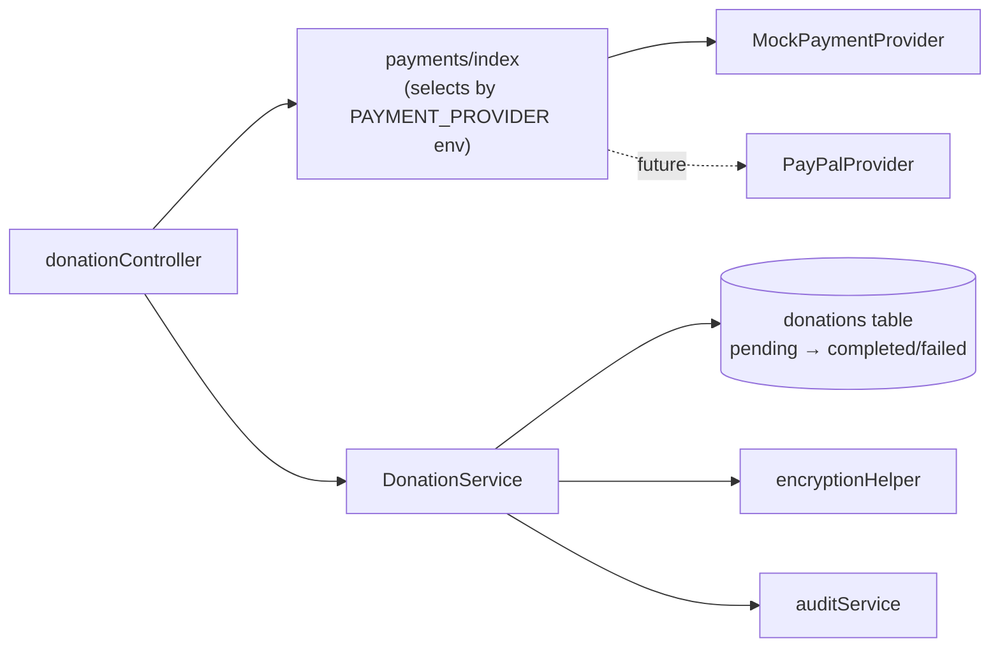
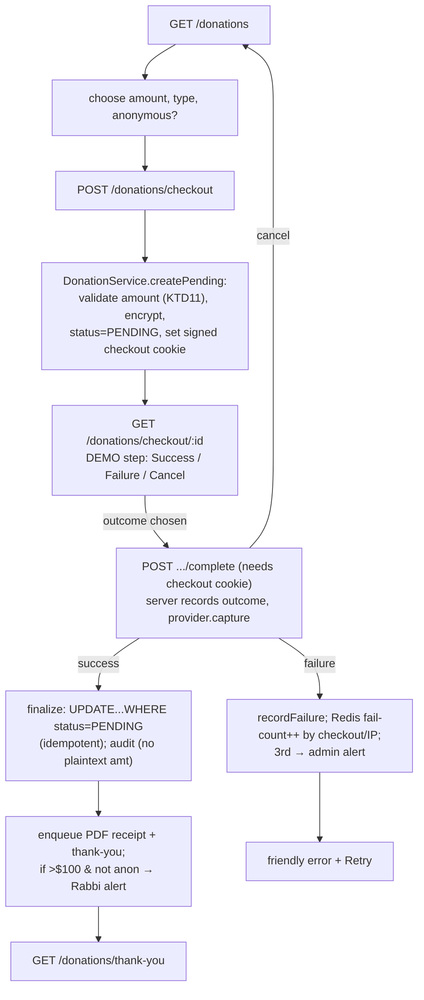

# feat: Donations & Financial Transparency (mock-provider MVP)

## Summary

Build the full Epic 8 donations feature on a **mocked payment provider** behind a
swappable `PaymentProvider` interface: a public donations page, a server-authoritative
simulated checkout (with a demo-able success/failure/cancel toggle), automated PDF
tax receipts, a Rabbi/Admin/Treasurer dashboard, major-donation alerts, and failure
handling. No real money moves; live PayPal drops into the same interface after the
Board authorizes it.

---

## Problem Frame

The temple needs a working donations experience to present to the Board, who will
authorize real PayPal credentials only if satisfied (see memory: MVP PayPal is
mocked until Board authorization). Donations is the revenue feature and the PRD's
top business pain point. A mock provider lets the Board see the complete offering —
page, receipts, dashboard, alerts, failure UX — with no real integration, then swap
in live PayPal with minimal change.

The substrate exists: an encrypted `donations` table (migration 004), a stub
`createDonation` controller, `VIEW_DONATIONS` RBAC (admin/rabbi/treasurer), the bull
email queue + template + audit services. The gaps: the provider abstraction, the
page/checkout/dashboard surfaces, PDF receipts, email-attachment support, and — per
the plan review — a **server-authoritative checkout state machine** so the demo's
financial data can't be forged.

---

## Requirements Trace

| Story / FR | Where addressed |
|---|---|
| 8.1 donations page, levels $18/$36/$100+, one-time/recurring toggle | U5 |
| 8.2 one-time donation (no account) | U1, U4, U5 |
| 8.3 recurring monthly (record + flag; no scheduler for mock) | U1, U4, U5 |
| 8.4 anonymous donations (PII minimization) | U4, U5, U10 |
| 8.5 automated PDF tax receipt email (FR115 fields) | U2, U3, U6 |
| 8.6 Rabbi/Admin/Treasurer dashboard (totals, counts, filters, CSV) | U7 |
| 8.7 major-donation (>$100, non-anonymous) email alert | U6 |
| 8.8 failure handling (friendly errors, retry, 3-strike alert, breaker) | U1, U8 |
| FR51 prominent Donations nav (public) | U5 |
| NFR-S6 donation data encrypted at rest + audit | U4, U10 |

---

## Key Technical Decisions

- **KTD1 — Swappable `PaymentProvider` interface; mock now, PayPal later.** A small
  interface (create a checkout session, capture/confirm an outcome) with a
  `MockPaymentProvider`, selected by `PAYMENT_PROVIDER` env (default `mock`). Real
  PayPal is a future implementation of the same interface.
- **KTD2 — Simulated checkout with a server-trusted outcome toggle.** The mock
  checkout page offers Simulate Success / Failure / Cancel so the failure and
  thank-you flows are demo-able live, behind a prominent "DEMO / no real payment"
  banner. The chosen outcome is recorded **server-side** against the checkout (see
  KTD9) — it is never read from a client-posted value.
- **KTD3 — Recurring is recorded and flagged, not scheduled.** A recurring donation
  records the subscription intent (`donation_type=recurring`, `recurring_frequency`)
  and issues the initial receipt; there is no mock monthly-charge engine (that
  arrives with real PayPal subscriptions).
- **KTD4 — PDF receipts via `pdfkit`.** Pure-JS, no native deps. Generates the
  IRS-style receipt (date, amount, donor name if not anonymous, tax-deductible
  statement, "no goods or services," temple EIN/legal name/address). Temple identity
  from env (`TEMPLE_LEGAL_NAME`, `TEMPLE_EIN`, `TEMPLE_ADDRESS`) with clearly-marked
  placeholders — **real data the temple must supply before launch**.
- **KTD5 — Email pipeline carries attachments.** Extend `enqueueEmail` AND the worker
  (`emailQueueWorker`) to thread `attachments` through to nodemailer. Both sides must
  be patched or receipts enqueue successfully but arrive with no PDF — the worker
  test asserting attachments reach `sendEmail` is a hard guard.
- **KTD6 — Encrypted-amount aggregation happens in app, not SQL.** `encrypted_amount_cents`
  is non-deterministic AES, so the dashboard filters by plaintext `created_at`/`status`
  in SQL, then decrypts the filtered rows and sums in JS. Unique-donor count decrypts
  donor emails and dedupes in app (a deterministic `donor_email_hash` column is a
  deferred optimization). MRR = sum over **distinct active recurring subscriptions**
  (latest per donor), so a re-checkout doesn't double-count.
- **KTD7 — No new migration.** The `donations` table (migration 004) already has
  `status` (pending/completed/failed), `payment_id`, `metadata`, `recurring_frequency`,
  `is_anonymous`, `tax_receipt_sent`, and indexes on `created_at`/`status`.
- **KTD8 — Anonymity = no PII persisted.** Anonymous donations never store donor
  name/email, show "Anonymous" in the dashboard, and fire no major-donation alert
  (FR60/8.4). Amount/date/status are still recorded for totals.
- **KTD9 — Server-authoritative, idempotent, ownership-bound checkout (review-driven).**
  The integrity of the Board's financial data depends on this:
  - **Outcome is server-set, not client-trusted.** `MockPaymentProvider` derives the
    checkout outcome from server state keyed to the checkout, never from a value in
    the completion POST body — so no one can POST `outcome=success` to fabricate a
    completed donation.
  - **DB pending row is the source of truth**, not an in-memory map — the mock
    survives a restart / multiple processes.
  - **Finalize is idempotent**: a conditional `UPDATE ... SET status='completed'
    WHERE id=$1 AND status='pending'`; `rowCount=0` means already-finalized → skip all
    side-effects (no duplicate receipts/alerts on replay or double-click).
  - **Ownership-bound**: `createPending` sets a signed checkout secret (cookie);
    completion requires it, so a visitor can't finalize a stranger's pending checkout.
  - **The legacy `POST /api/donations` stub is removed** (not deferred) — it is
    unauthenticated and inserts `status='completed'` straight from the body, a forge
    vector.
- **KTD10 — Audit never stores plaintext amount or donor PII.** Donation audit
  entries reference the donation id + status only (the amount is encrypted at rest
  precisely to protect it, and audit access is broader than `VIEW_DONATIONS`);
  `ip_address` is omitted on anonymous-donation audit rows. This corrects the stub's
  current `description` pattern.
- **KTD11 — Server-side amount validation.** `createPending` enforces:
  integer cents, `> 0`, a minimum floor (100 = $1.00), `<= MAX_DONATION_AMOUNT` (the
  stub's existing ceiling), and a currency whitelist — the preset levels are UI only,
  so the posted amount is untrusted.

---

## High-Level Technical Design

Provider abstraction (mock now, PayPal later behind the same seam):

Server-authoritative donation flow (the demo path):

---

## Implementation Units

### U1. PaymentProvider abstraction + mock provider

- **Goal:** A swappable payment interface with a server-authoritative mock.
- **Requirements:** 8.2, 8.3, 8.8 (KTD1, KTD9)
- **Dependencies:** none
- **Files:** `src/services/payments/PaymentProvider.js` (base + JSDoc contract),
  `src/services/payments/MockPaymentProvider.js`, `src/services/payments/index.js`
  (selects by `PAYMENT_PROVIDER`, default mock),
  `__tests__/services/payments/MockPaymentProvider.test.js`
- **Approach:** Interface (directional): `createCheckout({ amountCents, donationType,
  isAnonymous }) → { checkoutId, providerRef }`; `capture(checkoutId) → { status, transactionId, errorCode? }`.
  The mock keys checkout state to the **DB pending donation row** (not an in-memory
  map) and reads the server-recorded outcome — `capture` takes no client outcome
  argument. A thin circuit-breaker wrapper (open after N consecutive provider errors)
  lives here so the seam is ready for live PayPal.
- **Patterns to follow:** `src/config/redis.js` env/test branching; service-module style.
- **Test scenarios:** createCheckout returns an id tied to the pending row; capture
  returns the server-set outcome (completed/failed/cancelled) with a transactionId on
  success; capture of an unknown/already-captured checkout → error; capture never
  consults a caller-supplied outcome; circuit-breaker opens after the threshold.
- **Verification:** provider unit tests pass; outcome cannot be set by the caller.

### U2. Email pipeline: attachment support

- **Goal:** Let queued emails carry attachments (prereq for PDF receipts).
- **Requirements:** 8.5 (KTD5)
- **Dependencies:** none
- **Files:** `src/services/emailQueueService.js`, `src/workers/emailQueueWorker.js`,
  `__tests__/services/emailQueueService.test.js` (extend) + worker test
- **Approach:** Add `attachments` to the `enqueueEmail` destructure and the
  `queue.add` payload; in the worker, destructure `attachments` from `job.data` and
  include it in the payload to `sendEmail` (nodemailer accepts `attachments`).
  Backward compatible.
- **Test scenarios:** enqueueEmail forwards `attachments` into job data; **worker
  passes `attachments` to `sendEmail`** (hard guard — a missing attachment means an
  empty tax receipt); omitting attachments still works.
- **Verification:** a queued email with a buffer attachment reaches `sendEmail` with it.

### U3. Receipt PDF service + tax-receipt template + temple identity

- **Goal:** Generate an IRS-style PDF receipt and the receipt email body.
- **Requirements:** 8.5, FR115 (KTD4)
- **Dependencies:** U2
- **Files:** `package.json` (add `pdfkit`), `src/services/receiptPdfService.js`,
  `src/services/emailTemplateService.js` (enhance the `receipt` template),
  `.env.example` (document temple-identity env), `__tests__/services/receiptPdfService.test.js`
- **Approach:** `generate({ amount, date, donorName, receiptId, isAnonymous }) →`
  PDF `Buffer` via pdfkit with temple legal name/address/EIN (env, placeholder-flagged),
  date, amount, donor name (omitted when anonymous), "tax-deductible; no goods or
  services were provided," and a receipt id. The `receipt` email template carries the
  thank-you body; the PDF is the attachment.
- **Test scenarios:** returns a Buffer with the `%PDF` header; includes amount/date/EIN;
  anonymous → no donor name; missing temple env → clearly-marked placeholder, no crash.
- **Verification:** a generated receipt opens as a valid PDF with the required fields.

### U4. DonationService (persistence, finalize, metrics, failure logging)

- **Goal:** The donations data + business core, with an idempotent state machine.
- **Requirements:** 8.2, 8.3, 8.4, 8.6, 8.8, NFR-S6 (KTD6, KTD8, KTD9, KTD10, KTD11)
- **Dependencies:** U1
- **Files:** `src/services/DonationService.js`, `__tests__/services/DonationService.test.js`
- **Approach:**
  - `createPending(input)` — validate amount per KTD11; encrypt amount (+ email unless
    anonymous); insert `status='pending'`; return id + the checkout secret.
  - `finalize(id, { transactionId })` — **conditional** `UPDATE ... SET status='completed',
    payment_id=$ WHERE id=$ AND status='pending' RETURNING *`; if no row updated, return
    null (already finalized → caller skips side-effects). Audit `DONATION_RECEIVED` with
    **id + status only** (no plaintext amount; no `ip_address` when anonymous — KTD10).
  - `recordFailure({ checkoutId, errorCode })` — log `status='failed'`; audit
    `DONATION_FAILED` (no PII).
  - `getDashboardMetrics()` — SQL-filter by `created_at`/`status`; decrypt + sum in app
    for all-time/YTD/MTD totals; recurring count; MRR over distinct active recurring
    subscriptions (KTD6); unique donor count via decrypt+dedupe.
  - `listDonations(filters)` — date/amount/recurring/anon filters + pagination.
  - `toCsv(rows)`; `isMajor(cents)` → `> 10000`.
- **Patterns to follow:** the member-directory service (validate/encrypt/audit shape),
  the stub's amount guards + `MAX_DONATION_AMOUNT`, recordings pagination.
- **Test scenarios:** createPending encrypts amount (stored ≠ plaintext), omits email
  when anonymous (8.4), rejects amount < 100 / non-integer / > max / bad currency
  (KTD11); finalize sets completed only from pending and is **idempotent** (second call
  → null, no duplicate side-effects); audit description carries no plaintext amount/PII
  (KTD10); metrics sum decrypted amounts, scope YTD/MTD, dedupe donors, MRR doesn't
  double-count; isMajor boundary ($100 → false, $100.01 → true) (8.7); encrypted columns
  never in WHERE/ORDER.
- **Verification:** service unit tests pass against mocked db.

### U5. Donations page + checkout flow + thank-you (and remove the legacy stub)

- **Goal:** The public giving surface and the server-authoritative (mock) checkout.
- **Requirements:** 8.1, 8.2, 8.3, 8.4, FR51 (KTD9, KTD11)
- **Dependencies:** U1, U4
- **Files:** `src/controllers/donationController.js` (rework), `src/routes/donations.js`
  (new public router, mounted in `src/server.js`), `src/routes/api.js` (**remove the
  legacy `POST /donations` route**), `__tests__/integration/donation.integration.test.js`
  (update for the removal/rework), `src/views/donations/index.ejs`,
  `src/views/donations/checkout.ejs` (DEMO banner + outcome controls),
  `src/views/donations/thank-you.ejs`, `public/css/donations.css`,
  `public/js/donations.js` (CSP-safe preset/custom + recurring/anon toggles), nav link
  in `src/views/layout.ejs` (public, prominent), `__tests__/integration/donationRoutes.test.js`
- **Approach:** `GET /donations` (public) renders levels $18 (Chai)/$36 (Double Chai)/
  $100+ and one-time/recurring + anonymous + donor fields (hidden when anonymous).
  `POST /donations/checkout` validates (KTD11), `createPending` + `provider.createCheckout`,
  sets the signed checkout cookie, redirects to `GET /donations/checkout/:id` (DEMO
  step). `POST /donations/checkout/:id/complete` (handled in U6/U8) requires the
  checkout cookie and records the chosen outcome server-side. CSRF on the POSTs.
  **Delete the unauthenticated `POST /api/donations` stub** and its controller path as
  part of this unit (KTD9), updating `donation.integration.test.js`. Page < 2s,
  responsive, keyboard accessible.
- **Patterns to follow:** member-directory controller validation hardening, SSR `layout`
  render, public-route mount, external-JS pattern.
- **Execution note:** Start with a failing integration test for the
  `POST /donations/checkout` → redirect (with checkout cookie) contract.
- **Test scenarios:** GET /donations renders levels + toggles, no auth; POST valid →
  pending created + checkout cookie + redirect; anonymous omits PII; invalid/tampered
  amount → 400 (KTD11); checkout page shows DEMO banner + outcome controls; completing
  without the checkout cookie → rejected; prominent nav link present; legacy
  `POST /api/donations` no longer routes.
- **Verification:** a visitor reaches the simulated checkout; the legacy forge endpoint
  is gone.

### U6. Success side-effects: receipt, thank-you, major-donation alert

- **Goal:** On a successful capture, finalize and fire emails/alerts (once).
- **Requirements:** 8.2, 8.5, 8.7, FR89 (KTD9, KTD10)
- **Dependencies:** U3, U4, U5
- **Files:** `src/controllers/donationController.js` (the `complete` success branch),
  `__tests__/integration/donationRoutes.test.js` (extend)
- **Approach:** On `provider.capture` success → `DonationService.finalize`; **only if
  finalize returned a row** (idempotency) do the side-effects run: generate the PDF
  (U3), `enqueueEmail` the receipt with the PDF attachment + thank-you body (FR89; skip
  the email when anonymous since no address is stored); if `isMajor` and not anonymous →
  `enqueueEmail` a Rabbi alert (subject "Major Donation Received: $X", amount/date/txn
  id); audit `TAX_RECEIPT_SENT` (no PII). Redirect to thank-you.
- **Test scenarios:** success → completed + receipt email enqueued with a PDF (8.5);
  replay/double-submit → no second receipt/alert (idempotent); >$100 non-anonymous →
  alert (8.7); >$100 anonymous → no alert + no PII in alert/audit; anonymous → no donor
  receipt email; thank-you renders.
- **Verification:** one successful mock donation produces exactly one receipt (with PDF)
  and, when major+named, one alert.

### U7. Admin donation dashboard + CSV export

- **Goal:** Financial visibility for Rabbi/Admin/Treasurer.
- **Requirements:** 8.6 (KTD6)
- **Dependencies:** U4
- **Files:** `src/routes/admin/donations.js`, `src/controllers/adminDonationController.js`,
  `src/views/admin/donations.ejs`, `src/server.js` (mount),
  `__tests__/integration/adminDonationRoutes.test.js`
- **Approach:** Middleware chain `[requireAuth, sessionTimeout(),
  requirePermission(VIEW_DONATIONS)]` (full chain — not `requirePermission` alone).
  `GET /admin/donations` shows all-time/YTD/MTD totals, unique donor count, recurring
  count + MRR, and a filterable recent list (date/amount/recurring/anon) via
  `DonationService`. `GET /admin/donations/export.csv` streams CSV
  (`text/csv` + attachment disposition), **rate-limited per user** (e.g. the
  `emailChangeLimiter` shape). Access audited (NFR-S6); anonymous rows show "Anonymous."
  Dashboard < 2s, responsive.
- **Patterns to follow:** `admin/directory` route + gate, recordings/directory list+filter,
  `auditService`, the `express-rate-limit` instances in `routes/api.js`.
- **Test scenarios:** member → 403 (test must set a member user — the RBAC middleware
  injects an admin in test when `req.user` is unset); admin/rabbi/treasurer → 200;
  totals/counts render; filters narrow the list; CSV returns `text/csv` with a header
  row; anonymous rows never show PII (8.4); export rate-limited; access audited.
- **Verification:** an authorized user sees correct totals + CSV; a member is blocked.

### U8. Failure handling, retry, and 3-strike admin alert

- **Goal:** Friendly failure UX + server-side abuse safeguards (8.8).
- **Requirements:** 8.8, NFR-I1 (KTD9)
- **Dependencies:** U1, U4, U5
- **Files:** `src/controllers/donationController.js` (the `complete` failure/cancel
  branches), `src/services/DonationService.js` (failure logging),
  `__tests__/integration/donationRoutes.test.js` (extend)
- **Approach:** On capture failure → `recordFailure`; increment a **server-side**
  failure counter in Redis keyed by checkout id / IP (there is no express-session in
  the stack and a client cookie is resettable — the counter must be server-authoritative);
  show a friendly error with "Retry Payment"/"Try Another Way" (never a raw code); on
  the 3rd failure → enqueue an admin alert (attempted amount + error). Cancel → return
  to the donations page. The circuit-breaker (U1) guards a flapping provider. Retry
  controls keyboard accessible.
- **Patterns to follow:** `emailQueueService.alertAdminFailure` for the alert; error/
  `layout` views for friendly errors; `src/config/redis.js` for the counter store.
- **Test scenarios:** failure → friendly message + retry, failed row logged (8.8); 3rd
  failure (server-side count) → admin alert; counter can't be reset by clearing a
  cookie; cancel → back to donations; no technical code shown.
- **Verification:** the demo can trigger a failure, see friendly retry UX, and (after 3)
  an admin alert that can't be cookie-reset.

### U10. Cross-cutting verification: route-protection, anonymity, a11y

- **Goal:** Lock access control, anonymity/PII guarantees, and accessibility.
- **Requirements:** 8.4, 8.6, NFR-A1, NFR-S6
- **Dependencies:** U5, U6, U7, U8
- **Files:** `__tests__/integration/donationRouteProtection.test.js`,
  `__tests__/views/donations.accessibility.test.js`,
  `__tests__/views/donationDashboard.accessibility.test.js`
- **Approach:** Route-protection matrix: `/donations*` public, `/admin/donations*`
  gated to `VIEW_DONATIONS` (member → 403, with an explicit member user), CSRF on POSTs,
  and the `complete` endpoint rejecting a missing/forged checkout cookie. Anonymity
  invariant: an anonymous donation never persists donor email, and **never appears with
  PII in the dashboard payload, the major-donation alert, or the audit log** (incl. no
  `ip_address`). jest-axe WCAG 2.1 AA on the donations page, checkout step, thank-you,
  and dashboard.
- **Patterns to follow:** the member-directory `directoryRouteProtection` + jest-axe suites.
- **Test scenarios:** the matrix above; the forged-outcome and stranger-finalize attacks
  are rejected; anonymity payload+audit invariant; axe clean on all four views.
- **Verification:** `npm test` + `npm run test:a11y` pass; forge/anonymity/access
  guarantees are enforced by failing-if-violated tests.

---

## Scope Boundaries

In scope: the full Epic 8 flow on a mock provider. Out (Board-demo decision): real
PayPal / real money; a real recurring-charge scheduler.

### Deferred to Follow-Up Work

- Live PayPal provider behind the `PaymentProvider` interface (drop-in post-authorization)
  + real recurring subscriptions.
- `donor_email_hash` deterministic column for SQL-side donor dedup/counting.
- Venmo/Zelle fallback payment methods (PRD alternates; not MVP).

---

## Risks & Dependencies

- **Demo-data integrity (highest).** A mock checkout must not let anyone fabricate
  completed donations the Board reviews. Mitigated by KTD9 (server-set outcome,
  idempotent + ownership-bound finalize, DB-row source of truth, legacy stub removed)
  and the U10 forge tests.
- **Encryption ⇒ no SQL aggregation.** Dashboard totals/donor-count computed in app
  after decrypt (KTD6); fine at congregation scale.
- **PII in logs.** Audit entries must never carry plaintext amount or donor PII (KTD10);
  enforced by U4/U10 tests.
- **Mock must never look live.** Prominent DEMO banner on the checkout step.
- **Temple identity data.** `TEMPLE_LEGAL_NAME`/`TEMPLE_EIN`/`TEMPLE_ADDRESS` are real
  values required before any real receipt; shipped as flagged placeholders.
- **Dependencies:** `ENCRYPTION_KEY` (already required); new `pdfkit`; Redis (already
  present) for the failure counter; the email worker must run for receipts/alerts.

---

## System-Wide Impact

- New public route group `/donations*` and admin `/admin/donations*`; new prominent
  public nav link. The unauthenticated legacy `POST /api/donations` is removed.
- Email pipeline gains optional attachments (backward compatible).
- New `pdfkit` dependency; new `PAYMENT_PROVIDER` + temple-identity env vars.
- No schema change (migration 004 suffices).

---

## Open Questions (deferred to implementation)

- Exact Redis key shape + TTL for the per-checkout/IP failure counter (U8) — a small
  implementation detail; the decision to make it server-side is settled (KTD9/U8).

---

## Sources & Research

- Requirements: `_bmad-output/planning-artifacts/epics.md` Epic 8 (8.1-8.8),
  FR51-FR60, FR89/FR115, NFR-S6/NFR-I1.
- Substrate (verified this session): `migrations/004_create_donations_table.sql`,
  `src/controllers/donationController.js` (stub: hardcoded `completed`, plaintext amount
  in audit), `src/routes/api.js` (legacy `POST /donations`), `src/config/roles-permissions.js`
  (VIEW_DONATIONS), `src/services/emailQueueService.js` + `src/workers/emailQueueWorker.js`
  (attachment gap), `src/services/emailService.js`, `src/services/emailTemplateService.js`
  (`receipt` stub), `src/utils/encryptionHelper.js` (non-deterministic AES),
  `src/services/auditService.js` (plaintext description + ip_address), `src/middleware/requireRbac.js`
  (test admin-injection), `__tests__/integration/donation.integration.test.js`.
- Plan review (feasibility + security + adversarial) drove KTD9/KTD10/KTD11 and the
  server-authoritative checkout, the legacy-stub removal, the Redis failure counter, the
  `requireAuth` chain + CSV rate-limit, and the audit-PII constraints.
- Decision context: memory `mvp-paypal-mocked-for-board-demo`;
  `july-mvp-execution-plan-2026-06-14.md`. PDF: `pdfkit` (pure-JS, no native deps).
