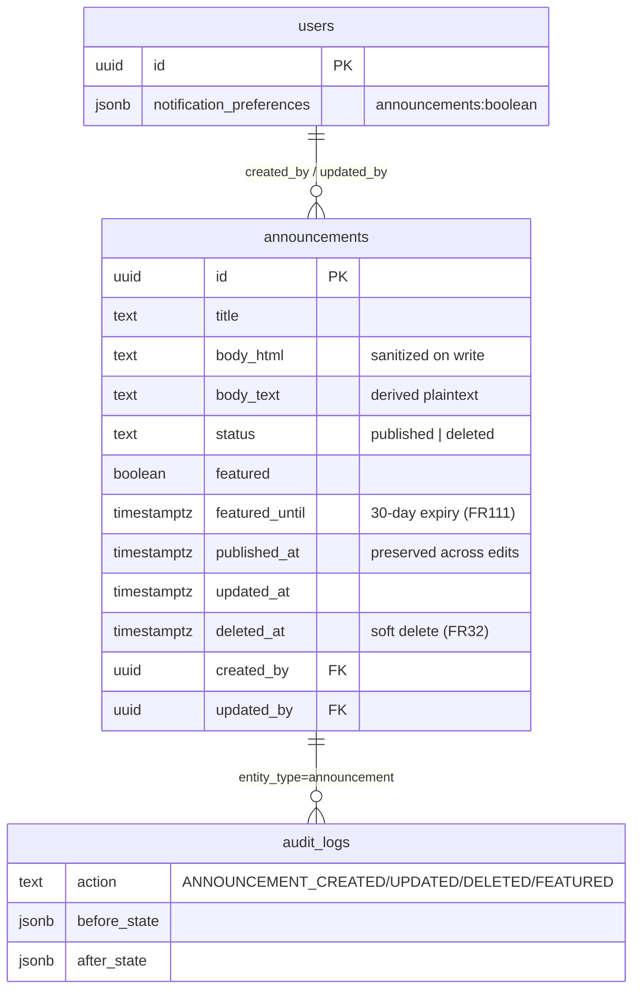

# feat: Announcements & Member Communications (Epic 5)

## Summary

Let the Rabbi (and Admin / Social Chair) author announcements that appear
immediately on the homepage and are emailed to every member who opted in to
announcement notifications. The current `src/services/AnnouncementService.js` is
an in-memory placeholder wired to nothing; this plan replaces it with a real
Postgres-backed service plus a new `019_create_announcements_table.sql`
migration, an admin authoring UI gated by `requirePermission(POST_ANNOUNCEMENTS)`,
a public homepage display section, an `announcement-notification` email template,
and the **first bulk fan-out on the existing Bull email queue** — so opt-in
filtering and per-recipient enqueue batching are first-class concerns here. The
build reuses the recordings publish→notify→cache-invalidate pattern almost
verbatim (`RecordingService.publishRecording` is the canonical precedent). Scope
is Stories 5.1–5.7; the notification-preference toggles (Story 5.6) already exist
in the codebase and need only a verification pass, not a rebuild.

---

## Problem Frame

The Rabbi is the temple's content bottleneck (PRD persona "Rabbi Sarah") and the
single biggest adoption lever is fast, low-friction announcement posting that
reaches members both on the site and by email — the PRD's "Email + in-person
announcement required" lesson (epics.md ~line 416). Today nothing ships: the
service is a stub, the admin dashboard shows an
`alert('Announcements feature coming soon!')` button
(`src/views/admin/dashboard.ejs:160`), and the homepage has no announcement
section at all.

The hard constraints are:

- **End-of-July MVP** — favor reuse of the recordings notify pattern over net-new
  infrastructure. No scheduling, no rich-text WYSIWYG engine, no image-upload
  pipeline beyond what the existing asset conventions already allow.
- **The email queue's first real bulk payload.** Every prior `enqueueEmail` call
  is 1:1 (one reset, one receipt, one email-change). Announcements fan out to
  *all opted-in members* — potentially 200+ recipients per post (PRD launch
  metric: "Email list ready ... 200+ addresses"). One Bull job **per recipient**
  (mirroring `RecordingService`) is the right grain (per-recipient retry/backoff
  already exists), but the enqueue loop must run **outside the DB transaction**,
  must not let one bad address abort the rest, and must filter to opted-in
  members at the SQL layer (`notification_preferences->>'announcements'`).
- **Audit + soft-delete for accountability** (NFR-S8, FR32). Delete is a soft
  delete with archive/restore; edit captures before/after state.

**On rich text / images / links (FR35, Story 5.1 ACs):** the ACs ask for a "rich
text editor (bold, italic, lists)", inline images with alt text, and hyperlinks.
The site's CSP forbids inline `<script>`/`<style>` (CLAUDE.md), and there is no
sanitizer dependency in the tree today. This plan stores announcement body as
**server-sanitized HTML** (allowlist of `b/i/em/strong/ul/ol/li/a/p/br/img`,
`a[href]` http(s)-only, `img[src]` http(s)-only + required `alt`) and ships a
*minimal* toolbar over a `contenteditable`/textarea using a small external
`public/js/` module (CSP-safe). The WYSIWYG richness is deliberately thin for
MVP; see Scope Boundaries and Open Questions. **The sanitizer is the security
crux of this epic** — homepage and email both render member-... no, *staff*-
authored HTML, so a dependency-light, well-tested allowlist sanitizer
(`sanitize-html`) is a Key Technical Decision, not an afterthought.

---

## Requirements Trace

**Legend:** each unit's `Requirements:` line lists every story/FR aspect that unit
touches; this table shows the *primary delivery point(s)* per story/requirement.

| Story / FR (origin) | Primary delivery |
|---|---|
| Story 5.1 create + post (FR29, FR35) | U1, U2, U4, U5 |
| Story 5.1 audit on publish (NFR-S8) | U2 |
| Story 5.1 autosave drafts (30s) | U4 (draft), U5 (client) |
| Story 5.2 homepage display, newest-first (FR30) | U1, U2, U6 |
| Story 5.2 expand/read full, responsive images, a11y (NFR-A1/A2/A3) | U6, U9 |
| Story 5.2 featured pinned to top (FR111) | U2, U6 |
| Story 5.3 edit published (FR31), before/after audit (FR116) | U2, U4, U5 |
| Story 5.3 preserve original date + "Updated:" indicator | U1, U2, U6 |
| Story 5.3 do NOT re-notify on edit | U2 |
| Story 5.4 soft delete + archive + restore (FR32), audit | U1, U2, U4, U5 |
| Story 5.4 confirm dialog, removed from public immediately | U5, U2 |
| Story 5.5 email all opted-in members (FR33, FR86) | U3, U7 |
| Story 5.5 subject "New Announcement: [title]", full body, homepage link | U3 |
| Story 5.5 unsubscribe link (FR88) | U3 (reuses `appendUnsubscribe`) |
| Story 5.5 opted-out excluded (FR34) | U2, U7 |
| Story 5.5 queued with backoff retry, admin alert after 3 fails (NFR-I2/I3) | U7 (existing queue/worker) |
| Story 5.6 preference toggles (FR34) | U8 (verify-only) |
| Story 5.7 feature/pin, one-at-a-time, 30-day expiry (FR111), audit | U1, U2, U4, U5 |
| FR25/FR26/FR27 RBAC (admin/rabbi/social_chair post) | U4 (`POST_ANNOUNCEMENTS`) |

Acceptance examples per story are enforced as tests in U7 (email), U9 (a11y), and
the unit-local "Test scenarios" in U2/U4/U6.

---

## Key Technical Decisions

- **KTD1 — Dedicated `announcements` table; status-driven, soft-delete, single
  featured row.** Columns mirror the recordings model: `id UUID PK`, `title`,
  `body_html` (sanitized HTML), `body_text` (derived plaintext for the email text
  part + previews), `status` (`'published' | 'deleted'`; no separate draft *row*
  state for MVP — drafts live client-side / via autosave endpoint, published on
  explicit publish), `featured BOOLEAN`, `featured_until TIMESTAMPTZ` (30-day
  expiry, FR111), `published_at TIMESTAMPTZ` (preserved across edits, Story 5.3),
  `updated_at`, `deleted_at` (soft delete, FR32), `created_by`/`updated_by` UUID
  FKs to `users`. **Rationale:** a real column + btree index serves the hot
  homepage query (`status='published' ORDER BY featured DESC, published_at DESC`);
  soft delete keeps the archive (Story 5.4) and the full-content audit trail
  intact. "Only one featured at a time" (Story 5.7) is enforced **in a
  transaction** — clearing any other featured row before setting the new one —
  not via a DB partial-unique constraint, because the 30-day auto-expiry is
  evaluated *at read time* (`featured AND featured_until > NOW()`), so the
  constraint and the read predicate would disagree. See KTD5.

- **KTD2 — Server-side HTML sanitization is mandatory and dependency-backed.** Add
  `sanitize-html` and sanitize `body_html` **on write** (in the service, before
  persist) with a tight allowlist (`p,br,b,i,em,strong,ul,ol,li,a,img`),
  `a[href]` and `img[src]` restricted to `http`/`https`/`mailto`, `img` requires
  `alt` (drop if missing → a11y, Story 5.2). Store the sanitized result so every
  consumer (homepage EJS, email HTML) is safe by construction and EJS can emit it
  with `<%- %>` (raw) *only* for `body_html`. **Rationale:** the alternative —
  escaping at render with `<%= %>` — defeats FR35 (no formatting/links/images
  would render). Sanitizing once on write is safer and cheaper than sanitizing on
  every render, and keeps the email worker (which has no EJS context) trivially
  correct. Derive `body_text` via the same library's text extraction. This is the
  single new runtime dependency the epic introduces; call it out in review.

- **KTD3 — Reuse the recordings publish→notify→invalidate transaction shape
  verbatim** (`RecordingService.publishRecording`, lines 153–295). Inside a
  `db.pool.connect()` transaction: INSERT the announcement, SELECT opted-in
  members, `logAudit(ANNOUNCEMENT_CREATED)`, `COMMIT`; **then, outside the
  transaction**, loop members and `enqueueEmail(...).catch(...)` per recipient,
  then `CacheService.invalidatePattern('announcement:*')`. **Rationale:** this is
  the proven pattern in the codebase for "persist + fan-out email + bust cache,"
  it already separates the slow/failable email enqueue from the DB commit, and it
  gives each recipient independent Bull retry/backoff (NFR-I2/I3) plus the
  existing `alertAdminFailure` after `MAX_ATTEMPTS` (Story 5.5 "alert admin after
  3 failures" — note the existing `BACKOFF_SCHEDULE_MS` has 5 attempts; see Open
  Questions).

- **KTD4 — Opt-in filtering at the SQL layer (FR34, FR86).** Recipient query is
  `SELECT id, email, first_name FROM users WHERE (notification_preferences->>'announcements')::boolean = true`,
  exactly mirroring the recordings query for `'recordings'`. **Rationale:** filters
  in the database (not in JS), uses the established JSONB-boolean predicate, and
  defaults are member-friendly (`announcements: true` in
  `userService.DEFAULT_NOTIFICATION_PREFERENCES`). New members are opted-in by
  default; opting out is honored immediately because the query runs at publish
  time.

- **KTD5 — Featured/pinned ordering computed at read time, expiry lazy.** Homepage
  ordering is `ORDER BY (featured AND featured_until > NOW()) DESC, published_at
  DESC`. There is **no cron** for the 30-day expiry in MVP; a featured row simply
  stops sorting to the top once `featured_until` passes (and the view stops
  rendering the badge). **Rationale:** avoids standing up a scheduled job for a
  cosmetic ordering effect, matches the "deployment-simple" philosophy in the PRD
  (smart caching, no build step), and is correct on every read. The 2-minute
  homepage cache (KTD6) bounds the visible staleness window.

- **KTD6 — Homepage cache + invalidation, reusing `CacheService`.** Cache the
  published-announcements list under `announcement:homepage` (≤5, the homepage
  slice) with a short TTL (the placeholder used 120s; keep 120s). Every write
  path (create/edit/delete/feature/restore) calls
  `CacheService.invalidatePattern('announcement:*')`. **Rationale:** matches the
  PRD's "cache invalidates when Rabbi posts new announcement" design and the
  recordings `invalidatePattern('recording:*')` precedent; the short TTL keeps the
  lazy-expiry (KTD5) staleness imperceptible.

- **KTD7 — Admin authoring UI mirrors `routes/admin/recordings.js` + an EJS
  list/form, gated by `requirePermission(POST_ANNOUNCEMENTS)`.** New router
  `src/routes/admin/announcements.js` mounted in the `/admin/*` block of
  `server.js`. **Rationale:** `POST_ANNOUNCEMENTS` already maps to admin/rabbi/
  social_chair (`roles-permissions.js:67,77,87`), and the directory admin route is
  the cleaner precedent for *permission*-gated (not role-list-gated) admin routes
  (`routes/admin/directory.js:17-21`). Use `requirePermission`, not
  `requireAnyRole`, so Social Chair (FR27) works without listing roles.

- **KTD8 — Story 5.6 toggles already exist — verify, don't rebuild.** The
  `announcements` and `recordings` checkboxes are already rendered in
  `src/views/account/settings.ejs` (lines ~34, ~46) and persisted via
  `PUT /api/account/preferences` → `userController.updatePreferences` →
  `userService.updatePreferences` (which validates keys against
  `DEFAULT_NOTIFICATION_PREFERENCES` and audits `PREFERENCES_UPDATED`). The epic's
  phrase "dynamically injected as part of Epic 5" is satisfied by their already
  being live. U8 is a verification + a11y/coverage pass, not new feature code.

---

## High-Level Technical Design

### ERD (new table)



### Post → display + email flow

```mermaid
sequenceDiagram
    actor Rabbi
    participant Ctrl as announcementController
    participant Svc as AnnouncementService
    participant DB as Postgres
    participant Q as emailQueue (Bull)
    participant Cache as CacheService
    Rabbi->>Ctrl: POST /admin/announcements (title, body)
    Ctrl->>Svc: create({title, body, ...}, {userId, ip})
    Note over Svc: sanitize body_html (KTD2)
    Svc->>DB: BEGIN; INSERT announcement
    Svc->>DB: SELECT members WHERE prefs.announcements = true
    Svc->>DB: logAudit(ANNOUNCEMENT_CREATED); COMMIT
    loop per opted-in member (outside txn)
        Svc->>Q: enqueueEmail(template=announcement-notification).catch()
    end
    Svc->>Cache: invalidatePattern('announcement:*')
    Svc-->>Ctrl: announcement
    Note over Q: worker renders template, sends, retries w/ backoff,<br/>alertAdminFailure after MAX_ATTEMPTS
    Rabbi-->>Rabbi: homepage shows it immediately (cache busted)
```

---

## Implementation Units

### U1 — Migration: `announcements` table

- **Goal:** Persist announcements with featured/soft-delete/audit-friendly columns.
- **Requirements:** Story 5.1 (storage), 5.2 (ordering columns), 5.3
  (published_at preserved + updated_at), 5.4 (deleted_at), 5.7
  (featured/featured_until).
- **Dependencies:** none (first unit).
- **Files:**
  - `migrations/019_create_announcements_table.sql` (new — confirmed next number;
    highest existing is `018_create_member_profiles.sql`).
- **Approach:** `CREATE TABLE IF NOT EXISTS announcements (...)` per KTD1. Columns:
  `id UUID PRIMARY KEY DEFAULT gen_random_uuid()` (or app-supplied via `uuid` like
  recordings — match the recordings choice of app-side `uuidv4()` for consistency,
  so do **not** rely on a DB default), `title TEXT NOT NULL`, `body_html TEXT NOT
  NULL`, `body_text TEXT`, `status TEXT NOT NULL DEFAULT 'published'`,
  `featured BOOLEAN NOT NULL DEFAULT false`, `featured_until TIMESTAMPTZ`,
  `published_at TIMESTAMPTZ NOT NULL DEFAULT NOW()`, `updated_at TIMESTAMPTZ DEFAULT
  NOW()`, `deleted_at TIMESTAMPTZ`, `created_by UUID REFERENCES users(id)`,
  `updated_by UUID REFERENCES users(id)`. Add `CHECK (status IN
  ('published','deleted'))`. Index the homepage read predicate:
  `CREATE INDEX idx_announcements_published ON announcements (published_at DESC)
  WHERE status = 'published';` and `CREATE INDEX idx_announcements_featured ON
  announcements (featured_until) WHERE featured = true AND status = 'published';`.
  Add `COMMENT ON` lines matching the `018` style.
- **Patterns to follow:** `migrations/018_create_member_profiles.sql` (header
  comment block, `IF NOT EXISTS`, indexes-with-rationale, `COMMENT ON`). Migrate
  runner picks `019` up automatically by lexical sort (`scripts/migrate.js`
  `readdirSync().sort()`); bootstrap only special-cases `000`–`006`, so no
  interaction.
- **Test scenarios:** *(integration, via U2 service tests against mocked `db`)*
  schema columns are referenced by the service queries; no standalone DB test in
  CI (no real Postgres). A migration-shape sanity check can assert the file exists
  and contains the table/index names.
- **Verification:** `npm run migrate` applies `019` cleanly on a local DB; `\d
  announcements` shows columns + indexes. (Do not run as part of this plan's
  agent work.)

### U2 — Replace `AnnouncementService` with a Postgres-backed service

- **Goal:** Real CRUD + feature/restore + homepage read + recipient fan-out,
  replacing the in-memory placeholder.
- **Requirements:** Stories 5.1, 5.2, 5.3, 5.4, 5.5 (recipient SELECT + audit),
  5.7; FR29–FR35, FR111, FR116; NFR-S8.
- **Dependencies:** U1 (table), U3 (email template — soft dep; can stub key first).
- **Files:**
  - `src/services/AnnouncementService.js` (rewrite).
- **Approach:** Convert the singleton-class placeholder to a module of functions
  (match `RecordingService.js` module style; the class export is fine to keep if
  preferred, but functions match the newer services). Methods:
  - `getHomepageAnnouncements(limit = 5)` — cache-read `announcement:homepage`;
    on miss `SELECT ... WHERE status='published' ORDER BY (featured AND
    featured_until > NOW()) DESC, published_at DESC LIMIT $1`; cache 120s; return
    rows with a computed `isFeatured` boolean and `wasEdited` (`updated_at >
    published_at + small epsilon`) for the "Updated:" indicator (Story 5.3).
  - `getById(id)` — UUID-guarded (reuse the `uuidRegex` guard from
    `RecordingService.getPublishedRecordingById`), published-only for public; an
    admin variant returns any non-deleted row for the edit form.
  - `listForAdmin({ includeDeleted })` — all rows newest-first for the admin list
    + archive (Story 5.4).
  - `create({ title, body, featured, featuredDurationDays }, { userId, ipAddress })`
    — sanitize `body`→`body_html`+`body_text` (KTD2); transaction per KTD3: INSERT,
    SELECT opted-in members (KTD4), `logAudit(ANNOUNCEMENT_CREATED, after_state)`,
    COMMIT; outside txn enqueue per-member (delegate to U3 helper / U7 path),
    `invalidatePattern('announcement:*')`; return the row + recipient count.
  - `update(id, { title, body, ... }, { userId, ipAddress })` — load before_state,
    sanitize, `UPDATE ... SET title, body_html, body_text, updated_at=NOW()`
    **preserving `published_at`**, `logAudit(ANNOUNCEMENT_UPDATED, before/after)`,
    invalidate cache. **Does NOT enqueue any email** (Story 5.3 "not re-notified").
  - `softDelete(id, { userId, ipAddress })` — `UPDATE SET status='deleted',
    deleted_at=NOW()`, `logAudit(ANNOUNCEMENT_DELETED, before_state=full content)`,
    invalidate.
  - `restore(id, ...)` — `UPDATE SET status='published', deleted_at=NULL`, audit
    `ANNOUNCEMENT_UPDATED` (restore note), invalidate (Story 5.4 reversible).
  - `setFeatured(id, { featured, durationDays = 30 }, ctx)` — transaction: clear
    `featured` on all other rows (`UPDATE ... SET featured=false WHERE featured=true
    AND id <> $id`), then set this row `featured=$bool, featured_until = $bool ?
    NOW()+interval || NULL`; `logAudit(ANNOUNCEMENT_FEATURED)`, invalidate
    (Story 5.7 one-at-a-time + 30-day).
  - `saveDraft(...)` — optional thin autosave persistence for Story 5.1/5.3 30s
    autosave; **MVP recommendation:** keep autosave client-side (localStorage) and
    have the endpoint just echo/validate, to avoid a draft-row state machine. See
    U4/Scope.
- **Patterns to follow:** `RecordingService.publishRecording` (txn shape, member
  SELECT, audit-then-commit-then-enqueue-then-invalidate); `auditService.logAudit`
  with `before_state`/`after_state`; `CacheService.get/set/invalidatePattern`;
  `db.query` for reads and `db.pool.connect()`+BEGIN/COMMIT/ROLLBACK for writes
  (matches `userService.requestEmailChange`).
- **Test scenarios** *(unit/integration with `jest.mock('../../src/config/db')`)*:
  - happy `create` with two opted-in + one opted-out member → INSERT runs once,
    recipient SELECT returns the two, `enqueueEmail` called exactly twice (opted-out
    excluded, FR34), `logAudit` called with `ANNOUNCEMENT_CREATED`,
    `invalidatePattern('announcement:*')` called once.
  - edit preserves `published_at` → UPDATE SQL does not set `published_at`;
    `enqueueEmail` **not** called (Story 5.3); audit `ANNOUNCEMENT_UPDATED` has
    before+after.
  - `setFeatured(true)` when another row is featured → two UPDATEs in txn (clear
    others, set this), `featured_until ≈ NOW()+30d`, audit `ANNOUNCEMENT_FEATURED`.
  - `softDelete` → `status='deleted'`, row excluded from `getHomepageAnnouncements`;
    `restore` brings it back.
  - edge: `create` with `body` containing `<script>` and `onclick=` → sanitized
    `body_html` contains neither; `<a href="javascript:...">` stripped to no href.
  - edge: `getHomepageAnnouncements` cache hit returns cached payload without a DB
    query (assert `db.query` not called on second call).
  - error: one bad recipient `enqueueEmail` rejection does not abort the loop or
    throw out of `create` (others still enqueued; rejection swallowed via
    `.catch`).
- **Verification:** `npx jest __tests__/services/announcementService` green;
  `npm run lint` clean.

### U3 — `announcement-notification` email template

- **Goal:** Subject `New Announcement: [title]`, full sanitized body, homepage
  link, unsubscribe footer.
- **Requirements:** Story 5.5 (subject, full body, homepage link, unsubscribe);
  FR33, FR35, FR88.
- **Dependencies:** none (independent of U2; U2 references the template key).
- **Files:**
  - `src/services/emailTemplateService.js` (add one template entry).
- **Approach:** Add `'announcement-notification': (data = {}) => ({ subject: 'New
  Announcement: ' + (data.title || 'Temple Announcement'), html: <greeting> +
  data.bodyHtml + <a href=homeUrl>View on the website</a>, text: <greeting> +
  data.bodyText + homeUrl })`. **Do not** add to `UNSUBSCRIBE_EXEMPT` — the
  generic `appendUnsubscribe` in `renderTemplate` adds the FR88 unsubscribe link
  automatically (passing `data.unsubscribeToken` if/when per-member tokens exist;
  see Open Questions). Home URL from `process.env.APP_URL`/`APP_BASE_URL` with a
  localhost fallback (matches recordings `archiveUrl`).
- **Patterns to follow:** the `'new-recording-available'` template entry (same
  file, lines 75–83) — greeting with `data.memberName`, link, both `html` and
  `text` parts; `renderTemplate` appends unsubscribe for non-exempt keys.
- **Test scenarios:**
  - `renderTemplate('announcement-notification', { title:'Shabbat', bodyHtml:'<p>x</p>',
    bodyText:'x', memberName:'Dana' })` → subject `New Announcement: Shabbat`,
    `html` contains the body and a homepage link and the unsubscribe footer, `text`
    mirrors.
  - missing `title` → subject falls back to `New Announcement: Temple Announcement`.
  - unknown key still throws (existing behavior, regression guard).
- **Verification:** `npx jest __tests__/services/emailTemplateService` green.

### U4 — Admin route + controller for authoring

- **Goal:** Permission-gated CRUD/feature endpoints behind the Rabbi UI.
- **Requirements:** Stories 5.1, 5.3, 5.4, 5.7; FR25/26/27 (RBAC).
- **Dependencies:** U2.
- **Files:**
  - `src/routes/admin/announcements.js` (new).
  - `src/controllers/announcementController.js` (new).
  - `src/server.js` (add `require` near lines 170–181; add `app.use('/admin/
    announcements', adminAnnouncementsRoutes)` in the `/admin/*` block, lines
    187–191 — **before** `app.use('/api', ...)` and after the `/` pages
    catch-all, matching the existing admin mounts).
- **Approach:** Router exports routes gated by
  `[requireAuth, sessionTimeout(), requirePermission(Permissions.POST_ANNOUNCEMENTS)]`:
  - `GET /admin/announcements` → list (published + archive) → render
    `bodyView: 'admin/announcements/list'`.
  - `GET /admin/announcements/new` and `GET /admin/announcements/:id/edit` →
    render the form view with `csrfToken: req.csrfToken?.()`.
  - `POST /admin/announcements` → `create` → JSON `{ success, announcement }` (form
    posts via the external JS module, JSON-style like recordings) or redirect; pick
    one and be consistent — **recommend JSON** to match `recordingController`.
  - `POST /admin/announcements/:id` (edit), `POST /admin/announcements/:id/delete`,
    `POST /admin/announcements/:id/restore`, `POST /admin/announcements/:id/feature`
    (`{ featured: bool }`).
  - Optional `POST /admin/announcements/drafts` autosave echo (see U2 `saveDraft`).
  - Controller passes `{ userId: req.user.id, ipAddress: req.ip ||
    req.connection?.remoteAddress }` to the service (matches `recordingController
    .publishRecording`). Validate `title` non-empty + length cap and `body` length
    cap; 400 on missing required.
- **Patterns to follow:** `routes/admin/directory.js` (permission-gated middleware
  array via `requirePermission`), `routes/admin/recordings.js` (route layout),
  `recordingController.js` (try/catch, JSON success/error envelope, `req.user.id`,
  `error.message.includes('required')` → 400 mapping). Note CSRF is global and
  **skipped in test** (`conditionalCsrf`), so state-changing routes need `_csrf`
  in production but tests post without it.
- **Test scenarios** *(integration, supertest, mock `src/config/db`, JWT cookie)*:
  - member token → `POST /admin/announcements` returns 403 (no
    `POST_ANNOUNCEMENTS`).
  - rabbi token → create returns 200/201 and the service `create` is called with
    the title/body and `userId='rabbi-1'`.
  - social_chair token → create allowed (FR27).
  - admin token → feature/delete/restore each call the matching service method
    with the actor id.
  - missing title → 400.
- **Verification:** `npx jest __tests__/integration/adminAnnouncementsRoutes`
  green.

### U5 — Admin EJS views + authoring client JS

- **Goal:** Rabbi-facing list/archive + create/edit form with minimal rich-text,
  preview, autosave, delete confirm, feature toggle.
- **Requirements:** Story 5.1 (form, rich text, image alt, links, preview,
  autosave, keyboard-accessible), 5.3 (edit form), 5.4 (confirm dialog, archive
  view, restore), 5.7 (feature toggle + confirmation).
- **Dependencies:** U4.
- **Files:**
  - `src/views/admin/announcements/list.ejs` (new).
  - `src/views/admin/announcements/form.ejs` (new).
  - `public/js/admin-announcements.js` (new — toolbar, preview, autosave, fetch
    submit; CSP-safe external file).
  - `public/css/announcements.css` (new — shared admin+public styles; pass via
    `stylesheets: [...]` to `layout`).
  - `src/views/admin/dashboard.ejs` (replace the
    `alert('... coming soon')` button at line ~160 with a link to
    `/admin/announcements`).
- **Approach:** List view shows published + a collapsible archive section with
  Restore buttons (Story 5.4). Form view: title input, a `contenteditable` (or
  textarea + preview) body with a small toolbar (Bold/Italic/List/Link/Image)
  driven by `admin-announcements.js`; image insertion prompts for URL + **required
  alt**; "Preview" renders the sanitized-ish preview client-side (server
  re-sanitizes on write — KTD2). Autosave to `localStorage` every 30s (MVP) with a
  restore-on-load prompt; optionally `POST /drafts`. Submit via `fetch` with the
  `_csrf` token from a hidden field / `res.locals.csrfToken`. Delete uses a
  confirm dialog with the exact AC copy; feature toggle posts and shows a
  confirmation message (`role="alert"`/`role="status"` client message — there is
  no server flash helper, per the directory plan note).
- **Patterns to follow:** `recordingController` views + `public/js/account-
  settings.js` (external module that fetches JSON, CSP-safe, `role="alert"` UX);
  `res.render('layout', { title, bodyView, stylesheets, viewData })` convention;
  CSP forbids inline JS/CSS (CLAUDE.md).
- **Test scenarios:** covered functionally by U4 integration tests and U9 a11y
  tests (the views render without violations); client-JS logic is light and not
  unit-tested per repo norms (`__tests__` not linted, no jsdom client tests for
  account-settings.js today).
- **Verification:** manual smoke in `npm run dev`; U9 axe tests green.

### U6 — Homepage announcement display

- **Goal:** Show published announcements (featured pinned) on the homepage,
  newest-first, expandable, responsive, accessible.
- **Requirements:** Story 5.2 (FR30, FR111, NFR-A1/A2/A3, NFR-P1), Story 5.3
  ("Updated:" indicator).
- **Dependencies:** U2.
- **Files:**
  - `src/controllers/homeController.js` (add `AnnouncementService
    .getHomepageAnnouncements()` to the `Promise.all`, pass into `viewData`).
  - `src/views/home.ejs` (new `<section>` for announcements).
  - `public/css/announcements.css` (public styles — shared with U5).
- **Approach:** In `getHomepage`, add the announcements fetch to the existing
  `Promise.all([...])` (with a `.catch(() => [])` so an announcement failure never
  500s the homepage). Add a homepage section after the hero / near events,
  rendering each announcement: `title`, `published_at` as a `<time>`, the
  `wasEdited` "Updated: [date]" indicator, a "Featured" badge when `isFeatured`,
  and the sanitized body via `<%- announcement.body_html %>` (raw — safe by KTD2)
  inside a `<details>`/`<summary>` for expand/collapse (keyboard-accessible by
  default; satisfies "click to expand", NFR-A1). Images already carry `alt` (KTD2)
  and CSS makes them responsive (`max-width:100%`).
- **Patterns to follow:** `home.ejs` events section markup (`role="region"`,
  `aria-labelledby`, `<time datetime>`); `homeController` `Promise.all` +
  per-source `.catch` fallback pattern.
- **Test scenarios** *(integration + view)*:
  - homepage with one featured + two normal → featured renders first with the
    badge; order is `featured, newest, older`.
  - homepage with zero announcements → an empty-state line, no crash.
  - edited announcement → "Updated:" indicator present.
  - body_html with a sanitized link/image renders raw (`<a href>`, ``);
    a malicious `<script>` (had it bypassed write-sanitization) would not — assert
    on the stored/sanitized fixture.
- **Verification:** `npx jest` home tests green; manual homepage check.

### U7 — Bulk email fan-out: batching, opt-in filtering, failure isolation

- **Goal:** Make the first all-members blast safe on the existing queue.
- **Requirements:** Story 5.5 (FR33, FR86, FR88, NFR-I2/I3), FR34.
- **Dependencies:** U2, U3.
- **Files:**
  - `src/services/AnnouncementService.js` (the enqueue loop — co-located with U2;
    listed separately to force explicit test coverage of the fan-out).
  - *(no change required to `emailQueueService.js`/`emailQueueWorker.js` — html/
    text payloads are already supported; attachments are not needed.)*
- **Approach:** After COMMIT, iterate the opted-in member rows and per member:
  `renderTemplate('announcement-notification', { memberName, title, bodyHtml,
  bodyText, unsubscribeToken })` then `enqueueEmail({ to, subject, html, text,
  priority: 2 }).catch(e => logger... )` — **one Bull job per recipient** so each
  gets independent retry/backoff and `alertAdminFailure` (the existing worker
  already alerts after `MAX_ATTEMPTS`). Wrap the loop so a single rejection is
  isolated. **Batching note for 200+ recipients:** enqueue is cheap (an in-memory/
  Redis `add` per job), and the loop is `await`ed sequentially today in
  `RecordingService`; for the larger announcement audience, enqueue with
  `Promise.allSettled` over the member list (still one job each) to avoid a long
  serial await, while keeping per-job failure isolation. Do **not** pass all
  recipients as one job (would lose per-recipient retry + leak the recipient list
  across To headers). Use `logger` (winston), not `console.log`, in `src/`.
- **Patterns to follow:** `RecordingService.publishRecording` steps 2/4/5 (member
  SELECT, per-member enqueue with `.catch`, then cache invalidate);
  `emailQueueService.enqueueEmail` signature `{ to, subject, text, html, template,
  data, priority }`; `emailQueueWorker` `failed` handler → `alertAdminFailure`.
- **Test scenarios** *(integration)*:
  - 3 opted-in + 1 opted-out → exactly 3 `enqueueEmail` calls; each `to` is a
    distinct member; subject `New Announcement: ...`.
  - one `enqueueEmail` rejects → the other calls still happen and `create`
    resolves (failure isolated).
  - zero opted-in members → zero enqueues, announcement still created + on
    homepage.
  - edit path → zero enqueues (Story 5.3).
- **Verification:** `npx jest` fan-out tests green; assert no `console.log` added
  (lint/grep).

### U8 — Notification-preference toggles: verify + harden (Story 5.6)

- **Goal:** Confirm the existing opt-in/out toggles satisfy Story 5.6; add
  coverage if missing.
- **Requirements:** Story 5.6 (FR34, FR88, NFR-A1, FR77–79).
- **Dependencies:** none (independent verification).
- **Files:**
  - `src/views/account/settings.ejs` (verify/adjust labels + a11y only).
  - `src/services/userService.js` (no change expected — `announcements`/
    `recordings` already in `DEFAULT_NOTIFICATION_PREFERENCES` and validated by
    `updatePreferences`).
- **Approach:** Confirm the `announcements` checkbox is present, labeled, keyboard-
  accessible, saved via `PUT /api/account/preferences`, and audited
  (`PREFERENCES_UPDATED`). Ensure the unsubscribe link's `/unsubscribe` flow maps
  to flipping `announcements:false` (see Open Questions — the unsubscribe endpoint
  may not exist yet; if absent, file as follow-up rather than expanding scope).
- **Patterns to follow:** existing `account/settings.ejs` + `account-settings.js`
  + `userService.updatePreferences`.
- **Test scenarios:**
  - existing `userService.updatePreferences` tests already cover toggling
    `announcements`; add an assertion that setting `announcements:false` is
    persisted and merged (regression guard).
  - a11y: settings page renders without axe violations (covered in U9).
- **Verification:** `npx jest userService` green.

### U9 — Accessibility (jest-axe) coverage

- **Goal:** WCAG A/AA for the new homepage section, admin list, and admin form.
- **Requirements:** Story 5.2 (NFR-A1/A2/A3), Story 5.1/5.3 (keyboard-accessible
  controls), Story 5.6.
- **Dependencies:** U5, U6.
- **Files:**
  - `__tests__/views/announcementsHome.accessibility.test.js` (new).
  - `__tests__/views/announcementsAdmin.accessibility.test.js` (new).
- **Approach:** Render each EJS to HTML with `ejs.render(fs.readFileSync(...),
  viewData)`, wrap in a minimal `<!doctype html>` document with `<main>`, run
  `axe(html, { runOnly: { type:'tag', values:['wcag2a','wcag2aa','wcag21a',
  'wcag21aa'] } })`, `expect(results).toHaveNoViolations()`. Cover: announcements
  present + empty states; featured badge; `<details>` expand control; form labels
  + image-alt field.
- **Patterns to follow:** `__tests__/views/chatModeration.accessibility.test.js`
  (jsdom env, `TextEncoder` shim, `ejs.render`, axe tag filter,
  `toHaveNoViolations`); `home.accessibility.test.js`.
- **Test scenarios:** the two new view tests pass with zero violations for
  populated and empty data.
- **Verification:** `npx jest accessibility` green.

---

## Scope Boundaries

**In scope (Stories 5.1–5.7):** DB-backed CRUD; soft delete + archive + restore;
single featured-at-a-time with 30-day lazy expiry; homepage display (newest-first,
featured pinned, expandable, responsive, accessible); all-opted-in-members email
blast on publish (one job per recipient) with subject/full-body/homepage-link/
unsubscribe; no re-notify on edit; "Updated:" indicator; permission-gated
(`POST_ANNOUNCEMENTS`) admin authoring UI with a minimal formatting toolbar,
image+alt, links, preview, and client autosave; audit on every write; verify the
existing Story 5.6 preference toggles; a11y coverage.

**Deferred to follow-up:**

- **Announcement scheduling ("post later").** PRD lists this explicitly as a Phase
  2 deferral (epics.md ~line 388). Out of MVP.
- **Cron-based featured expiry.** Lazy read-time expiry (KTD5) is sufficient for
  MVP; a sweep job to clear `featured` columns can come later if the admin list
  needs the stored flag to be accurate.
- **Server-side persisted drafts / autosave row state.** MVP autosaves to
  `localStorage`; a draft `status` and `/drafts` persistence can follow if the
  Rabbi needs cross-device drafts.
- **Per-recipient unsubscribe tokens.** The unsubscribe footer link uses the
  existing `appendUnsubscribe` helper; a tokenized one-click unsubscribe that flips
  `announcements:false` without login depends on an `/unsubscribe` endpoint that
  may not exist yet (Open Questions). If absent, the footer points to account
  settings and tokenization is a follow-up (still satisfies FR88's "link to manage
  preferences").
- **Rich media beyond allowlisted inline `` by URL.** No upload pipeline; no
  video embeds. FR35's "images" are satisfied by URL-referenced, alt-required
  images.
- **Member-facing dedicated `/announcements` archive page.** MVP shows the latest
  N on the homepage; a paginated public archive can reuse the recordings archive
  pattern later if desired.

---

## Risks & Dependencies

- **R1 — First bulk send on the queue.** A 200+ recipient blast is the largest
  fan-out the queue has handled. *Mitigation:* one job per recipient (independent
  retry/backoff), `Promise.allSettled` enqueue, failure isolation, enqueue outside
  the DB txn (U7). Monitor `getQueueStats` after the first real post.
- **R2 — Stored HTML injection.** `body_html` is rendered raw on the homepage and
  in emails. *Mitigation:* mandatory write-time `sanitize-html` allowlist (KTD2);
  tested with `<script>`/`onclick`/`javascript:` fixtures (U2). New dependency —
  flag in review.
- **R3 — New runtime dependency (`sanitize-html`).** Adds to the bundle/install.
  *Mitigation:* it is widely used, dependency-light, and the safest path; the
  alternative (hand-rolled regex sanitizer) is riskier. Confirm with owner.
- **R4 — Cache staleness vs. lazy featured expiry.** A featured announcement could
  appear pinned for up to the cache TTL past `featured_until`. *Mitigation:* 120s
  TTL bounds it; acceptable cosmetic window.
- **R5 — Homepage latency (NFR-P1 < 2s).** Adds one indexed query (cached).
  *Mitigation:* partial index on `status='published'`, 120s cache, `.catch(()=>[])`
  so it never blocks/500s the homepage.
- **Dependencies (already present, no build needed):** `POST_ANNOUNCEMENTS`
  permission + role map; `ANNOUNCEMENT_*` audit actions; `notification_preferences
  .announcements` default-true + `updatePreferences` validation; `CacheService`,
  `emailQueueService`, `emailQueueWorker`, `emailTemplateService`
  `appendUnsubscribe`; the recordings publish pattern as the template.

## System-Wide Impact

- `src/server.js` — one new `require` + one new `app.use('/admin/announcements',
  ...)` in the `/admin/*` block (order matters: after the `/` pages catch-all,
  before `/api`).
- `src/controllers/homeController.js` + `src/views/home.ejs` — homepage gains an
  announcements section and one cached query in the existing `Promise.all`.
- `src/views/admin/dashboard.ejs` — the placeholder "coming soon" button becomes a
  real link.
- `package.json` — adds `sanitize-html` (the only new runtime dep).
- Email volume — first recurring bulk sender on the queue; observe queue depth and
  the existing 30s worker tick logs.
- No changes to auth/CSRF/RBAC middleware, migrations `000`–`006`, or the
  `NODE_ENV==='test'` escape hatches.

## Open Questions

1. **`/unsubscribe` endpoint:** does a working unsubscribe route exist that the
   `appendUnsubscribe` link targets, and does it flip `announcements:false`?
   `emailTemplateService.buildUnsubscribeLink` builds `/unsubscribe?token=...` but
   no route was found in research. If missing, MVP footer points to account
   settings; tokenized unsubscribe is a follow-up. (Affects U3/U8.)
2. **"Alert admin after 3 failures" (Story 5.5) vs. existing `MAX_ATTEMPTS=5`:**
   the queue alerts after `BACKOFF_SCHEDULE_MS.length` (5) attempts, not 3.
   Accept the existing 5-attempt behavior for MVP, or adjust the schedule? Changing
   it affects *all* email types — recommend accepting 5 and noting the AC variance.
3. **Submit style for the admin form:** JSON `fetch` (like recordings) vs.
   classic form POST + redirect. Plan recommends JSON for consistency; confirm.
4. **Rich-text fidelity:** is a minimal Bold/Italic/List/Link/Image toolbar over
   `contenteditable` acceptable for "rich text editor (FR35)", or is a heavier
   editor expected? Plan assumes minimal for MVP + CSP constraints.
5. **`uuid` generation:** app-side `uuidv4()` (recordings style) vs. DB
   `gen_random_uuid()` default. Plan picks app-side for consistency; either works.

## Sources & Research

- Requirements: `_bmad-output/planning-artifacts/epics.md` Stories 5.1–5.7;
  `_bmad-output/planning-artifacts/prd.md` (FR25–FR35, FR111, personas, launch
  metrics, caching philosophy ~line 674).
- Canonical precedent: `src/services/RecordingService.js`
  (`publishRecording` lines 153–295 — txn + opted-in member SELECT + per-recipient
  enqueue + cache invalidate).
- Current placeholder being replaced: `src/services/AnnouncementService.js`.
- Email path: `src/services/emailQueueService.js` (`enqueueEmail`, backoff,
  `alertAdminFailure`, `MAX_ATTEMPTS`), `src/workers/emailQueueWorker.js`
  (`failed` handler), `src/services/emailTemplateService.js`
  (`new-recording-available` template, `appendUnsubscribe`, `UNSUBSCRIBE_EXEMPT`).
- Auth/RBAC: `src/config/roles-permissions.js` (`POST_ANNOUNCEMENTS`),
  `src/middleware/requireRbac.js` (`requirePermission`),
  `src/routes/admin/directory.js` + `src/routes/admin/recordings.js` (route
  patterns).
- Audit: `src/services/auditService.js` (`ANNOUNCEMENT_*` actions, `logAudit`
  before/after).
- Preferences: `src/services/userService.js`
  (`DEFAULT_NOTIFICATION_PREFERENCES.announcements`, `updatePreferences`),
  `src/routes/api.js` (`PUT /account/preferences`),
  `src/controllers/userController.js`, `src/views/account/settings.ejs`.
- Cache: `src/services/CacheService.js` (`get/set/invalidatePattern`).
- Homepage: `src/controllers/homeController.js`, `src/views/home.ejs`.
- Persistence: `src/config/db.js` (`{ query, pool }`),
  `migrations/018_create_member_profiles.sql` (migration style),
  `scripts/migrate.js` (lexical order, `000`–`006` bootstrap; next number `019`).
- Test patterns: `__tests__/integration/adminDirectoryRoutes.test.js`
  (`jest.mock('../../src/config/db')`, JWT cookie `token_version` stub,
  `JWT_SECRET='test-jwt-secret'`), `__tests__/integration/auditLogs.test.js`
  (audit INSERT assertion), `__tests__/views/chatModeration.accessibility.test.js`
  (jest-axe + `ejs.render`).
- House style: `docs/plans/2026-06-14-001-feat-member-directory-plan.md`,
  `docs/plans/2026-06-14-002-feat-donations-plan.md`.
