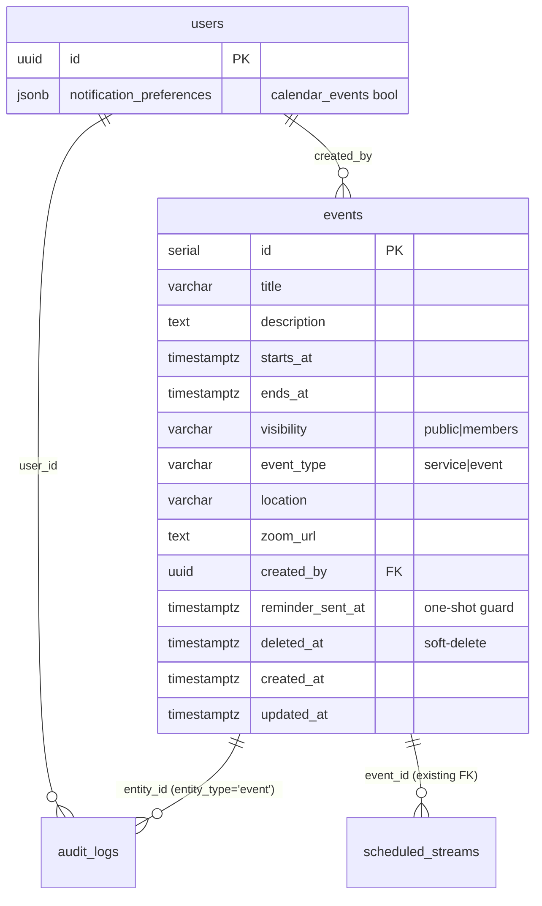
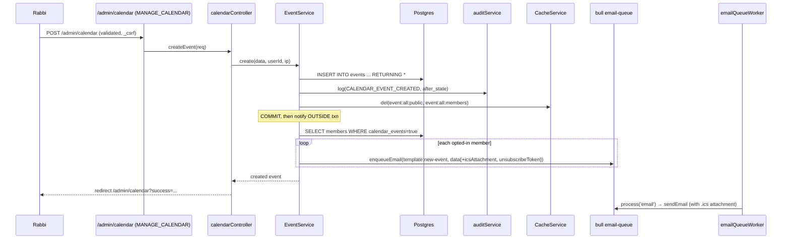
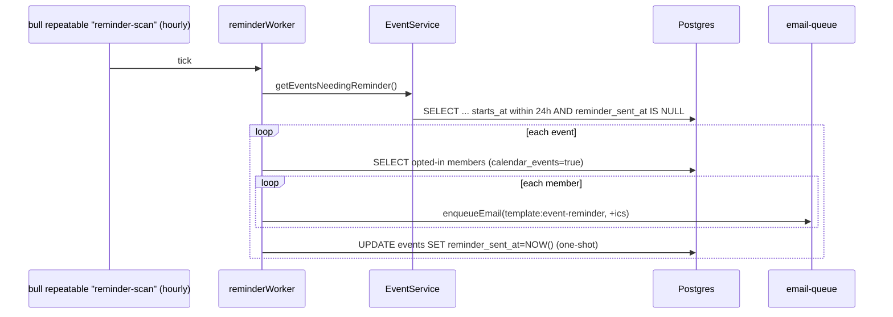

# feat: Event Calendar Management & Notifications

## Summary

Build Epic 6 end to end: a real Postgres-backed `events` table (migration `020`) that
replaces the **stubbed, in-memory** `EventService`, a Rabbi/Admin/Social-Chair calendar
management UI (create / edit / delete with soft-delete + restore, gated by
`MANAGE_CALENDAR`), public and members-only calendar pages with a 3-month-forward +
1-month-archive display, new-event email notifications to opted-in members, and 24-hour
iCal reminders driven by a scheduled job. As a side effect it fixes a live correctness
bug: the homepage's "Upcoming Events" and "Next Service" countdown currently render
**fabricated, non-persisted data** from a hardcoded array, so admins can't change what
visitors see. Once the service is DB-backed the homepage shows real, manageable events
with no homepage code change.

---

## Problem Frame

The temple has no working calendar. Three things are broken or missing:

1. **The homepage shows fake events (correctness bug).** `src/controllers/homeController.js`
   already calls `EventService.getNextService()` and `EventService.getUpcomingEvents(3)`,
   and `src/views/home.ejs` already renders an "Upcoming Events" list and a next-service
   countdown from that data. But `src/services/EventService.js` serves a **hardcoded
   static array** (`upcomingEvents`, three Feb-2026 entries) and its `create`/`update`/
   `delete` methods are explicit stubs (`// In real implementation, this would insert to
   DB`) that mutate that array in memory. So the homepage displays plausible-looking but
   **fabricated** events that no admin can edit and that vanish on restart. The countdown
   ticks against a fake date. This is a user-visible correctness bug, not just a missing
   feature — DB-backing the service fixes it.

2. **There is no calendar feature at all.** No `events` table, no management UI, no
   public calendar page, no members-only calendar, no notifications, no reminders.

3. **The substrate is half-laid and unused.** `MANAGE_CALENDAR` permission exists
   (admin/rabbi/social_chair) but is referenced nowhere. `CALENDAR_EVENT_CREATED/UPDATED/
   DELETED` audit actions exist but are unused. `notification_preferences.calendar_events`
   (default `true`) is a real per-user JSONB flag with a working toggle already on the
   account settings page (`src/views/account/settings.ejs:38`). `scheduled_streams.event_id`
   is a nullable FK already anticipating a real events table, and `EventService.getEvents()`
   already merges scheduled streams into the event list. The bull email queue + template +
   worker + audit + cache services all exist. The work is to fill the middle: a real table
   and service, the surfaces, and two notification paths.

This plan DB-backs the service while preserving every existing contract (the homepage
event object shape, `getNextService`, `getUpcomingEvents`, the stream-merge behaviour,
and the `event_id` FK from `scheduled_streams`).

---

## Requirements Trace

| Story / FR / NFR | Where addressed |
|---|---|
| 6.1 Create public event (date/time/title/desc, optional Zoom/location, public flag, preview, immediate publish, audit, notify, autosave, keyboard) | U2, U3, U4, U6, U7 |
| 6.2 Create members-only event (visibility flag, members-only section, hidden from public, login-gate, notify, audit, convert visibility) | U1, U3, U4, U6 |
| 6.3 Edit event (modify fields, change visibility, immediate, audit before/after, "Event Updated" email, autosave, confirm, keyboard) | U2, U3, U4, U6, U7 |
| 6.4 Display next 3 months + past 1 month archive, public vs members visibility, prev/next nav, <2s, responsive, keyboard | U2, U5, U7 |
| 6.5 New-event email to opted-in members (subject, fields, iCal, unsubscribe, opt-out respected, settings toggle, ≤5 min, retry, 3-strike alert) | U6, U8, U9 |
| 6.6 24h reminder job (hourly, opted-in, fields, iCal, subject, countdown copy, opt-out, once-per-event, retry, unsubscribe) | U6, U8, U9, U10 |
| 6.7 Delete event (confirm dialog, immediate removal, soft-delete, audit full detail, "Event Canceled" email, archive view, restore, success msg) | U1, U2, U3, U4, U6 |
| FR34 members opt in/out of emails | U6, U9 (existing `calendar_events` pref) |
| FR36 Rabbi create/edit public events | U2, U3, U4 |
| FR37 Rabbi members-only events | U1, U3, U4 |
| FR38 public calendar visible to all | U1, U5 |
| FR39 members-only visible only to logged-in | U1, U5, U7 |
| FR40 events show date/time/title/desc | U1, U5, U6 |
| FR41 optional Zoom link / location | U1, U4, U5, U6 |
| FR42 new-event email notification | U6, U8 |
| FR43 next 3 months + past 1 month archive | U1, U5 |
| FR77-79 responsive mobile/tablet/desktop | U5, U7 |
| FR87 24h reminder w/ iCal attachment | U6, U8, U9, U10 |
| FR88 unsubscribe link per email type | U8 |
| FR116 / NFR-S8 calendar changes in audit trail (before/after) | U3, U4 |
| NFR-P1 homepage / calendar <2s | U1 (cache), U5 |
| NFR-A1 keyboard accessible controls | U5, U7 |
| NFR-I2/I3 email queue retry + 3-strike alert | reused as-is (U8) |

---

## Key Technical Decisions

- **KTD1 — Real `events` table, migration `020` (not `019`).** Migration `018` is the
  current max; `019` is reserved for the **announcements** feature being planned in
  parallel (Epic 5). To avoid a lexical-order collision, the events table is
  `migrations/020_create_events_table.sql`. Do not take `019`.

- **KTD2 — Events table schema (DB-backed, soft-deletable, visibility-flagged).**
  ```
  events
    id              SERIAL PRIMARY KEY          -- keep numeric id; scheduled_streams.event_id is INTEGER
    title           VARCHAR(255) NOT NULL
    description     TEXT
    starts_at       TIMESTAMPTZ NOT NULL        -- combined date+time
    ends_at         TIMESTAMPTZ                  -- optional; null = no explicit end
    visibility      VARCHAR(16) NOT NULL DEFAULT 'public'   -- 'public' | 'members'
    event_type      VARCHAR(32) NOT NULL DEFAULT 'event'    -- 'service' | 'event' (drives countdown + homepage)
    location        VARCHAR(255)                 -- physical location (optional)
    zoom_url        TEXT                          -- meeting/Zoom link (optional)
    created_by      UUID REFERENCES users(id) ON DELETE SET NULL
    reminder_sent_at TIMESTAMPTZ                  -- null until the single 24h reminder is enqueued (Story 6.6)
    deleted_at      TIMESTAMPTZ                   -- null = active; non-null = soft-deleted/archived (Story 6.7)
    created_at      TIMESTAMPTZ NOT NULL DEFAULT CURRENT_TIMESTAMP
    updated_at      TIMESTAMPTZ NOT NULL DEFAULT CURRENT_TIMESTAMP
  -- CHECK (visibility IN ('public','members'))
  -- CHECK (event_type IN ('service','event'))
  -- CHECK (ends_at IS NULL OR ends_at >= starts_at)
  INDEX idx_events_starts_at        ON events(starts_at)            WHERE deleted_at IS NULL
  INDEX idx_events_visibility_starts ON events(visibility, starts_at) WHERE deleted_at IS NULL
  INDEX idx_events_reminder_scan     ON events(starts_at) WHERE deleted_at IS NULL AND reminder_sent_at IS NULL
  ```
  `visibility` (not a boolean) reads cleanly and leaves room for a third tier later.
  `event_type` preserves the existing `'service'|'event'` contract `home.ejs` and the
  countdown rely on. Soft-delete is `deleted_at` (every read filters `deleted_at IS NULL`);
  this satisfies 6.7's "archived, not permanently removed" + restore. The
  `idx_events_reminder_scan` partial index makes the hourly reminder query (KTD6) cheap.

- **KTD3 — No recurring events in MVP.** Story 6.x ACs only ask for single-occurrence
  events with a date/time. Recurrence (RRULE) is a large surface (expansion, "this vs all"
  edits, reminder fan-out) with no AC backing it. Each event is a single row. Recurrence
  is explicitly **Deferred**. This keeps the end-of-July MVP achievable.

- **KTD4 — DB-back `EventService` while preserving every existing contract.** Rewrite
  `create`/`update`/`delete` as real parameterized `pg` queries. Keep `getEvents()`,
  `getNextService()`, `getUpcomingEvents(limit)` and their return shape
  (`{ id, title, date, description, type, location, ... }`) so `homeController.js` and
  `home.ejs` need **zero changes** — `date` stays a `Date`, `type` stays `'service'|'event'`
  (mapped from `event_type`), and the existing scheduled-stream merge stays intact. This is
  what fixes the homepage correctness bug. Map DB columns → existing field names inside the
  service (`starts_at`→`date`, `event_type`→`type`, `zoom_url`→`zoomUrl`). Keep cache key
  `event:all` and the `CacheService.del('event:all')` / `event:${id}` invalidations the
  service already performs on write.

- **KTD5 — Visibility-aware reads; one query, role-filtered.** `getEvents()` and the new
  calendar-page reads accept an `includeMembersOnly` flag. Anonymous / logged-out callers
  get `visibility = 'public'` only; logged-in members get both. The homepage stays
  public-only (it's a public page). Members-only events never reach an unauthenticated
  response. **Cache split:** because cached output now depends on the viewer's role, use two
  keys — `event:all:public` and `event:all:members` (or pass `includeMembersOnly` through and
  cache per-scope) — and invalidate both on any write. Do not cache a members-only payload
  under a key a public request could read.

- **KTD6 — 3-month forward + 1-month archive display.** The calendar page default window is
  `[now − 1 month, now + 3 months]`, split into an upcoming section (next 3 months) and a
  collapsed/secondary "Past events" archive (previous 1 month), per FR43 / Story 6.4.
  Prev/next month navigation is a server round-trip via a `?month=YYYY-MM` query param
  (validated like `recordingController.getArchiveList` validates its params) — no client
  framework, SSR only. A small CSP-safe `public/js/calendar.js` may enhance keyboard nav,
  but month navigation must work without JS.

- **KTD7 — New-event email to opted-in members (mirror the recordings pattern, fix the
  unsubscribe gap).** On create (and an "updated"/"canceled" variant on edit/delete),
  after the DB write + audit + commit, query opted-in members and enqueue per-member emails
  **outside** the write transaction — exactly the shape of `RecordingService.publishRecording`.
  The query MUST use the canonical key **`calendar_events`** (not `recordings`):
  ```sql
  SELECT id, email, first_name
  FROM users
  WHERE (notification_preferences->>'calendar_events')::boolean = true
  ```
  Pass `template` + `data` (including a real `unsubscribeToken`) through `enqueueEmail` so
  `emailTemplateService.renderTemplate` auto-appends a working unsubscribe footer (FR88).
  Note: the recordings code currently enqueues **pre-rendered** html/text with **no**
  unsubscribe token (empty `/unsubscribe` link) — do **not** copy that bug; pass the
  template key so the footer renders correctly. New templates (`new-event`, `event-updated`,
  `event-canceled`, `event-reminder`) are NOT in `UNSUBSCRIBE_EXEMPT`, so they get the footer
  automatically.

- **KTD8 — 24h reminder = a scheduled scan job (bull repeatable job), not a new cron dep.**
  No cron / `node-cron` / date library exists in the stack. The codebase's recurring-task
  precedent is `metricsService.start()` (a gated `setInterval`) and the bull email queue
  already running on Redis. **Decision: add a bull *repeatable* job** ("reminder-scan",
  repeat every hour) processed by a small worker, mirroring `startEmailQueueWorker`'s
  structure and its `NODE_ENV==='test'` / env-flag gating. Bull is already a dependency and
  Redis is already required, so this adds no new dependency and gives crash-safe scheduling
  (vs. a bare `setInterval`, which is lost on restart). The scan finds events starting in the
  next 24h that have not yet been reminded:
  ```sql
  SELECT * FROM events
  WHERE deleted_at IS NULL
    AND reminder_sent_at IS NULL
    AND starts_at > NOW()
    AND starts_at <= NOW() + INTERVAL '24 hours'
  ```
  For each, enqueue reminder emails to opted-in members, then set `reminder_sent_at = NOW()`
  **once** (Story 6.6 "each event sends only one 24-hour reminder, tracked in database").
  Set `reminder_sent_at` immediately after enqueue so a scan overlap can't double-fire.

- **KTD9 — iCal `.ics` generation + the attachment-pipeline decision (CALL-OUT).**
  Stories 6.5/6.6 require an "Add to Calendar" iCal attachment. Two facts constrain this:
  (1) there is no `ics` package and no VCALENDAR code anywhere; (2) `enqueueEmail` and the
  worker payload only forward `to/subject/text/html` — **attachments are dropped**, and
  `emailService.sendEmail` spreads `options` so it *would* pass `attachments` to nodemailer
  if they arrived. **Decision: extend the email pipeline to carry attachments** (add
  `attachments` to the `enqueueEmail` payload and to the worker's forwarded payload), and
  generate the `.ics` ourselves with a tiny hand-rolled VCALENDAR builder (no new dependency
  — VEVENT is ~12 deterministic lines; `ics` is an optional convenience, not required).
  Rationale: a real `.ics` **attachment** is what calendar apps consume (an inline data link
  is unreliable across mail clients), and the parallel **donations plan (002, KTD5) already
  proposes the identical `enqueueEmail` + worker attachment extension for PDF receipts** —
  doing it once here serves both. *Coordinate so only one of the two plans lands the pipeline
  change; the other consumes it.* If the attachment change is judged too risky for the MVP
  window, the documented fallback is an **inline "Add to Calendar" link** to a
  `GET /calendar/events/:id.ics` route that streams the VCALENDAR with
  `Content-Type: text/calendar` — but the recommended path is the attachment.

- **KTD10 — Account-settings toggle is already present; no new toggle work.** Story 6.5/6.6
  ask to "inject" a calendar-notifications toggle into account settings. It **already exists**
  (`settings.ejs:38`, `name="calendar_events"`, persisted via `userService.updatePreferences`).
  Treat this AC as satisfied. A separate "reminders" vs "new event" split toggle is **not in
  scope** (no AC requires two distinct toggles); both notification types honour the single
  `calendar_events` flag.

- **KTD11 — `created_by` audit + before/after state.** Calendar writes log via
  `auditService.log` with `CALENDAR_EVENT_CREATED/UPDATED/DELETED`, `entity_type:'event'`,
  `entity_id`, and on edit the full `before_state`/`after_state` (FR116 / NFR-S8 require
  before/after). Logging happens **inside the service method** (the StreamingService
  convention), not in the controller.

---

## High-Level Technical Design

### ERD



### Create / notify flow (Story 6.1, 6.2, 6.5)



### Reminder flow (Story 6.6)



---

## Implementation Units

### U1 — `events` table migration + DB-backed `EventService` core (reads/writes)
- **Goal:** Replace the stubbed in-memory store with a real table and real CRUD, preserving
  every existing public contract.
- **Requirements:** 6.1, 6.2, 6.3, 6.7, FR36-FR43, KTD1, KTD2, KTD4, KTD5.
- **Dependencies:** none (foundation).
- **Files:**
  - `migrations/020_create_events_table.sql` (new — schema per KTD2)
  - `src/services/EventService.js` (rewrite create/update/delete + soft-delete/restore;
    add `getEventsInRange`, `getEventById`, `getEventsNeedingReminder`,
    `getArchivedEvents`; keep `getEvents`/`getNextService`/`getUpcomingEvents` contract)
  - `__tests__/services/EventService.test.js` (new)
- **Approach:** Mirror `015_create_scheduled_streams_table.sql` style (SERIAL PK,
  TIMESTAMPTZ, CHECKs, partial indexes, `COMMENT ON TABLE`). In the service, map DB columns
  to the legacy field names so callers are unchanged; filter `deleted_at IS NULL` on all
  reads; accept `includeMembersOnly` and add `visibility='public'` predicate when false.
  Soft-delete sets `deleted_at`; restore nulls it. Preserve the scheduled-stream merge in
  `getEvents()`.
- **Patterns:** `pg` parameterized queries; `db.pool.connect()` + BEGIN/COMMIT for the
  write-then-audit path (see `userService.requestEmailChange`); migration template
  `migrations/015_*`.
- **Test scenarios:**
  - *happy:* insert → `getEventById` returns it; `getEvents()` returns mapped shape with
    `date` as Date and `type`; `getUpcomingEvents(3)` filters/sorts future events.
  - *edge:* members-only event excluded when `includeMembersOnly=false`; soft-deleted event
    excluded from all reads but visible via `getArchivedEvents`; `ends_at < starts_at`
    rejected by CHECK.
  - *error:* update/delete of missing id throws "Event not found"; bad `visibility`/
    `event_type` rejected.
  - *integration:* homepage still renders (contract preserved) — see U2.
- **Verification:** `npx jest __tests__/services/EventService.test.js`; confirm
  `getEvents()` output shape matches what `home.ejs` consumes.

### U2 — Homepage correctness fix (verify wiring, no behaviour regressions)
- **Goal:** Confirm the homepage now shows real DB events + a real countdown, and the nav
  "Calendar" placeholder becomes a live link.
- **Requirements:** Problem-frame bug, FR43, NFR-P1.
- **Dependencies:** U1.
- **Files:**
  - `src/controllers/homeController.js` (no logic change expected; verify)
  - `src/views/home.ejs` (no change expected; verify event-card + countdown blocks)
  - `src/views/layout.ejs` (replace disabled "Calendar" `<span class="nav-link disabled">`
    placeholder at ~line 38 with `<a class="nav-link" href="/calendar">Calendar</a>`)
- **Approach:** Because U1 preserves the service contract, the homepage updates with no
  controller/view edit. The only edit is enabling the nav link.
- **Patterns:** existing nav `<a class="nav-link">` entries in `layout.ejs`.
- **Test scenarios:**
  - *happy:* seed a future `'service'` event → homepage countdown renders against it.
  - *edge:* no future events → existing empty-state (`.no-events`) shows; countdown hidden.
  - *integration:* `GET /` 200 with DB mocked to return events; nav has a real
    `/calendar` link.
- **Verification:** existing `__tests__/views/home.accessibility.test.js` still passes;
  add an assertion that the events list reflects mocked DB rows, not the old static three.

### U3 — Admin calendar management: routes + controller (create/edit/delete/restore)
- **Goal:** Rabbi/Admin/Social-Chair CRUD UI backend, gated by `MANAGE_CALENDAR`.
- **Requirements:** 6.1, 6.2, 6.3, 6.7, FR36, FR37, NFR-S8, FR116, KTD11.
- **Dependencies:** U1.
- **Files:**
  - `src/routes/admin/calendar.js` (new — mirror `src/routes/admin/streaming.js`)
  - `src/controllers/calendarController.js` (new — admin handlers + public handlers in U5)
  - `src/server.js` (mount `app.use('/admin/calendar', adminCalendarRoutes)` in the admin
    block near the other admin mounts; add the `/calendar` public mount for U5 — preserve
    pagesRoutes catch-all order)
  - `__tests__/integration/adminCalendarRoutes.test.js` (new)
- **Approach:** Route array `[requireAuth, sessionTimeout(), requirePermission(Permissions.MANAGE_CALENDAR)]`.
  Handlers: list (active + archived), render new form, create (PRG redirect with sanitized
  flash), render edit form (sticky), update, delete (soft), restore. Validate body with
  `express-validator` (title required, `starts_at` parseable, `ends_at >= starts_at` if
  present, `visibility ∈ {public,members}`, optional URL for `zoom_url`). Audit + notify
  happen inside `EventService` (U1/U6), not the controller.
- **Patterns:** `streamingController` (try/catch, `userId=req.user.id`, `ipAddress=req.ip`,
  sticky-form re-render on validation error, `sanitizeFlashMessage`); route file mirrors
  `admin/streaming.js`; CSRF is global (skipped in test env) — no per-route csrf.
- **Test scenarios:**
  - *happy:* admin POST create → 302 redirect + service called; edit → before/after audit;
    delete → soft-delete; restore → `deleted_at` nulled.
  - *edge:* social_chair can create public AND members events (they have `MANAGE_CALENDAR`);
    visibility convert public↔members on edit.
  - *error:* member token → 403 on every admin route; missing title → sticky re-render with
    error; delete missing id → 404.
  - *integration:* full JWT-cookie stack (mint member/admin tokens, mock `src/config/db`).
- **Verification:** `npx jest __tests__/integration/adminCalendarRoutes.test.js`.

### U4 — Admin calendar EJS views (list, new, edit, archive) + assets
- **Goal:** CSP-safe management UI: event table, create/edit form with preview + autosave,
  archive/restore view, full keyboard access.
- **Requirements:** 6.1 (preview, autosave, keyboard), 6.3 (autosave, confirm), 6.7
  (confirm dialog, archive, restore), FR41, NFR-A1.
- **Dependencies:** U3.
- **Files:**
  - `src/views/admin/calendar/list.ejs` (new — active events table + per-row edit/delete
    forms)
  - `src/views/admin/calendar/new.ejs`, `src/views/admin/calendar/edit.ejs` (new — form
    with `_csrf` hidden input, `visibility` radio/select, `datetime-local` for start/end,
    location + zoom fields, preview region)
  - `src/views/admin/calendar/archive.ejs` (new — soft-deleted events + restore form)
  - `public/js/calendar-admin.js` (new — 30s autosave POST, delete confirm dialog, live
    preview; CSP-safe, no inline handlers)
  - `public/css/calendar.css` (new — shared with public page in U5)
- **Approach:** Use `admin/streaming/` views as the template (clean, CSP-compliant) — NOT
  `admin/recordings/list.ejs` (it has inline scripts that violate CSP). Canonical CSRF line:
  `<input type="hidden" name="_csrf" value="<%= csrfToken %>">`. Autosave POSTs to a draft/
  update endpoint every 30s (mirror recordings autosave intent but in external JS reading a
  `data-` attr). Delete uses a confirm dialog from `calendar-admin.js`.
- **Patterns:** `views/admin/streaming/{index,new,edit}.ejs`; `stylesheets:['/css/calendar.css']`
  in the controller `res.render('layout', ...)`; client JS reads `data-*` attributes like
  `public/js/stream-status.js`.
- **Test scenarios:**
  - *happy:* form renders all fields; submit creates event.
  - *edge:* sticky values repopulate after a validation error; edit prefills from record.
  - *error:* (a11y) every input has an associated `<label>`; preview updates without
    inline script.
  - *integration:* jest-axe on `/admin/calendar` and the form pages (no WCAG AA violations).
- **Verification:** add `__tests__/views/calendarAdmin.accessibility.test.js`
  (jsdom + jest-axe, mirror `home.accessibility.test.js`).

### U5 — Public + members-only calendar page (3-month + archive, month nav)
- **Goal:** A `/calendar` page showing the next 3 months and a past-1-month archive; public
  events for everyone, members-only events for logged-in members; responsive + keyboard.
- **Requirements:** 6.4, FR38, FR39, FR40, FR41, FR43, FR77-79, NFR-P1, NFR-A1.
- **Dependencies:** U1, U3 (controller).
- **Files:**
  - `src/routes/calendar.js` (new — public route; `requireAuth` NOT applied globally, but
    the controller passes `includeMembersOnly = !!req.user` so members see more)
  - `src/controllers/calendarController.js` (extend — `getCalendarPage`)
  - `src/views/calendar/index.ejs` (new — upcoming (3mo) + archive (1mo) sections, prev/next
    month controls, members-only login prompt for anon users)
  - `public/js/calendar.js` (new — optional keyboard nav enhancement; page works without JS)
  - `public/css/calendar.css` (shared from U4)
- **Approach:** `req.user` is populated globally by the server JWT decode, so visibility is
  decided per-request without forcing login. Anonymous users viewing the members section see
  a "Login to view members-only events" prompt (Story 6.2 AC). Month navigation via validated
  `?month=YYYY-MM` (validate exactly as `recordingController.getArchiveList` validates ISO
  params; clamp to a sane range). Cache reads via `CacheService` per KTD5 scope keys.
- **Patterns:** public list controller = `recordingController.getArchiveList` (param
  validation, `res.render('layout', {bodyView:'calendar/index', stylesheets, viewData})`);
  members-gating pattern from `routes/recordings.js` (but per-request, not router-wide).
- **Test scenarios:**
  - *happy:* anon GET `/calendar` → only public events; member GET → public + members.
  - *edge:* `?month=2026-07` paginates; archive shows past-1-month only; empty window → empty
    state.
  - *error:* `?month=garbage` → 400 render('error'); members-only event never appears in an
    anon response body.
  - *integration:* supertest with/without member cookie asserting presence/absence of a
    members-only title.
- **Verification:** `npx jest` calendar integration + a jest-axe a11y test for `/calendar`
  (`__tests__/views/calendar.accessibility.test.js`).

### U6 — EventService notification orchestration (new / updated / canceled)
- **Goal:** Fan out emails to opted-in members on create, edit, and delete, inside the
  service, outside the write transaction.
- **Requirements:** 6.1, 6.2, 6.3, 6.5, 6.7, FR34, FR42, FR88, KTD7.
- **Dependencies:** U1, U8 (templates), U9 (iCal).
- **Files:**
  - `src/services/EventService.js` (extend create/update/delete to enqueue notifications)
- **Approach:** After COMMIT, `SELECT id, email, first_name FROM users WHERE
  (notification_preferences->>'calendar_events')::boolean = true`, then loop
  `enqueueEmail({ to, template:'new-event'|'event-updated'|'event-canceled', data:{...event,
  unsubscribeToken, icsAttachment}, priority:2 }).catch(...)`. Edit email highlights changes
  (pass `changes` in data). Canceled email fires on delete. Generate `unsubscribeToken` per
  member (reuse whatever token mechanism `buildUnsubscribeLink` expects; if none exists yet,
  pass the member id-derived token consistent with the unsubscribe route — confirm in U8).
- **Patterns:** `RecordingService.publishRecording` notify loop — but pass `template`+`data`
  (with `unsubscribeToken`) instead of pre-rendered html, to fix the unsubscribe gap (KTD7).
- **Test scenarios:**
  - *happy:* create → one enqueue per opted-in member.
  - *edge:* member with `calendar_events=false` excluded; zero opted-in members → no enqueue,
    no error.
  - *error:* enqueue rejection is caught and logged, does not fail the create.
  - *integration:* mock `enqueueEmail`; assert call count + template + `unsubscribeToken`
    present.
- **Verification:** `npx jest __tests__/services/EventService.test.js` (notification cases).

### U7 — Accessibility & responsive polish (admin + public)
- **Goal:** WCAG AA + responsive across the calendar surfaces.
- **Requirements:** NFR-A1, FR77-79, story keyboard ACs.
- **Dependencies:** U4, U5.
- **Files:** `public/css/calendar.css`; the calendar EJS views; a11y tests.
- **Approach:** Labels for every form control, `aria-required`/`aria-describedby` help text
  (streaming-form pattern), logical tab order, prev/next month controls keyboard-operable,
  responsive grid at 375/768/1200 breakpoints.
- **Patterns:** `home.accessibility.test.js` structural assertions (main landmark, skip link,
  heading hierarchy, labelled inputs).
- **Test scenarios:** *happy:* no axe violations on `/calendar`, `/admin/calendar`, the form;
  *edge:* mobile-width render has no horizontal scroll (manual/responsive-test view);
  *error:* missing label would fail axe (regression guard).
- **Verification:** the three jest-axe specs from U4/U5 pass.

### U8 — Email templates + attachment-pipeline extension
- **Goal:** Four calendar email templates + carry `.ics` attachments through the queue.
- **Requirements:** 6.5, 6.6, FR42, FR87, FR88, KTD9.
- **Dependencies:** U9 (iCal builder).
- **Files:**
  - `src/services/emailTemplateService.js` (add `new-event`, `event-updated`,
    `event-canceled`, `event-reminder` template builders; they auto-get the unsubscribe
    footer since not in `UNSUBSCRIBE_EXEMPT`)
  - `src/services/emailQueueService.js` (add `attachments` to the `enqueueEmail` payload)
  - `src/workers/emailQueueWorker.js` (forward `attachments` into the `sendEmail` payload)
  - `__tests__/services/emailTemplateService.test.js`,
    `__tests__/services/emailQueueService.test.js` (extend)
- **Approach:** Subjects per AC: `New Temple Event: [title]`,
  `Reminder: [title] tomorrow at [time]` (+ "Event starts in 24 hours" body copy),
  updated/canceled variants. **Coordinate with donations plan 002 (KTD5):** only one plan
  lands the `attachments` passthrough; if 002 lands it first, this U8 just consumes it.
  `emailService.sendEmail` already spreads options into nodemailer `mailOptions`, so once the
  worker forwards `attachments`, nodemailer sends them.
- **Patterns:** existing `templates` object + `new-recording-available` template;
  `renderTemplate` unsubscribe-footer flow.
- **Test scenarios:**
  - *happy:* each template renders subject/html/text with event fields + unsubscribe footer.
  - *edge:* missing optional fields (no zoom/location) render gracefully.
  - *error:* unknown template key throws (existing behaviour); attachment passthrough present
    end-to-end (enqueue → worker → sendEmail payload).
  - *integration:* worker test asserts `attachments` reach `sendEmail`.
- **Verification:** `npx jest __tests__/services/emailTemplateService.test.js __tests__/services/emailQueueService.test.js`.

### U9 — iCal `.ics` generation
- **Goal:** A small VCALENDAR/VEVENT builder producing a valid `.ics` for an event.
- **Requirements:** 6.5, 6.6, FR87, KTD9.
- **Dependencies:** none.
- **Files:**
  - `src/services/icalService.js` (new — `buildEventIcs(event)` → `{ filename, content }`)
  - `__tests__/services/icalService.test.js` (new)
- **Approach:** Hand-roll VCALENDAR (no dependency): `BEGIN:VCALENDAR`/`VERSION:2.0`/`PRODID`,
  one `VEVENT` with `UID` (`event-<id>@<host>`), `DTSTAMP`, `DTSTART`/`DTEND` (UTC, `Z`),
  `SUMMARY` (title), `DESCRIPTION`, `LOCATION` (location or zoom_url), `END:VEVENT`/
  `END:VCALENDAR`. Escape commas/semicolons/newlines per RFC 5545; fold long lines.
  Return `{ filename: 'event-<id>.ics', content, contentType: 'text/calendar' }` shaped for
  nodemailer `attachments`.
- **Patterns:** pure utility service, no DB; date formatting via native `Date.toISOString()`
  stripped to `YYYYMMDDTHHMMSSZ`.
- **Test scenarios:**
  - *happy:* event → string contains `BEGIN:VCALENDAR`, matching `DTSTART`, escaped `SUMMARY`.
  - *edge:* event with no `ends_at` → `DTEND` omitted (or +1h default — pick one, document);
    title with commas/newlines escaped.
  - *error:* missing `starts_at` throws.
  - *integration:* attachment object plugged into a notification enqueue (U6/U8).
- **Verification:** `npx jest __tests__/services/icalService.test.js`.

### U10 — 24h reminder worker (bull repeatable job)
- **Goal:** Hourly scan that sends one-shot 24h reminders to opted-in members.
- **Requirements:** 6.6, FR87, KTD6, KTD8.
- **Dependencies:** U1, U6, U8, U9.
- **Files:**
  - `src/workers/reminderWorker.js` (new — mirror `emailQueueWorker.js` structure + gating)
  - `src/server.js` (start it under the same
    `NODE_ENV!=='test' && <ENV_FLAG>!=='false'` guard as the email worker)
  - `__tests__/services/reminderWorker.test.js` (new)
- **Approach:** Register a bull **repeatable** job (`repeat: { cron: '0 * * * *' }` or
  `every: 3600000`) plus a processor that calls `EventService.getEventsNeedingReminder()`,
  loops opted-in members, enqueues `event-reminder` emails (with `.ics`), then
  `UPDATE events SET reminder_sent_at = NOW()` per event (set immediately after enqueue to
  prevent double-send on overlapping scans). Gate startup exactly like `startEmailQueueWorker`.
- **Patterns:** `startEmailQueueWorker` (test-queue shim, `.unref()` interval, `stop()`,
  env gating); `metricsService.start()` precedent for a gated recurring task.
- **Test scenarios:**
  - *happy:* event 12h out, `reminder_sent_at` null → enqueues + sets `reminder_sent_at`.
  - *edge:* event already reminded → skipped; event >24h out → skipped; soft-deleted →
    skipped.
  - *error:* a member enqueue failure doesn't abort the scan; `reminder_sent_at` still set so
    no infinite retry.
  - *integration:* run the processor against a mocked DB returning one due event; assert
    enqueue count + the `UPDATE`.
- **Verification:** `npx jest __tests__/services/reminderWorker.test.js`; confirm
  test-env gating (worker does not start under `NODE_ENV=test`).

---

## Scope Boundaries

**In scope:** events table (migration 020); DB-backed `EventService` preserving all existing
contracts (homepage fix); admin CRUD + soft-delete/restore gated by `MANAGE_CALENDAR`;
public + members-only calendar page (3-month + 1-month archive, month nav); new-event /
updated / canceled email notifications to opted-in members; 24h iCal reminders via a bull
repeatable job; `.ics` generation; email-attachment pipeline extension (coordinated with
plan 002); audit logging; accessibility + responsive.

**Deferred (out of scope for MVP):**
- **Recurring events / RRULE** (KTD3) — no AC requires it; large surface.
- **Separate "reminders" vs "new-event" notification toggles** (KTD10) — single
  `calendar_events` flag covers both; no AC mandates two.
- **Calendar export feed (subscribable `webcal://` / full-calendar `.ics`)** — only
  per-event "Add to Calendar" is required.
- **iCal `RRULE`/timezone-name (VTIMEZONE) richness** — UTC `Z` times are sufficient.
- **Real per-member unsubscribe-token persistence** if none exists yet — use the existing
  unsubscribe mechanism; building a new token store is its own task (confirm in U8).
- **Client-side single-page calendar grid** — SSR month view only (no framework, per repo
  rules).
- **Reminder windows other than 24h** (e.g. 1-week, 1-hour) — only 24h is required.

---

## Risks & Dependencies

- **Migration-number collision (019 announcements).** Mitigation: this plan uses **020**.
  Both plans must not take 019/020 simultaneously — confirm the announcements plan keeps 019.
- **Email-attachment pipeline shared with donations plan 002 (KTD5/KTD9).** Two plans propose
  the same `enqueueEmail`+worker change. Mitigation: land it once; whichever merges first owns
  it, the other consumes. A duplicate or conflicting edit to `emailQueueService.js` /
  `emailQueueWorker.js` is the main integration risk.
- **Cache poisoning across visibility (KTD5).** A single `event:all` key shared between public
  and member requests could leak members-only events to anon users. Mitigation: scope cache
  keys by visibility and invalidate both on write; default to public-only on cache miss for
  anon.
- **Reminder double-send / missed send.** Overlapping scans or a crash mid-loop. Mitigation:
  `reminder_sent_at` one-shot guard set immediately after enqueue; bull repeatable job is
  crash-safe (Redis-backed) vs a bare `setInterval`.
- **Concurrent build on the repo.** Another process is actively committing. Mitigation: this
  is a plan-only doc; the implementer should rebase and re-verify migration numbers + the
  email pipeline state before coding.
- **Contract drift on `EventService`.** `home.ejs`, the streaming admin event dropdown
  (`EventService.getEvents()`), and `scheduled_streams.event_id` all depend on the current
  shape/id type. Mitigation: keep numeric `id`, the field-name mapping, and the stream-merge
  in `getEvents()` (U1).
- **`getEvents()` stream-merge interaction.** The DB-backed `getEvents()` must still merge
  scheduled streams without re-introducing the old static array. Mitigation: explicit U1 test
  for the merge.

---

## System-Wide Impact

- **`src/server.js`** — two new route mounts (`/admin/calendar`, `/calendar`, preserving the
  pagesRoutes catch-all ordering) and one new worker start (reminder worker, env-gated).
- **`src/services/EventService.js`** — from in-memory stub to DB-backed; the homepage,
  streaming admin dropdown, and any other `getEvents()` consumer are affected (contract
  preserved, behaviour corrected).
- **Email pipeline** (`emailQueueService`, `emailQueueWorker`, `emailTemplateService`,
  `emailService`) — gains attachment support + four templates; shared with plan 002.
- **`src/views/layout.ejs`** — "Calendar" nav goes from disabled placeholder to live link.
- **Audit log** — new `CALENDAR_EVENT_*` rows (actions already defined).
- **DB** — one new table (`events`) + indexes; new FK target already referenced by
  `scheduled_streams.event_id`.
- **No change** to auth/RBAC config (MANAGE_CALENDAR already mapped), or to
  `notification_preferences` shape (`calendar_events` already present).

---

## Open Questions

1. **iCal attachment vs inline (KTD9):** confirm the attachment-pipeline extension is
   approved for the MVP window, or fall back to the inline `GET /calendar/events/:id.ics`
   link. Recommendation: attachment (shared with donations 002).
2. **Unsubscribe token source (KTD7/U6):** does a per-member unsubscribe token exist, or does
   `buildUnsubscribeLink` expect a token the calendar feature must mint? If none exists,
   scope a minimal token (or accept the existing empty-token behaviour for MVP and note it).
3. **`ends_at` for iCal `DTEND`:** when an event has no end time, omit `DTEND` or default to
   `starts_at + 1h`? (Affects how calendar apps block time.) Recommend default +1h.
4. **Social Chair scope:** FR27 says Social Chair manages the **public** calendar only, but
   `MANAGE_CALENDAR` (their granted permission) doesn't distinguish visibility. Should the UI
   prevent a Social Chair from creating **members-only** events, or is single-permission
   parity acceptable for MVP? Recommend: accept parity for MVP, note as a follow-up.
5. **"Emails within 5 minutes" (6.5):** the bull queue + worker tick satisfy this in practice;
   confirm no stricter SLA instrumentation is required.
6. **Reminder scan cadence:** AC says "hourly"; confirm hourly (vs every 15 min) is the
   intended granularity given a 24h window.

---

## Sources & Research

- `_bmad-output/planning-artifacts/epics.md` — Epic 6, Stories 6.1-6.7 (lines ~1125-1269).
- `_bmad-output/planning-artifacts/prd.md` — FR34, FR36-FR43, FR77-79, FR87, FR88, FR116;
  NFR-P1, NFR-A1, NFR-S8, NFR-I2, NFR-I3.
- `src/services/EventService.js` — current stubbed in-memory implementation + stream merge +
  cache keys (`event:all`).
- `src/controllers/homeController.js`, `src/views/home.ejs` — existing event-list + countdown
  wiring (the correctness bug source).
- `src/views/layout.ejs` — disabled "Calendar" nav placeholder; layout/csrf/stylesheet
  conventions.
- `src/config/roles-permissions.js` — `MANAGE_CALENDAR` (admin/rabbi/social_chair),
  `requirePermission` usage.
- `src/services/userService.js`, `src/views/account/settings.ejs` — `calendar_events`
  preference (default true) + existing toggle.
- `src/services/RecordingService.js` (notify loop, `notification_preferences->>'recordings'`)
  — pattern to mirror, with the unsubscribe-token gap to fix.
- `src/services/emailQueueService.js`, `src/workers/emailQueueWorker.js`,
  `src/services/emailTemplateService.js`, `src/services/emailService.js` — queue/worker/
  template/sender; attachments currently dropped; `sendEmail` spreads options.
- `src/services/auditService.js` — `CALENDAR_EVENT_*` actions; before/after logging API.
- `src/services/CacheService.js` — get/set/del/invalidatePattern; `event:all` invalidation.
- `src/routes/admin/streaming.js`, `src/controllers/streamingController.js`,
  `src/views/admin/streaming/*` — clean CSP-safe admin CRUD template to mirror.
- `src/routes/admin/recordings.js`, `src/controllers/recordingController.js` (getArchiveList)
  — public-list param validation + members-gating patterns.
- `src/middleware/requireRbac.js`, `src/middleware/requireAuth.js` — gating + test-env
  fallbacks; `JWT_SECRET='test-jwt-secret'`.
- `migrations/015_create_scheduled_streams_table.sql`, `018_create_member_profiles.sql` —
  migration style; `scheduled_streams.event_id` is the existing FK to the new events table.
- `__tests__/integration/adminDirectoryRoutes.test.js`, `__tests__/views/home.accessibility.test.js`
  — integration (JWT cookie + mocked db, CSRF skipped in test) and jest-axe boilerplate.
- `src/services/metricsService.js` — precedent for a gated recurring background task.
- `docs/plans/2026-06-14-002-feat-donations-plan.md` (KTD5) — shared email-attachment
  pipeline extension to coordinate with.
- `package.json` — available deps (`bull`, `ioredis`, `nodemailer`, `pg`); no `ics`,
  `node-cron`, or date library present.
