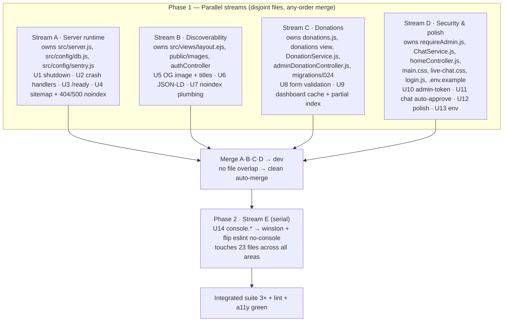

# feat: Parallel hardening & polish (reliability · discoverability · donation flow · security)

**Date:** 2026-06-15 · **Type:** feat · **Depth:** Deep · **Status:** Ready for `ce-work`
**Origin:** Improvement survey (this session's 8-lens grounded sweep) + `docs/ideation/2026-06-14-mvp-remaining-work-ideation.html`. Parallel-stream pattern mirrors `docs/brainstorms/2026-06-15-parallel-code-tasks-requirements.md`.
**Branch base:** `dev`
**Deepened:** 2026-06-15 — an adversarial review pass (architecture · security · data-integrity) corrected U9 (cache targeted the wrong query + a non-existent method), U10 (`requireAdmin.js` is dead code), U11 (impersonation only partly closed), and the graceful-shutdown sequence. See Sources & Research.

---

## Summary

A focused, high-leverage batch of improvements from the survey, structured as **four independent work-streams over disjoint files** so they run concurrently and auto-merge into `dev`, followed by **one serial logging-cleanup pass**. The streams: (A) production-reliability hardening, (B) search/social discoverability, (C) donation-flow protection + perf, (D) security tighten-ups + cheap a11y/UX polish + env completion. Stream E (`console.* → winston`) runs last because it rewrites logging across 23 files and would collide with every stream.

The contended file is `src/server.js` — all edits to it live in Stream A. The other coordination points (`src/views/layout.ejs` → B only; `.env.example` → D only; a shared `res.locals.noindex` convention) are documented so the streams never block each other.

---

## Problem Frame

The site is feature-complete on `dev` (1026 tests green) and most prior-ideation MVP items have shipped. The survey surfaced ~38 remaining opportunities; this plan executes the high-leverage, cleanly-parallelizable subset:

- **Reliability is the biggest real gap.** `src/server.js` registers no signal handlers, so every deploy hard-kills in-flight requests and severs live-chat sockets; `src/config/db.js`'s pool has no `error` listener (an idle-connection drop after a DB failover crashes the web process); there are no `uncaughtException`/`unhandledRejection` handlers, so an escaped rejection exits with nothing in winston or Sentry. `/health` is liveness-only — nothing checks DB/Redis depth.
- **Discoverability has cheap, high-impact gaps.** `sitemap.xml` advertises the member-gated `/archive` (302s crawlers to `/login`) and omits the top conversion page `/donations`; the OG image is the 600×137 logo rendered under `summary_large_image` (broken sliver on every share); there is no JSON-LD structured data; admin/auth pages are indexable.
- **The donation flow is under-protected.** The form is `novalidate` with no submit guard (a bad amount/email bounces donors to a full error page, discarding their input); the dashboard re-decrypts every completed donation on every load with no cache and only single-column indexes.
- **Security tighten-ups + stale config.** `src/middleware/requireAdmin.js` is orphaned dead code (admin pages gate via `requireRbac.requireAnyRole`) that still mints a synthetic admin on a bare `ADMIN_TOKEN` and auto-admins tokenless requests under `NODE_ENV==='test'` — a latent footgun to remove; guest chat auto-approve keys on `display_name` (a guest can post under a previously-approved name — accepted per OQ1), but nothing stops a guest from using a clergy/role name in chat; `.env.example` omits the critical secrets and still ships a Hattiesburg address.

---

## Scope Boundaries

### In scope (this plan)
Streams A–E below: graceful shutdown, pool/process crash handlers, `/ready` deep health, sitemap fix, OG image, JSON-LD, branded titles, `noindex`, donation-form validation, dashboard cache + index, admin-token query removal, chat auto-approve hardening, `homeController` 500 + small a11y/CSS polish, `.env.example` completion, and the `console.* → winston` migration.

### Deferred to Follow-Up Work (known, valuable, out of this batch)
- Member donation-history + receipt re-download page (M; needs a new `byUser` query + view).
- AES-256-CBC → GCM re-encryption of PII (M; needs versioned ciphertext + backfill).
- Bounded/streamed donations CSV export (M; currently truncates silently >10k rows).
- App `Dockerfile` + compose service; announcements archive page; iCal "Add to Calendar"; pagination-helper + `getClientIp` dedupe; failed-email-job dashboard surfacing; backup verify-after-restore; household-modal focus trap.
- `User` account-status column (`is_active`/`deleted_at`) decision — the unsubscribe *token* shipped but no column exists to deactivate against. Either add it or formally close as N/A (see Open Questions).

### Out of scope (gated / non-code)
- **Real PayPal** — intentionally mocked until Board authorization (`PAYMENT_PROVIDER=mock`).
- **Operator-owned launch tasks** — production secret *values*, host/DNS/SSL cutover, SPF/DKIM/DMARC DNS records, cross-browser/mobile QA sweep. (This plan ships the `.env.example` *documentation*, not the secret values.)

---

## Requirements Traceability

| ID | Requirement | Units | Survey lens |
|---|---|---|---|
| R1 | Server survives deploys + downstream failures without dropping work or crashing silently | U1, U2, U3 | ops-reliability |
| R2 | Crawlers/social see correct, complete, non-gated metadata; admin/auth not indexed | U4, U5, U6, U7 | seo-content |
| R3 | Donation flow protects donor input and stops re-decrypting the whole table per load | U8, U9 | accessibility-frontend, performance |
| R4 | Close the admin-token leak and the chat moderation bypass | U10, U11 | security-privacy |
| R5 | Fix the branded-500 gap + AA contrast/focus polish; complete deploy config | U12, U13 | code-quality, a11y, ops |
| R6 | Restore production observability: winston everywhere, lint-enforced | U14 | code-quality (×3 lenses) |

---

## High-Level Technical Design

Parallel-stream layout and merge ordering. Streams A–D touch disjoint files and merge in any order; Stream E is serial-last.

### Conflict map (grounded)

| File | A | B | C | D | E (serial) |
|---|:-:|:-:|:-:|:-:|:-:|
| `src/server.js` | ✓ | | | | ✓ |
| `src/config/db.js` | ✓ | | | | |
| `src/config/sentry.js` | ✓ | | | | |
| `src/views/layout.ejs` | | ✓ | | | |
| `src/routes/pages.js` | | ✓ | | | ✓ |
| `src/controllers/authController.js` | | | | | ✓ |
| `public/images/` | | ✓ | | | |
| `public/js/donations.js` · `src/views/donations/index.ejs` | | | ✓ | | |
| `src/services/DonationService.js` · `migrations/024_*.sql` | | | ✓ | | |
| `src/middleware/requireAdmin.js` (deleted by U10) | | | | ✓ | |
| `src/services/ChatService.js` · `src/services/chatSocketServer.js` | | | | ✓ | |
| `src/views/admin/chat-moderation.ejs` · `public/js/live-chat.js` | | | | ✓ | |
| `src/controllers/homeController.js` | | | | ✓ | ✓ |
| `public/css/main.css` · `public/css/live-chat.css` · `public/js/login.js` | | | | ✓ | |
| `.env.example` · committed `.env` | | | | ✓ | |

The only file two **parallel** streams would touch is `src/server.js` — assigned wholly to Stream A. Stream A reaches the chat layer for shutdown **from `server.js`** (capture the `wss` that `initChatSocketServer` returns, then `server.removeAllListeners('upgrade')` + `wss.close()` + the exported `closeAllConnections()`), so it does **not** edit `chatSocketServer.js` — that file belongs to Stream D's U11 (the WS-upgrade reserved-name gate). Stream E is serial-LAST because it re-touches `server.js`, `authController.js`, `pages.js`, `homeController.js`, `requireRbac.js`, and many others; running it after A–D merge avoids every conflict.

### Shared `noindex` convention (keeps A and B independent)
`src/views/layout.ejs` reads `res.locals.noindex` once (Stream B, U7) and emits `<meta name="robots" content="noindex">` when truthy. Setters: Stream A on the in-`server.js` 404/500 renders **and** for all `/admin/*` pages via a global `res.locals` middleware added beside the existing global setters at `src/server.js:159-186`, keyed on `req.path.startsWith('/admin')` (admin pages gate via `requireRbac.requireAnyRole`, **not** the orphaned `requireAdmin`, so a `server.js` middleware is the only admin injection point that doesn't collide with Stream C's admin controllers); Stream B on auth/account renders (U7). The flag defaults undefined (= indexed), so streams land in any order — a setter before the reader just means the tag isn't emitted yet (fail-open, harmless).

---

## Key Technical Decisions

- **KTD1 — All `src/server.js` edits go in Stream A.** It is the one contended file (reliability + sitemap + 404/500 noindex). Mirrors the proven lesson in `docs/brainstorms/2026-06-15-parallel-code-tasks-requirements.md` (group same-file tasks into one stream).
- **KTD2 — `console.* → winston` is a serial Phase-2 pass (U14), not a parallel stream.** It rewrites logging in 23 files spanning every other stream's territory. Flipping `.eslintrc.json` `no-console` from `off` to `error` lands with it so the violation can't recur.
- **KTD3 — `noindex` is a single `res.locals.noindex` flag** read once in `layout.ejs`; per-route setters keep streams independent (see convention above). Admin `noindex` is set by a global `/admin`-path middleware in `src/server.js` (Stream A) — **not** in `requireAdmin.js` (dead code, KTD4a) or an admin controller (Stream C).
- **KTD4 — Reserved-name protection for live chat (auto-approve behavior unchanged — OQ1).** OQ1 resolved to **keep** the existing guest auto-approve (a guest whose `display_name` had a prior approved message auto-approves), so U11 does **not** change the status matrix. Instead it blocks the clergy/role-impersonation vector: reject guest display names that (case-insensitively) contain role words — "rabbi", "cantor", "admin", "moderator" (OQ5: role words only, no staff personal names) — at **both** the WebSocket **upgrade handler** (`chatSocketServer.js:266-278`, so a guest can't even open a connection or receive the `connection_established` echo under such a name) **and** `ChatService.validateMessage` (the post-time gate covering the REST path), and harden the `user_id`-keyed Guest badge (the queue/viewer UI distinguishes guest from member only by it; `msg.role`-driven "moderator" styling is dead — role isn't in the payload). **Accepted residual (OQ1):** a guest can still post under an arbitrary previously-approved *guest* name.
- **KTD4a — Delete the orphaned `requireAdmin.js` + the `ADMIN_TOKEN` synthetic-admin mechanism.** `src/middleware/requireAdmin.js` is imported by nothing in `src/` — admin routes gate via per-route `requireAdminAccess` arrays (`requireAuth + sessionTimeout + requireRbac.requireAnyRole([ADMIN, RABBI])`). The `?admin_token=` leak it appears to "fix" is unreachable in production; the module's real risk is that it mints a full synthetic admin on a bare header token (no session/jti/audit identity) and auto-admins tokenless requests under `NODE_ENV==='test'`. The honest fix is to **remove the module and the `ADMIN_TOKEN` mechanism entirely** (pre-existing dead code → flagged, not silently dropped; gated by OQ4), not edit a query-string branch that never runs.
- **KTD5 — Cache the donation aggregates via the existing `CacheService` singleton, busting through one centralized helper.** The 30s-polled value is `getMtdTotalCents()` (`DonationService.js:195`, consumed by `adminController.gatherLiveMetrics` → the `metrics.json` poll), **not** `getDashboardMetrics()` (the cold `/admin/donations` page). Cache **both**, under distinct keys (`donations:metrics:mtd`, `donations:metrics:dashboard`), TTL 90s. Invalidate via a single private `bustMetricsCache()` that deletes **both** keys, called from `DonationService.finalize` (the method is `finalize`, `:90` — there is no `finalizeDonation`). **Invariant: cache aggregates only — never cache `listDonations` rows or any decrypted per-donor field**; the metrics returns are scalar totals, so Redis holds no PII. `migrations/004` sets `status DEFAULT 'completed'`, so any future completed-insert/refund path that bypasses `finalize` must also call `bustMetricsCache()`.
- **KTD6 — Migration 024 (optional) adds `idx_donations_completed_created_at` as a non-`CONCURRENT` `CREATE INDEX IF NOT EXISTS`.** `scripts/migrate.js` wraps each file in one `BEGIN/COMMIT` (confirmed `:101-104`), and `CREATE INDEX CONCURRENTLY` is illegal inside a transaction; the `donations` table is small, so the brief lock is fine. The partial index `donations(created_at) WHERE status='completed'` serves the **MTD range query only**, not the all-time dashboard scan (predicate matches the whole partial set → seq-scan+sort; that page is sped up by the cache). **Note `idx_donations_created_at(created_at DESC)` already exists** (`migrations/004:26`) and can already satisfy the range bound, so `024` is a *more-selective* partial index — **include only if an `EXPLAIN` on seeded data shows the existing index isn't chosen**; otherwise the cache is the real fix and `024` can be dropped.
- **KTD7 — Graceful-shutdown sequence (drain-first), orchestrated from `server.js`:** capture the `wss` returned by `initChatSocketServer(server)` (currently discarded at `:297-298`). On shutdown: `server.close()` and **await its drain callback** (in-flight requests finish on keep-alive connections) → **`server.removeAllListeners('upgrade')` + `wss.close()`** (stop new upgrades — today nothing closes `wss`, so a post-`server.close` upgrade can still `db.query` after the pool ends and `wss` leaks a handle) → `closeAllConnections()` (existing export, closes live client sockets) → **only then** `db.pool.end()` → `redis.quit()` → worker `stop()`. Doing this from `server.js` (not editing `chatSocketServer.js`) keeps that file free for Stream D's U11. The sequence races a hard-timeout `process.exit` fallback (~10s); the routine is an **exported, directly-callable function** so U1's test invokes it without signal registration (handlers register **only outside** `NODE_ENV==='test'`).
- **KTD7a — Capture the worker stop handles.** `startEmailQueueWorker()` returns `{ stop }` and `startReminderWorker()` returns `{ stop, queue }` (destructure just `{ stop }`), but `src/server.js:34-40` discards them. U1 must retain both at module scope to call `stop()` during shutdown; both are absent under `NODE_ENV==='test'` (workers aren't started), so shutdown must no-op on `undefined`.
- **KTD8 — Process crash handlers are timeout-first, non-re-entrant, and report through the sentry wrapper.** `src/config/sentry.js` exports `{ initSentry, attachErrorHandler, isEnabled }` but no capture helper — add a `captureException(err)` passthrough (no-op when disabled) so `uncaughtException`/`unhandledRejection` stay observable without importing `@sentry/node` directly and stay test-safe. The `uncaughtException` path must **arm a non-`unref` force-`process.exit(1)` *before* invoking the shared shutdown** (post-crash, the shutdown itself may throw) and must distinguish "duplicate signal" (ignore) from "shutdown failing" (force-exit) so U1's idempotency guard can't latch the process into a hung half-dead state. Exit codes: `0` for SIGTERM/SIGINT, `1` for `uncaughtException`.
- **KTD9 — JSON-LD ships as `` (`<%-` unescaped; data is server-built, not user input) — see KTD9.
- **Execution note:** add a CSP-compliance assertion to the test (the project has a CSP-view-compliance suite — extend it).
- **Patterns to follow:** the optional-locals pattern in `layout.ejs`; the existing CSP-view-compliance tests.
- **Test scenarios:**
  - Happy path: home renders the sitewide `application/ld+json` block, which `JSON.parse`s to a `PlaceOfWorship` with the temple name + address.
  - Integration: the calendar page renders **two** JSON-LD blocks — the sitewide `PlaceOfWorship` and the page `Event` (seeded); the watch page renders the sitewide block + a `VideoObject`.
  - CSP: the rendered page passes the CSP-view-compliance check (no inline executable script flagged).
  - Edge: a page with no `jsonLd` local renders only the sitewide block (no empty second block).
- **Verification:** Google Rich Results test (or schema validator) accepts the output; CSP suite green.

#### U7. `noindex` plumbing + auth/account pages
- **Goal:** Establish the `noindex` layout contract and apply it to login/register/account pages.
- **Requirements:** R2.
- **Dependencies:** none (defines the convention KTD3; A-U4 and D-U10 are independent setters).
- **Files:** `src/views/layout.ejs` (emit `<meta name="robots" content="noindex">` when the `noindex` local is truthy), `src/routes/pages.js` (the auth/account GET renders — `/login`, `/register`, `/auth/request-password-reset`, `/auth/reset-password`, `/account/*` — pass `noindex: true`). **Note `authController.js` is JSON-only and renders no pages** — the page renders live in `pages.js`. Test: `__tests__/integration/noindex.test.js`.
- **Approach:** One conditional `<meta>` in the head reading the `noindex` **top-level render local** (passed in `res.render('layout', {...})`, like `title`); the auth/account routes in `pages.js` pass `noindex: true`. Default-undefined = indexed.
- **Test scenarios:**
  - Login/register/password-reset pages render the `noindex` meta.
  - A normal public page (home/about) does **not** render it.
- **Verification:** view tests assert presence/absence per route.

---

### Stream C — Donation flow (owns `public/js/donations.js`, `src/views/donations/index.ejs`, `src/services/DonationService.js`, `src/controllers/adminDonationController.js`, `migrations/024_*.sql`)

#### U8. Donation-form client-side validation
- **Goal:** Catch an empty/invalid amount or bad email before submit, preserving donor input instead of bouncing to a full error page.
- **Requirements:** R3.
- **Dependencies:** none.
- **Files:** `public/js/donations.js` (add a `submit` handler), `src/views/donations/index.ejs` (the `novalidate` form at `:5`, custom-amount input at `:18`, hidden `amount_cents` at `:20`; add an `aria-live` error region). Test: `__tests__/views/donations.accessibility.test.js` (extend) + a DOM-logic unit test if the project tests `public/js`.
- **Approach:** On submit, validate that `amount_cents` is a positive integer (custom amount ≥ $1) and the email (if present) is well-formed; on failure, `preventDefault`, show an inline message in the `aria-live` region, and move focus to the first invalid field. Mirror the existing `public/js/contact-form.js` pattern. Server-side validation in `src/controllers/donationController.js:38-50` stays authoritative (defense in depth).
- **Execution note:** test-first for the validation predicate (pure function over amount/email).
- **Patterns to follow:** `public/js/contact-form.js` (inline error + focus); the amount-sync logic already in `donations.js`.
- **Test scenarios:**
  - Happy path: valid preset amount submits normally.
  - Edge: custom amount empty or `0`/negative → blocked, inline error, focus on the custom-amount field, form not submitted.
  - Edge: malformed email → blocked with a field-specific message.
  - A11y: the error region is `aria-live` and focus moves to the offending field (screen-reader + keyboard path).
- **Verification:** jest-axe passes on the donations view; manual: a bad amount no longer navigates away.

#### U9. Dashboard metrics cache + partial index
- **Goal:** Stop re-SELECTing and AES-decrypting completed donations on every dashboard load **and** every 30s poll, and index the MTD query.
- **Requirements:** R3.
- **Dependencies:** none.
- **Files:** `src/services/DonationService.js` (`getMtdTotalCents` `:195` — the 30s-polled value; `getDashboardMetrics` `:140-187` — the cold page; `finalize` `:90`; add a private `bustMetricsCache()`), `migrations/024_add_donations_completed_created_at_index.sql` (new). Test: `__tests__/unit/donationServiceCache.test.js`. (No controller edit — caching is internal to the service.)
- **Approach:** Cache **both** aggregate paths under distinct keys — `donations:metrics:mtd` (the hot poll, via `adminController.gatherLiveMetrics`) and `donations:metrics:dashboard` (the cold `/admin/donations` page) — TTL 90s. Add `bustMetricsCache()` that `del`s **both** keys, called from `finalize` (KTD5 — the method is `finalize`, not `finalizeDonation`). Add the partial index `idx_donations_completed_created_at` on `donations(created_at) WHERE status='completed'` (KTD6 — non-CONCURRENT, idempotent `IF NOT EXISTS`); it serves the **MTD range query only**. **Invariant:** cache scalar aggregates only — never the decrypted donor rows from `listDonations`.
- **Execution note:** test-first for the bust-on-finalize behavior across **both** keys (db + `CacheService` mocked).
- **Patterns to follow:** `CacheService` usage in `src/controllers/pageController.js` and `src/services/StreamingService.js`; `acquireLock` (`CacheService.js:65`) only if single-flight is adopted; `CREATE INDEX IF NOT EXISTS` style from `migrations/004`/`013`.
- **Test scenarios:**
  - Happy path: a second `getMtdTotalCents` within TTL returns cached data without a second DB decrypt (assert query called once); same for `getDashboardMetrics`.
  - Integration (the real user-visible bug): finalizing a donation busts **both** keys, so the next polled `metrics.json` reflects the new donation, not a stale tile (assert both `del`s + a fresh MTD value).
  - Edge: a Redis/cache error degrades to a live DB read (no throw) — `CacheService.get` swallows + returns `null`; assert metrics still return.
  - Invariant: the JSON written to Redis contains no `@`-bearing / email-shaped field (locks in aggregates-only, no PII at rest).
  - Invariant: `listDonations` never writes to `CacheService` (mock `CacheService.set`, assert not called) — and its `toCsv` formula-injection escaping (`/^[=+\-@]/`) is preserved through the refactor.
  - Migration (if `024` is included): applying it is idempotent (re-run no-ops) and the index exists and is valid.
- **Verification:** unit tests green; if `024` ships, an `EXPLAIN` of the MTD query on a **seeded** `donations` table prefers the completed-only partial index over the existing `idx_donations_created_at` (on a near-empty table the planner picks seq-scan — seed rows, or drop `024` per KTD6).
- **Note (forward-looking):** a future refund/void or back-office cash-entry path (the schema's `'refunded'` status has no code today; `status DEFAULT 'completed'` lets an insert skip `finalize`) must also call `bustMetricsCache()`. Stampede: two cold-key loads both decrypt the full table — tolerable at current volume; adopt `acquireLock` single-flight only if it bites.

---

### Stream D — Security, polish & config (owns `src/middleware/requireAdmin.js`, `src/services/ChatService.js`, `src/controllers/homeController.js`, `public/css/main.css`, `public/css/live-chat.css`, `public/js/login.js`, `.env.example`)

#### U10. Delete the orphaned `requireAdmin.js` + `ADMIN_TOKEN` mechanism
- **Goal:** Remove dead, latent-footgun middleware rather than cosmetically editing an unreachable code path. (Admin `noindex` moved to U4; the admin-token query "leak" is unreachable in production — KTD4a.)
- **Requirements:** R4.
- **Dependencies:** none. **Gated by OQ4.**
- **Files:** delete `src/middleware/requireAdmin.js` and its test `__tests__/middleware/requireAdmin.test.js`. Also strip `ADMIN_TOKEN` from the **committed `.env`** (CLAUDE.md notes a `.env` is checked in) so no orphaned knob remains for a future hand to re-wire. Update the `.env.example` `ADMIN_TOKEN` note in U13.
- **Approach:** Confirm `grep -rn "requireAdmin" src/` returns no production importer (admin routes use `requireAdminAccess` = `requireAuth + sessionTimeout + requireRbac.requireAnyRole([ADMIN, RABBI])`). Delete the module + its test — this removes the synthetic-admin-on-bare-token and the test-mode auto-admin. No behavior change to real admin pages (they never used it).
- **Execution note:** verification-first — the deciding check is the grep proving zero importers; if any exists, STOP and re-scope (the module is live somewhere unexpected).
- **Test scenarios:** `Test expectation: none beyond the importer grep` — deletion of dead code; the existing `requireRbac` admin suite is the regression guard that real admin gating is unaffected.
- **Verification:** `grep -rn "requireAdmin\b" src/` clean; full admin RBAC suite still green.

#### U11. Reserved-name protection for live chat
- **Goal:** Block clergy/role-name impersonation in live chat. OQ1 resolved to **keep** the existing guest auto-approve, so the status matrix is unchanged — this unit adds reserved-name rejection + Guest-badge hardening only.
- **Requirements:** R4.
- **Dependencies:** none. (OQ1 = keep auto-approve; OQ5 = role words only.)
- **Files:** `src/services/ChatService.js` (reserved-name check + helper in `validateMessage` `:13` — **not** the `createMessage` status logic); `src/services/chatSocketServer.js` (same reject at the **upgrade handler** `:266-278`, beside the existing guest-name length check); `src/views/admin/chat-moderation.ejs` + `public/js/live-chat.js` (make the `user_id`-keyed "Guest" badge prominent/non-suppressible). Test: `__tests__/unit/chatService.test.js`, a chatSocketServer upgrade test, a moderation-view render test.
- **Approach (OQ1/OQ5 resolved):** (1) Reject guest display names that (case-insensitively) contain role words — "rabbi", "cantor", "admin", "moderator" (OQ5: role words only, no staff personal names) — at **both** the WS upgrade handler (`chatSocketServer.js`, so a guest can't open a connection or receive the `connection_established` echo under such a name) **and** `validateMessage` (`ChatService.js`, REST path). (2) Harden the Guest badge so an approved guest message is unmistakably guest (note `msg.role`-driven "moderator" styling is dead — role isn't in the payload). **Do not change the auto-approve status matrix** (OQ1).
- **Execution note:** test-first — assert the reserved-name rejection before adding it.
- **Test scenarios:**
  - Security: a guest connecting via WS with a `guestName` containing a role word is rejected at the **upgrade handler** (401/400) and never receives `connection_established`; the same name via REST is rejected at `validateMessage`.
  - Regression: an ordinary guest name behaves exactly as today (auto-approves if it has prior approved history — OQ1 unchanged); a registered member (`userId` set) is unaffected.
  - Badge: an approved guest message renders the Guest badge and **without** "moderator" styling.
- **Verification:** unit + render tests green; manual: a guest can't use a clergy/role name; ordinary guest behavior is unchanged.
- **Accepted residual (OQ1):** a guest can still post under an arbitrary previously-approved *guest* name (general bypass) — accepted; reserved names close the clergy/role-impersonation vector specifically.

#### U12. `homeController` branded 500 + a11y/CSS polish
- **Goal:** The highest-traffic route fails into the branded error view, and three quick AA/UX nits are fixed.
- **Requirements:** R5.
- **Dependencies:** none.
- **Files:** `src/controllers/homeController.js` (`:100-101` plain-text `send('Internal Server Error')` + `console.error`), `public/css/main.css` (add `.nav-donate` rule near `.nav-login` at `:264`), `public/css/live-chat.css` (`.message-time` `#9ca3af` → `#6b7280` at `:180`), `public/js/login.js` (move focus to the error region at `:21/:30/:58`). Test: extend relevant view/a11y tests.
- **Approach:** Replace the home 500 with `res.status(500).render('error', { title, message })` + `logger.error` (matches `src/server.js:285`). Add a gold `.nav-donate` CTA rule mirroring `.nav-login` (`:264-273`) — the `.nav-donate` class **already exists** in `layout.ejs:74` on `dev` (independent of any stream), so only the CSS rule is missing; no cross-stream dependency. Darken the chat timestamp to the `#6b7280` already used in the same file. On login failure, add `tabindex="-1"` + `.focus()` to the aria-live region (mirror `public/js/contact-form.js`). (Note: the `homeController` `console.error` here is also swept in U14 — fixing the 500 render incidentally removes it; no conflict since U14 is serial-after.)
- **Test scenarios:**
  - Home controller error path renders the branded `error` view with a message (not plain text).
  - A11y: `.message-time` contrast ≥ 4.5:1; login error moves focus to the live region.
  - Visual: `.nav-donate` renders as a styled CTA (manual screenshot).
- **Verification:** jest-axe + view tests green; manual screenshot of the nav CTA.

#### U13. `.env.example` completion + address fix
- **Goal:** Make `.env.example` a reliable deploy reference — document the missing critical vars and fix the stale Hattiesburg address.
- **Requirements:** R5.
- **Dependencies:** none.
- **Files:** `.env.example`.
- **Approach:** Add documented entries (commented, with guidance, no secret values) for the vars present in code but absent from the file: `JWT_SECRET` (required outside test), `DATABASE_URL`, `REDIS_URL`, `SMTP_HOST/PORT/SECURE/USER/PASS/FROM`, `CAPTCHA_SECRET/SITE_KEY`, `CONTACT_EMAIL`, `ADMIN_EMAIL`, `RABBI_EMAIL`, `APP_URL`, `APP_BASE_URL`, `UNSUBSCRIBE_TOKEN_SECRET`, `EMAIL_WORKER_ENABLED`, `REMINDER_WORKER_ENABLED`, `FACEBOOK_LIVE_EMBED_URL/WATCH_URL/TITLE/IS_ACTIVE/SCHEDULED_START`, `STREAM_PROVIDER_UNAVAILABLE`, `BACKUP_LOG_FILE`. Since U10 deletes the `ADMIN_TOKEN` mechanism, **omit `ADMIN_TOKEN`** (from both `.env.example` and the committed `.env`) so no dead gate can be re-enabled. Fix `TEMPLE_ADDRESS` example `5371 U.S. 49, Hattiesburg, MS 39401` → the real Florence, AL address. **Document only vars actually read** — grep the whole repo (`src/` + `scripts/` + root config), not just `src/`, before listing a key (e.g. confirm where `ADMIN_EMAIL`/`RABBI_EMAIL` are read, which may be outside `src/`).
- **Dependencies:** lands after U10 within Stream D (so the `ADMIN_TOKEN` removal is settled).
- **Execution note:** none — config/docs. `Test expectation: none — documentation-only file, not loaded by the suite.`
- **Patterns to follow:** the existing commented, well-annotated style already in `.env.example` (e.g., the `SITE_URL`/`ENCRYPTION_KEY` blocks).
- **Verification:** every distinct `process.env.*` key read across the repo is represented or intentionally noted; no Hattiesburg string remains; `ADMIN_TOKEN` gone from both env files.

---

### Stream E — Logging cleanup (serial, after A–D merge)

#### U14. `console.* → winston` migration + enforce `no-console`
- **Goal:** Restore production observability (rotation + Sentry) and prevent regression by enforcing the documented hard rule.
- **Requirements:** R6.
- **Dependencies:** **All of A–D merged to `dev` first** (this re-touches `server.js`, `authController.js`, `requireAdmin.js`, `homeController.js`, and others).
- **Files:** the 23 files under `src/` containing `console.*` (controllers, middleware `requireAuth/requireRbac/sessionTimeout`, routes, services), and `.eslintrc.json` (`no-console` at `:13`).
- **Approach:** Replace each `console.log/error/warn/info/debug` with the matching `logger` level via `src/utils/logger.js`; pass error objects as winston metadata (not string-concatenated, so stack traces reach Sentry). Land as **two commits**: (1) the 23-file rewrite — verify `grep -rE "console\.(log|error|warn|info|debug)" src/` is clean and the suite is green — then (2) flip `.eslintrc.json` `"no-console": "off"` → `"error"`, so a missed file surfaces as an isolated lint failure rather than entangled with the rewrite. Worst offenders to verify (they leak user emails / full error objects): `src/middleware/requireAuth.js`, `src/middleware/requireRbac.js`, `src/middleware/sessionTimeout.js`, `src/controllers/userController.js`, `src/controllers/authController.js`.
- **Execution note:** mechanical refactor — rely on the existing suite as the regression guard; no new behavior.
- **Test scenarios:** `Test expectation: none (behavior-preserving)` — but `npm run lint` must pass with the rule at `error` (proves zero `console.*` remain in `src/`), and the full suite stays green.
- **Verification:** `grep -rE "console\.(log|error|warn|info|debug)" src/` returns nothing; `npm run lint` green with `no-console: error`; full suite green.

---

## Cross-Cutting Verification Discipline

Carried from `docs/brainstorms/2026-06-15-parallel-code-tasks-requirements.md` (lessons from the prior parallel run):

- **Each stream:** its own `npx jest` (touched paths) + `npm run lint` green before reporting; TDD on behavior-bearing units (U1, U8, U9, U11).
- **Any new integration test that boots `src/server.js` MUST mock `src/config/redis`** — an unmocked client's late `connect` log failed an unrelated suite last time.
- **No wall-clock / time-boundary assertions** (the off-by-1ms flake) — relevant to U9's MTD boundary logic.
- **Shutdown/handler tests must not leak open handles** — run `npm run test:leaks` on U1/U2.
- **Orchestrator:** after A–D merge and again after E, run the **full suite 3× + `npm run lint` + `npm run test:a11y`** before finalizing. Individual-stream green is necessary but not sufficient.

---

## Risks & Dependencies

| Risk | Likelihood | Mitigation |
|---|---|---|
| Graceful shutdown hangs a deploy (a close never resolves) | Med | Hard timeout fallback → `process.exit` (KTD7); leak test on U1 |
| In-flight WS upgrade completes after `server.close` and queries an ended pool | Med | KTD7 — `closeServer()` detaches the upgrade listener + `wss.close()` before `pool.end()`; drain-await before pool end |
| Crash-path shutdown re-enters and hangs the process | Med | KTD8 — timeout-first force-`exit(1)`; guard distinguishes duplicate-signal from shutdown-failure |
| JSON-LD trips the strict CSP unexpectedly | Low | KTD9 — `application/ld+json` is data; U6 test asserts CSP compliance |
| Guest posts under an arbitrary previously-approved guest name | Low (accepted, OQ1) | Reserved-name reject (U11) blocks clergy/role names; general case accepted |
| Clergy-name impersonation (post-time, or holding a WS connection under the name) | Med | KTD4 — reserved-name reject at **both** the WS upgrade handler and `validateMessage` (U11) + Guest-badge hardening |
| Crash report leaks donor PII to Sentry (error thrown in a decrypt path) | Med | KTD8/U2 — `beforeSend` scrub of email-shaped strings; aggregates-only cache invariant (U9) |
| Metrics cache goes stale via a completed-write that bypasses `finalize` | Low | KTD5 — single `bustMetricsCache()`; `DEFAULT 'completed'`/refund paths flagged in U9 note |
| Migration 024 fails (CONCURRENTLY in a txn) | Low | KTD6 — non-concurrent `IF NOT EXISTS`; runner wraps in one txn |
| `noindex` setter lands before layout reader | Low | Fail-open convention (KTD3) — meta simply not emitted until U7 lands |
| Stream E conflicts if run too early | Med | Hard dependency: E starts only after A–D merge (sequencing in HTD) |

---

## Open Questions

- **OQ1 (U11) — RESOLVED 2026-06-15: NO.** Keep the existing guest auto-approve (a guest whose `display_name` had a prior approved message still auto-approves). U11 ships reserved-name protection + Guest-badge hardening only; the arbitrary-previously-approved-name bypass is accepted.
- **OQ4 (U10) — RESOLVED 2026-06-15: YES.** Delete `src/middleware/requireAdmin.js` + its test + the `ADMIN_TOKEN` mechanism (also strip `ADMIN_TOKEN` from the committed `.env`).
- **OQ5 (U11) — RESOLVED 2026-06-15: role words only.** Block guest names containing "rabbi"/"cantor"/"admin"/"moderator" (case-insensitive); no staff personal names.
- **OQ2 (execution-time, U5):** Crop region for the 1200×630 OG image from `temple-building.jpg`. Default: center-weighted on the building façade.
- **OQ3 (out of scope, noted):** The `User` account-status column (`is_active`/`deleted_at`) — add it (enables deactivation + email-fanout filtering) or formally close as N/A. Not in this batch; surfaced so it stops recurring on audits.

---

## Sources & Research

- **This session's improvement survey** — 8-lens grounded sweep (security, performance, a11y, code-quality, product/UX, ops, SEO, prior-ideation reconcile); 59 findings with `file:line` evidence. Primary input.
- **Direct re-verification this run** (line numbers confirmed): `src/server.js` (sitemap `:244-254`, health `:232`, error handler `:285`, listen `:293`), `src/config/db.js` (pool `:11`, exports `:17`), `src/config/redis.js` (error listener `:54`), `src/config/sentry.js` (exports `:53`), `src/services/chatSocketServer.js` (`closeAllConnections` `:418/:437`), `src/services/ChatService.js` (`:56-91`), `src/views/layout.ejs` (`ogImage` `:16`, OG block `:27-39`), `src/services/DonationService.js` (`:140-199`), `public/js/donations.js`, `src/views/donations/index.ejs:5`, `src/middleware/requireAdmin.js:10`, `.eslintrc.json:13`, `.env.example` (vs 46 `process.env` keys), `src/services/CacheService.js` API.
- **Corrections to stale survey/ideation claims:** `.env.example` is already partially expanded (not bare); `closeAllConnections()` lives in `chatSocketServer.js`, not server shutdown; `db.js` exposes `pool` (no close helper); `sentry.js` has no `captureException` (must be added); the `CacheService` "duplicate" is a case-insensitive-FS artifact (git tracks one file).
- **Deepening pass (2026-06-15) — adversarial review corrected the plan itself:** (architecture) `requireAdmin.js` is orphaned dead code — admin pages gate via `requireRbac.requireAnyRole`, so U10 became a deletion and admin-`noindex` moved to a `server.js` middleware (U4); the shutdown sequence gained `closeServer()` (detach `upgrade` + `wss.close`), drain-before-`pool.end`, captured worker handles (KTD7/7a), and a timeout-first non-re-entrant crash path (KTD8). (data-integrity) U9 was caching the cold page, not the 30s-polled `getMtdTotalCents`, called a non-existent `finalizeDonation`, and over-claimed the index — rewritten to cache both aggregates via `bustMetricsCache()` and scope the index to the MTD query. (security) U11 gained reserved-name protection because binding auto-approve to `user_id` closes only the *unmoderated* impersonation path; the moderated clergy-name path survives without it.
- **Document-review pass (2026-06-15) — coherence/feasibility/scope/security:** corrected U7 (auth/account pages render in `src/routes/pages.js`, not the JSON-only `authController.js`); resolved the `chatSocketServer.js` Stream A↔D contention (A orchestrates shutdown from `server.js` via the returned `wss` + `removeAllListeners('upgrade')` + exported `closeAllConnections`, leaving the file to D's U11); added a WS-upgrade reserved-name gate (a guest could otherwise hold a connection + screenshot `connection_established` under a clergy name) and a Sentry `beforeSend` PII scrub (crash handlers now forward errors that may carry decrypted donor emails); noted `idx_donations_created_at` already exists so migration `024` is optional; and pinned `jsonLd`/`noindex` as top-level layout render locals (not `viewData`).
- **Pattern reference:** `docs/brainstorms/2026-06-15-parallel-code-tasks-requirements.md` — conflict-map + grouped-stream approach and the integration-test lessons.
- **External (settled, not researched):** schema.org `PlaceOfWorship`/`Event`/`VideoObject` shapes for U6; CSP treatment of `<script type="application/ld+json">` as non-executable data.
