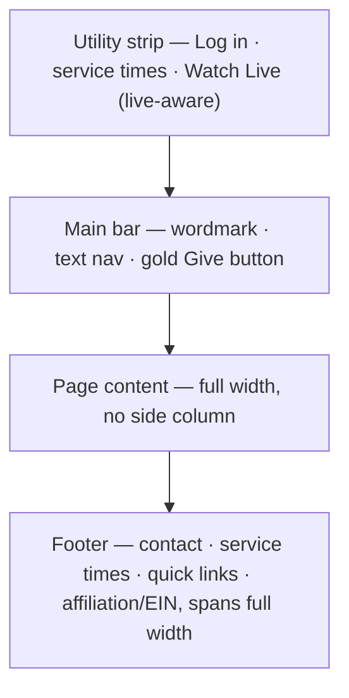

# Global Chrome & Top Nav - Plan

## Goal Capsule

- **Objective:** Replace the desktop left-sidebar navigation with a two-tier top navigation bar and a richer full-width footer — a clean, modern global chrome that looks intentional on desktop, tablet, and mobile and eliminates the sidebar-induced layout-bug cluster.
- **Product authority:** Direction chosen by the site owner (2026-07-01) from three rendered mockups: the "two-tier congregation bar" in docs/design/2026-07-01-global-chrome-mockups.html. Identity stays the established navy/gold palette with serif wordmark and sans nav, per docs/plans/2026-06-14-006-feat-visual-foundation-plan.md.
- **Open blockers:**
  - Stakeholder sign-off — the left sidebar shipped days ago on stakeholder direction; reverting it needs an explicit product OK before merge, not a silent change.
  - Footer content values — phone, email, denomination/affiliation, and the 501(c)(3) EIN are not in the repo; owner supplies them. Placeholders unblock layout work; real values gate final copy.

---

## Product Contract

### Summary

Replace the desktop left-sidebar nav with a two-tier top bar — a thin utility strip (log in, this week's service times, a live-aware Watch link) over a main bar (serif wordmark, sans text nav, one gold Give button) — and rebuild the footer as a full-width multi-column band. The pattern is the researched congregation-site standard (Central Synagogue, B'nai Jeshurun) and runs on data the site already has.

### Problem Frame

A live UI pass traced five desktop defects to the persistent left sidebar shipped in commit `3fef52a`: a white dead zone at bottom-left on long pages, the sidebar overrunning the footer on short pages, an L-shaped page edge where the footer starts at x≈240, no active-page indicator on desktop (mobile has one), and Donate/Login/Logout rendered as arbitrary outlined boxes. The symptoms share one root: a fixed side column fighting the footer and page height for space. Patching them individually cannot resolve that structural conflict, and the chrome is the first thing every visitor sees on every page.

### Key Decisions

- **Two-tier bar over single-row or hero-band variants.** Owner picked the two-tier direction from three mockups; the utility strip earns its height by surfacing service times and the livestream — the two things a congregation visitor most often comes for.
- **Wire, don't build.** The live cue reads the existing admin-asserted, time-bounded stream status in `src/services/streamingService.js`; service times derive from the existing `EventService.getNextService()`. No new liveness or scheduling mechanism.
- **One gold action.** Donate/Give is the only filled button in the chrome; everything else is a plain text link. Gold is used only as a fill, an underline, or on navy — gold text on white fails WCAG AA.
- **Nav item set unchanged.** Home · Calendar · Watch · About · Contact · Donate, plus the existing authed items (Directory, Account, Admin, Logout) and Login for guests.

### Requirements

**Top bar**

- R1. The desktop/tablet chrome renders as a two-tier top bar: a thin navy utility strip (log in link, this week's service times, Watch link) above a main bar with the wordmark/logo left, sans-face text nav, and a single gold Give button right.
- R2. When a stream is live per the existing time-bounded status in `src/services/streamingService.js`, the utility strip's Watch link shows a live indicator; otherwise it renders as a plain Watch link.
- R3. Service times in the utility strip derive from existing event data (`EventService.getNextService()` or upcoming `service` events), and the strip omits them gracefully when none resolve.
- R4. The current page's nav item is visibly marked (gold underline or heavier weight), server-rendered from the existing `activePath` / `aria-current="page"` hook.
- R5. Donate/Give is the only filled button in the chrome; Login/Logout and all other items render as plain text links.

**Footer**

- R6. The footer spans the full page width and renders as a multi-column band (contact/address, service times, quick links, affiliation + 501(c)(3)/EIN) that stacks to one column on mobile.

**Responsive & accessibility**

- R7. The chrome renders unbroken at desktop, tablet (~768px), and mobile (~390px); on mobile the logo and Give button stay visible outside the hamburger, and the nav plus utility-strip items collapse into the existing hamburger menu.
- R8. Accessibility is preserved or improved: skip link, real `<button>` hamburger with `aria-label`/`aria-expanded`, `aria-current="page"`, visible focus states, adequate tap targets, and WCAG AA contrast on every gold pairing.
- R9. The implementation stays within the strict-CSP constraints: server-rendered EJS partials plus CSS in `public/`, no inline scripts or styles, `public/js/hamburger.js` remains progressive enhancement.

### Acceptance Examples

- AE1. **Covers R2.** Given an admin took a stream live 1 hour ago (within the auto-expiry window), when any public page renders, then the utility strip shows a live indicator linking to /watch.
- AE2. **Covers R2.** Given no stream is live (or an `active` stream is past its expiry window), when a page renders, then the strip shows a plain Watch link and no live indicator.
- AE3. **Covers R3.** Given no upcoming `service` event exists, when a page renders, then the utility strip shows no times — no placeholder or empty label.
- AE4. **Covers R6, R7.** Given a short page (e.g., the donation checkout), when rendered at 1440px, then the footer sits at the bottom spanning the full width with no dead zone or side-column overrun.

### Success Criteria

- All five sidebar-cluster symptoms are gone: no dead zone, no footer overrun, no L-shaped edge, a visible desktop active indicator, no arbitrary CTA boxes.
- Existing nav/layout tests stay green; new tests cover active-state rendering and the live-indicator conditional.
- The chrome reads as one coherent design at all three breakpoints in a fresh screenshot pass.

### Scope Boundaries

- Out: the reusable EJS component kit and semantic action-color contract (ideation I15) — this change removes the boxed-CTA arbitrariness but does not build the shared kit.
- Out: a homepage hero / welcome band (the third mockup direction) — a separate item if wanted later.
- Out: nav information-architecture changes — the item set stays as-is.
- Out: per-page content fixes tracked separately (donation form I10, mobile calendar grid I4).

### Dependencies / Assumptions

- Nav items and routes are unchanged; only presentation, the utility strip, and the footer change.
- Service times are derivable from existing events; if the owner prefers fixed weekly times, that becomes a small config decision at planning (see Outstanding Questions).
- `public/images/tbi-logo.png` (referenced as `/images/tbi-logo.png`) remains the wordmark asset; no new logo work.

### Outstanding Questions

**Deferred to planning**

- Service-times source: derive from the next `service` event (default) vs a small static weekly-times config.
- Sticky behavior: sticky main bar with shadow-on-scroll (default, research-recommended) vs fully static; utility strip scrolls away either way.

### Sources / Research

- docs/ideation/2026-07-01-full-project-review-ideation.html — idea I9 and the live-UI evidence behind the five defects.
- docs/design/2026-07-01-global-chrome-mockups.html — the three rendered directions; owner chose "two-tier congregation bar".
- docs/plans/2026-06-14-006-feat-visual-foundation-plan.md — established navy/gold + serif/sans identity this chrome must stay consistent with.
- Pattern references: Central Synagogue (two-tier nav, utility strip, top-right Give), B'nai Jeshurun (live-now indicator, 501(c)(3)/EIN footer line); responsive breakpoints ~768/1024px per common practice.
- Current implementation: nav markup inline in `src/views/layout.ejs`; sidebar behavior in the `@media (min-width: 768px)` block of `public/css/main.css` (~354-401) plus `.app-shell`/`.app-main` base scaffolding outside the block (~344-350) that commit `3fef52a` also added — both must be unwound together; globals via `res.locals` in `src/server.js` (185, 199).
