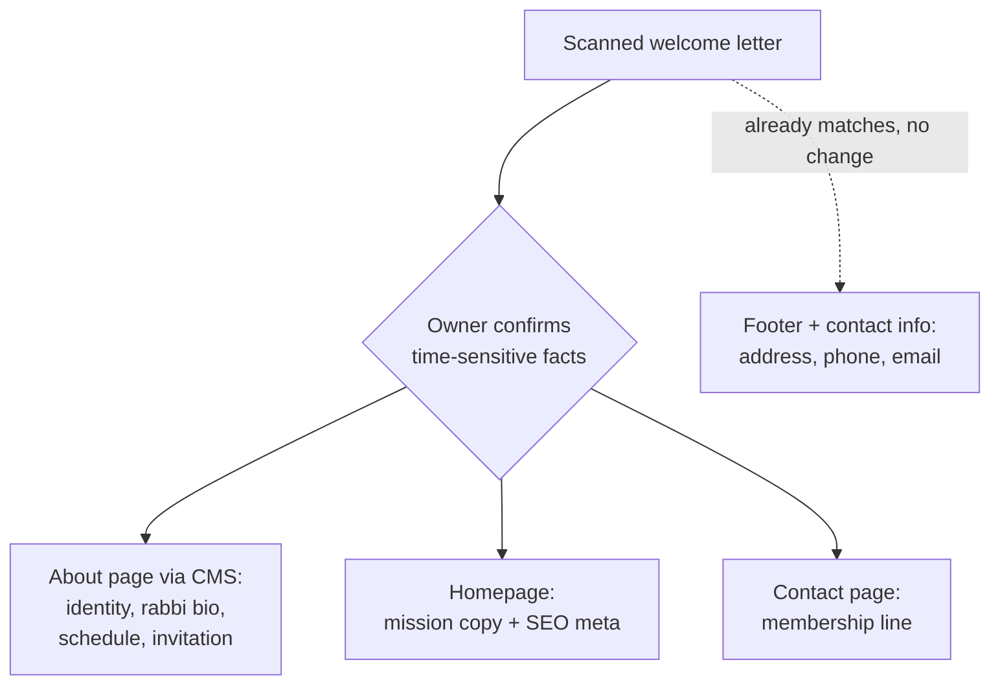
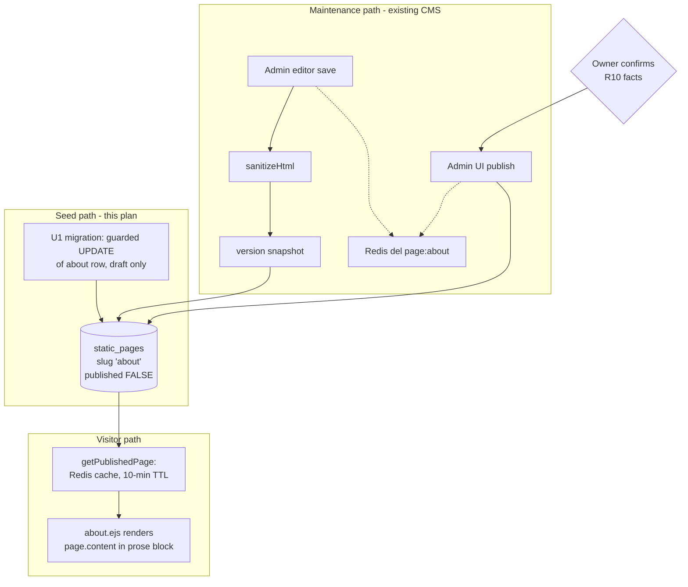

# Temple Description Content Integration - Plan

## Goal Capsule

- **Objective:** Publish the About page and enrich site-wide identity copy using the content of the congregation's scanned welcome letter (transcribed in Appendix A).
- **Authority:** This document's Product Contract, then `_bmad-output/planning-artifacts/epics.md` Story 1.3 acceptance criteria, then `AGENTS.md` hard rules (SSR EJS MPA, strict CSP, no new frontend tooling, migrations append-only).
- **Execution profile:** Six small units on one branch — one data migration, three small code/copy edits, one permission grant, one client-toolbar trim.
- **Stop conditions:** Publishing the About page is owner-gated and is NOT executed as part of this plan — stop after all units are verified and the publish runbook (Operational Notes) is in place. Surface a blocker instead of guessing if any change would alter product scope (R-IDs) or CSP/test-mode invariants.

---

## Product Contract

### Summary

Turn the scanned welcome letter into live site content: rewrite and publish the draft About page through the existing pages CMS — congregation identity, Rabbi Tunick bio, worship schedule, and membership invitation — and thread the letter's identity facts into the homepage mission copy, SEO metadata, and the contact page. Every letter-derived fact that can go stale passes an owner-confirmation check before it goes public.

### Problem Frame

The site has almost no real content about who the congregation is. The About page exists only as an unpublished placeholder draft with generic mission boilerplate, so `/about` — the target of the homepage's "New Here? Learn More" call to action and an unconditional main-nav link — returns 404. Story 1.3's acceptance criteria require a welcome message, core values and mission, and "information about the Rabbi and community leadership"; none of that exists anywhere in the codebase (no mention of Rabbi Tunick, the Shoals community, or the congregation's 100-year history). The homepage mission statement and SEO description are generic ("a warm, inclusive Jewish community") and name no denomination or regional identity, which weakens local search for the exact people the site serves.

The scanned welcome letter is the first authoritative, congregation-voiced source for this content. It is undated, so its time-sensitive facts may lag reality — that risk shapes the governance requirements below.

### Key Decisions

- **Distribute facts to their existing surfaces, not one About-page dump.** The About page carries the narrative; the homepage mission and SEO metadata carry the identity one-liner; the contact page carries the membership line. Facts land where visitors already look, and the letter's contact details (address, phone, email) already match what the footer and contact page display — those need no change.
- **Content enters through the existing CMS and existing copy locations — no new schema.** The pages CMS (sanitized HTML, version snapshots, admin/rabbi editing) is purpose-built for exactly this. A centralized "temple facts" store was considered and deferred (see Scope Boundaries).
- **The standing worship schedule lives as About-page prose, not as event rows.** The events system has no recurrence support — each service event is created individually — and the homepage countdown and header label already derive from whatever events exist. Prose carries "every Friday at 7:00pm / Saturday 9:30am Torah study" durably; automating recurring events is deferred.
- **The letter is source material, not ground truth.** It is undated (internal evidence puts it at 2013 or later); the president's name, service pattern, and rabbi arrangement require owner confirmation before publish. Facts that can't be confirmed ship in timeless phrasing or not at all.
- **No affiliation claims beyond what the letter says.** "A Reform Jewish congregation in practice" supports identity copy, but it does not confirm the footer's placeholder "Affiliated with the Union for Reform Judaism" — that stays an owner item, out of scope here.

### Actors

- A1. Visitor / prospective member — the letter's addressed audience; reads About, homepage, contact.
- A2. Admin or Rabbi editor — enters, publishes, and maintains the CMS content.
- A3. Site owner (congregation leadership) — confirms currency of time-sensitive facts before publish.

### Requirements

**About page (primary home for the letter)**

- R1. The About page opens with a welcome message and presents the congregation's identity in its own voice: Reform in practice, inclusive of Jewish families of all denominations and interfaith families, part of the Shoals community for well over 100 years, naming Florence, Muscle Shoals, Sheffield, and Tuscumbia.
- R2. The About page includes a Rabbi Nancy Tunick section: Nashville-based rabbi, cantorial soloist, and composer; with the congregation since 2000, its spiritual leader since 2008, ordained July 2013; congregations previously served. This satisfies the Story 1.3 criterion "information about the Rabbi and community leadership."
- R3. The About page states the standing worship pattern as prose — Friday evening services at 7:00pm, roughly alternating rabbi-led and lay-led; Saturday 9:30am Torah study joined by others from the Shoals area — and closes with the letter's invitation to attend.
- R4. The About page carries the membership contact: inquiries to the congregation president at info@florencetemple.org.
- R5. The About page is published (live at `/about`) once its content passes the R10 confirmation; until then it remains an unpublished draft.
- R6. The About page includes the temple building photo already committed at `public/images/temple-building.jpg` (currently the homepage hero background), as an inline image with descriptive alt text.

**Homepage and site metadata**

- R7. The homepage mission copy reflects the letter's identity — inclusive of all denominations and interfaith families, rooted in the Shoals — within its current one-short-paragraph shape.
- R8. Homepage and About page titles/meta descriptions name the Reform identity and Florence / Shoals, AL locality so local search can find the congregation.

**Contact page**

- R9. The contact page adds the membership line: membership and general inquiries go to the congregation president via info@florencetemple.org, showing a personal name only if owner-confirmed current.

**Content governance**

- R10. Every time-sensitive letter fact — president's name, service times and cadence, the rabbi's current arrangement — is owner-confirmed before publish; unconfirmed facts are omitted or phrased timelessly.
- R11. Authored CMS HTML uses only the sanitizer's allowed tags (`p`, `h2`, `h3`, `strong`, `em`, `u`, `a`, `ul`, `ol`, `li`, `img` — note `br` is not allowed) so saving through the admin editor strips nothing.

### Key Flows

- F1. Content publish flow
  - **Trigger:** enriched About content drafted from the letter transcription.
  - **Steps:** A3 confirms the R10 facts; A2 reviews (and if needed edits) the seeded content in the admin page editor (sanitized and version-snapshotted on save); A2 publishes; A1 sees the page live.
  - **Outcome:** `/about` stops returning 404 and satisfies Story 1.3's acceptance criteria.
  - **Covers:** R1–R6, R10, R11.

### Acceptance Examples

- AE1. **Covers R5, R10.** Given the About draft is ready but the owner has not confirmed the president's name, when publish is considered, then the page either stays draft or ships with the membership line phrased without a personal name.
- AE2. **Covers R11.** Given the drafted About HTML uses only allowed tags, when it is saved through the admin editor, then the rendered page shows the full content with no stripped elements.
- AE3. **Covers R3.** Given no upcoming service events exist in the database, when a visitor reads the About page, then the standing schedule is still fully visible as prose.

### Scope Boundaries

**Deferred for later**

- A centralized "temple facts" store (one admin-editable source for address, schedule, contact, identity line feeding footer, pages, and SEO). It would eliminate copy drift across surfaces, but adds schema and plumbing this content drop doesn't need. Confirmed absent today — no settings/facts table exists anywhere in `migrations/` or `src/`.
- Recurring-event automation for the weekly services. Event rows stay hand-entered and power the homepage countdown independently of this work.
- A dedicated history or timeline page — the letter gives one sentence of history; not enough source material yet.

**Deferred to Follow-Up Work**

- An image pipeline for the CMS editor: upload endpoint plus a working Quill image handler. Today the image button inserts `data:` URIs the sanitizer strips (U6 removes the button; images enter content as hand-authored HTML).
- A representative preview: the editor's Preview shows pre-sanitize, pre-save content without site CSS.
- A per-page SEO/meta column on `static_pages` (route-level hardcoded descriptions remain the pattern).
- Refreshing `docs/PAGES_CMS.md` — it claims the image button is disabled (it is not) and that Rabbi editing works (blocked by RBAC until U5).

**Outside this work's scope**

- Resolving the footer trust-cue placeholders (URJ affiliation, EIN) — already flagged as an owner item in the layout; the letter does not settle either.
- Visual redesign of the About page or homepage layout.
- Committing the scanned JPEG to the repository — it is a personal document; the transcription in Appendix A is the durable copy.

### Dependencies / Assumptions

- The transcription in Appendix A is the complete, accurate extraction of the scan.
- The letter is assumed possibly stale (undated; internal evidence 2013 or later) — the reason R10 exists.
- An admin account exists to review and publish content (`npm run create-admin` bootstraps one); Rabbi editing additionally requires U5.
- The production `about` row still holds the 001 placeholder content. The U1 migration guards on that content, so if the row was hand-edited it no-ops by design and the fallback is pasting the content through the admin editor (which sanitizes, versions, and invalidates cache).
- The seeded placeholder 'about' draft carries nothing worth preserving; overwriting it is safe.

### Outstanding Questions

**Resolve before publish (does not block implementation)**

- Owner confirms: current president (letter: Traci Welch), the service pattern (weekly Friday 7:00pm; alternating rabbi-led/lay-led), the Saturday 9:30am Torah study, and Rabbi Tunick's current role. Handled as the Operational Notes publish gate — implementation completes independently of it.

### Sources / Research

- Source document: user-provided scan "Temple Bnai Israel Description.jpeg" (outside the repo); full transcription in Appendix A.
- Pages CMS schema and seeded draft: `migrations/001_create_static_pages.sql`; publish-gated 404: `src/routes/about.js`; editor and versioning: `src/views/admin/pages/edit.ejs`, `src/controllers/pageController.js`.
- Page caching: `src/controllers/pageController.js` caches `page:<slug>` in Redis (10-minute TTL) and invalidates on `updatePage`/`publishPage`; `scripts/publish_about.js` flips `published` via raw SQL and bypasses that invalidation.
- Content-seed migration precedent: `migrations/021_seed_legal_pages.sql` (dollar-quoted HTML, idempotent). Its `ON CONFLICT (slug) DO NOTHING` shape cannot update an existing row — the reason U1 uses a guarded UPDATE.
- Homepage mission and SEO strings: `src/controllers/homeController.js` (~lines 74–86); consumed by `src/views/home.ejs`. No test asserts the literal copy (verified repo-wide), so rewrites are test-safe.
- About meta description is hardcoded in `src/routes/about.js` (both the test-fallback and real branches); `static_pages` has no meta column. Contact's meta description is locked by an exact-string assertion in `__tests__/routes/seo.test.js` — do not touch it.
- RBAC: `requirePageManagementAccess` gates on `MANAGE_CONTENT` (`src/routes/admin/pages.js`); `src/config/roles-permissions.js` grants it only to ADMIN and MEMBERSHIP_DIRECTOR — the Rabbi role currently 403s on `/admin/pages/*`.
- Editor toolbar: `public/js/page-editor.js` enables blockquote, code-block, and image controls whose output the sanitizer (`src/utils/sanitizeHtml.js`) strips or breaks.
- Building photo: `public/images/temple-building.jpg` (1600×1066, 425KB, sourced from florencetemple.org), used as the homepage hero background in `public/css/main.css`.
- Shared component styles: `public/css/components.css` (loaded globally in `layout.ejs`); About content renders inside `.prose.prose--rich-text` in `src/views/about.ejs` — no new CSS needed.
- Story 1.3 acceptance criteria: `_bmad-output/planning-artifacts/epics.md`.

---

## Planning Contract

**Product Contract preservation:** changed R6 — the repo already contains a production-quality building photo (`public/images/temple-building.jpg`), so the owner-supplied-photo dependency is removed and the photo is in scope; Dependencies/Assumptions and the Appendix B fact row updated to match. The two former "Deferred to Planning" questions are resolved into KTD1 and KTD3. All other R/A/F/AE IDs and text unchanged.

### Key Technical Decisions

- **KTD1. Seed the About draft via a guarded data migration; publish stays in the admin UI.** A new migration updates the `about` row's title and content only while the row still holds the 001 placeholder, and leaves `published = FALSE`. Content is versioned in git and reproducible across environments (the `021_seed_legal_pages.sql` precedent); the guard cannot clobber live edits; and touching only draft state sidesteps the migration path's two gaps — no version snapshot and no Redis invalidation — because publish and all subsequent edits flow through `pageController`, which handles both. Rejected: admin-editor-only entry (content not in git; exposed to the toolbar traps) and `ON CONFLICT DO UPDATE` (unguarded overwrite, unprecedented shape in this repo).
- **KTD2. Reuse `public/images/temple-building.jpg` as the About page image, inline in the CMS content.** The asset is already committed, production quality, and served from `public/`; the sanitizer allows `img[src, alt]`. A single-size JPEG matches current site practice — responsive variants stay deferred with the image guide's aspirational checklist.
- **KTD3. SEO copy lands as code edits at the existing hardcoded sites.** The About description string in both branches of `src/routes/about.js`, and the homepage `title`/`description`/mission strings in `src/controllers/homeController.js`. No CMS meta column (deferred). The contact page's meta description is not touched (exact-string test).
- **KTD4. Grant `MANAGE_CONTENT` to the Rabbi role.** The Product Contract's A2 and Story 1.3's intent ("CMS editing for Rabbi/Admin") both assume it; today the Rabbi role 403s on `/admin/pages/*`. One-line grant in `src/config/roles-permissions.js` plus an access test. The permission is all-or-nothing across `/admin/pages/*`, so the grant deliberately covers every CMS page — including the legal pages (privacy, terms, accessibility) — rather than adding per-slug scoping machinery this site doesn't need; U5 asserts that reach explicitly.
- **KTD5. Trim the editor toolbar to what the sanitizer supports.** Remove blockquote, code-block, and image from the Quill toolbar config. All three silently destroy content on save (tags unwrapped; image `data:` URI stripped to a broken `img`), which directly threatens R11 for future maintenance edits. The proper image pipeline is deferred follow-up work.

### High-Level Technical Design

Content lifecycle across the two write paths and the read path:

The seed path deliberately never touches `published` or the cache: as long as the page is draft, `getPublishedPage` returns null regardless of cache state, and the first publish (through the admin UI) invalidates `page:about`.

### Sequencing

U1 first — the authored content anchors the copy tone the other units echo. U2–U6 are independent of each other and can land in any order after U1.

---

## Implementation Units

### U1. Author the About content and seed it via a guarded migration

- **Goal:** The letter-derived About page HTML lands in the database as a draft, versioned in git.
- **Requirements:** R1, R2, R3, R4, R6, R11; keeps R5/R10 intact (row stays unpublished).
- **Dependencies:** none.
- **Files:** `migrations/027_seed_about_page_content.sql` (new; confirm 027 is the next free number at implementation time), `__tests__/scripts/aboutPageContentMigration.test.js` (new; joins the five existing migration-content tests in `__tests__/scripts/`, e.g. `legalPagesMigration.test.js`).
- **Approach:** Follow `migrations/021_seed_legal_pages.sql` for style — header comment block, dollar-quoted (`$html$...$html$`) HTML. One `UPDATE static_pages SET title, content, updated_at = NOW() WHERE slug = 'about' AND content LIKE '%vibrant and inclusive Jewish community%'` (a distinctive marker from the 001 placeholder) so the migration no-ops if the row was ever hand-edited; do not touch `published`. Author the content from Appendix A: welcome + identity section, Rabbi Nancy Tunick section, worship schedule + invitation, membership contact with a `mailto:` link, and `` with descriptive alt text. Allowed tags only — paragraph breaks via `
`, never ` `. Commit the HTML in the sanitizer's fixed-point form: run the drafted HTML through `sanitizeHtml()` once and commit that output — the sanitizer injects `rel="noopener noreferrer"` on every `<a>` and re-emits `` self-closing, so hand-authored markup will not round-trip byte-identically.
- **Execution note:** The content itself is the deliverable — hand-author the HTML against the transcription; don't generate it through Quill.
- **Test scenarios** (the test extracts the dollar-quoted HTML block from the migration file):
  - Covers AE2. The extracted HTML passes `sanitizeHtml()` unchanged (byte-identical round-trip — holds because the committed content is the sanitizer's own fixed-point output per Approach).
  - Content carries the letter's load-bearing facts: "Nancy Tunick", "Shoals", "Florence", "Friday", "7:00", "Saturday", "9:30", "Torah", "info@florencetemple.org".
  - The `` tag references `/images/temple-building.jpg` and has a non-empty `alt`.
  - No disallowed content: no ` `, `<blockquote>`, `<script>`, or `style=` attributes.
  - The migration SQL contains the `WHERE slug = 'about' AND content LIKE` guard (static check protecting the no-clobber invariant).
- **Verification:** `npm run migrate` against the local stack updates the row (new title/content, `published` still FALSE); a second run is a no-op (tracked in `migrations` table); the guard no-ops on a hand-edited row.

### U2. About route meta description

- **Goal:** About page SEO metadata names the Reform identity and Florence / the Shoals (R8).
- **Requirements:** R8.
- **Dependencies:** U1 (copy tone only).
- **Files:** `src/routes/about.js`, `__tests__/routes/about.test.js`.
- **Approach:** Replace the hardcoded `description` string in both render branches (test-fallback and published-page) with copy naming the Reform congregation and Florence / the Shoals, AL. Title continues to come from `page.title`. The 404-when-unpublished behavior is untouched.
- **Test scenarios:**
  - Happy path: GET `/about` with `getPublishedPage` mocked to a published page → response HTML's meta description contains "Reform", "Florence", and "Shoals" — "Shoals" is the discriminating keyword absent from the current string, so the assertion fails before the change and pins the new copy.
  - Regression: `getPublishedPage` resolving null still 404s outside test mode (existing assertion stays green).
- **Verification:** `npx jest __tests__/routes/about.test.js` green.

### U3. Homepage mission and SEO copy

- **Goal:** Homepage mission and metadata reflect the letter's identity (R7, R8).
- **Requirements:** R7, R8.
- **Dependencies:** U1 (copy tone only).
- **Files:** `src/controllers/homeController.js`, `__tests__/controllers/homeController.test.js`.
- **Approach:** Rewrite `mission.headline`/`mission.statement` (one short paragraph naming inclusivity of all denominations and interfaith families, rooted in the Shoals) and the `title`/`description` SEO strings (Reform congregation, Florence, AL). CTA text and `/about` link unchanged. Existing tests assert structure, not copy — safe.
- **Test scenarios:**
  - Existing structural assertions (`mission: expect.any(Object)`, `title: expect.any(String)`) stay green.
  - New keyword guards: SEO `description` contains "Florence" and "Reform"; `mission.statement` contains "interfaith" (guards the identity copy without locking full strings).
- **Verification:** `npx jest __tests__/controllers/homeController.test.js __tests__/routes/home.test.js` green.

### U4. Contact page membership line

- **Goal:** The contact page carries the membership-inquiry line (R9).
- **Requirements:** R9; AE1's no-name phrasing default.
- **Dependencies:** none.
- **Files:** `src/views/contact.ejs`, `__tests__/routes/contact.test.js`.
- **Approach:** Add a short membership paragraph alongside the existing contact methods: membership and general inquiries to the congregation president via a `mailto:info@florencetemple.org` link, phrased without a personal name by default (the name is added only after owner confirmation, per R10). Do NOT modify the contact route's meta description — `__tests__/routes/seo.test.js` asserts its exact string.
- **Test scenarios:**
  - Covers AE1. GET `/contact` response contains the membership line (match on "membership") and the `mailto:` link; no personal name present by default.
  - `__tests__/views/contact.accessibility.test.js` and `__tests__/routes/seo.test.js` stay green untouched.
- **Verification:** `npx jest __tests__/routes/contact.test.js __tests__/routes/seo.test.js __tests__/views/contact.accessibility.test.js` green.

### U5. Grant the Rabbi role content-management permission

- **Goal:** The Rabbi role can actually edit and publish CMS pages, matching actor A2 and Story 1.3's intent.
- **Requirements:** A2, F1.
- **Dependencies:** none.
- **Files:** `src/config/roles-permissions.js`, `__tests__/integration/adminPagesRoutes.test.js`, `__tests__/config/roles-permissions.test.js`.
- **Approach:** Add `MANAGE_CONTENT` to the Rabbi role's permission list. No middleware changes — `requirePageManagementAccess` already keys on the permission. `__tests__/config/roles-permissions.test.js` currently asserts the Rabbi role does NOT hold `MANAGE_CONTENT` — flip that assertion to expect the grant, as the direct corollary of KTD4 (otherwise the full suite goes red on a file this unit doesn't touch).
- **Test scenarios** (authenticate via a signed JWT `auth_token` cookie following the `mkToken` pattern in `__tests__/integration/directoryRouteProtection.test.js`, with a `src/config/db` mock added to `adminPagesRoutes.test.js` whose user-lookup query returns the target role — the `NODE_ENV=test` fallback injects only a hardcoded admin user, so rabbi/member roles cannot be exercised via test-mode `req.user`):
  - A rabbi-role user reaches GET `/admin/pages/about` (200 with mocked controller) and the POST save/publish endpoints pass RBAC.
  - Boundary: a rabbi-role user also reaches a legal-page slug (e.g. GET `/admin/pages/privacy` → 200), asserting the grant's full documented reach (KTD4) is intentional.
  - Regression: a member-role user still receives 403 on `/admin/pages/*`.
  - The roles-permissions unit test expects the Rabbi grant list to contain `MANAGE_CONTENT` (flipped from the current `not.toContain` assertion).
- **Verification:** `npx jest __tests__/integration/adminPagesRoutes.test.js __tests__/config/roles-permissions.test.js` green.

### U6. Trim sanitizer-incompatible controls from the page editor toolbar

- **Goal:** The editor cannot produce content the sanitizer silently destroys (protects R11 for future maintenance edits).
- **Requirements:** R11.
- **Dependencies:** none.
- **Files:** `public/js/page-editor.js`.
- **Approach:** Remove `blockquote`, `code-block`, and `image` from the Quill toolbar configuration. Blockquote/code-block tags are unwrapped by the sanitizer with no editor feedback; the image button's default handler inserts a `data:` URI the sanitizer strips into a broken image, and no upload endpoint exists. Images enter content as hand-authored HTML (U1) until the deferred image pipeline lands.
- **Test scenarios:** Test expectation: none — static client toolbar config; `public/js/` has no JS test harness (and is outside the `src/**` lint scope).
- **Verification:** Load `/admin/pages/about` locally: the three controls are gone; saving existing content round-trips it unchanged.

---

## Verification Contract

| Gate | Command | Applies to |
|---|---|---|
| Full suite + coverage (60% global threshold, Node 18) | `npm test` | all units |
| Lint (`src/**` only) | `npm run lint` | U2, U3, U5 |
| Content round-trip + facts | `npx jest __tests__/scripts/aboutPageContentMigration.test.js` | U1 |
| About route | `npx jest __tests__/routes/about.test.js` | U2 |
| Homepage | `npx jest __tests__/controllers/homeController.test.js __tests__/routes/home.test.js` | U3 |
| Contact + SEO lock | `npx jest __tests__/routes/contact.test.js __tests__/routes/seo.test.js` | U4 |
| Admin pages RBAC | `npx jest __tests__/integration/adminPagesRoutes.test.js __tests__/config/roles-permissions.test.js` | U5 |
| Accessibility | `npx jest __tests__/views/about.accessibility.test.js __tests__/views/contact.accessibility.test.js` | U4; the About suite covers the template shell only (it mocks `getPublishedPage` to null) — seeded-content a11y is carried by U1's alt-text check and runbook step 4 |
| Migration smoke (local stack) | `docker compose up -d && npm run migrate` — row updated, `published` FALSE; second run no-ops | U1 |
| Editor smoke (manual) | Load `/admin/pages/about`; toolbar trimmed; save round-trips | U6 |

Quality gates from `AGENTS.md` apply throughout: no `console.log` in `src/`, no inline `<script>`/`<style>` (strict CSP), no changes to `NODE_ENV === 'test'` branches, migrations 000–006 untouched.

---

## Definition of Done

- All six units implemented; `npm test` green with the coverage threshold intact; `npm run lint` clean.
- The U1 migration applies cleanly on a fresh database and no-ops on re-run; the `about` row holds the letter-derived content and remains unpublished.
- Local smoke (`npm run dev`): homepage shows the new mission copy and metadata; `/contact` shows the membership line; `/about` still 404s (draft) — expected until the owner-gated publish.
- No dead-end or experimental code left in the diff.
- The publish itself is explicitly outside done — it executes later via the Operational Notes runbook once A3 confirms the R10 facts.

### Operational Notes — publish runbook (post-merge, owner-gated)

1. A3 confirms: president's name (letter: Traci Welch), Friday 7:00pm weekly cadence and rabbi/lay alternation, Saturday 9:30am Torah study, Rabbi Tunick's current role.
2. For any unconfirmed fact, A2 edits the About content to timeless phrasing via `/admin/pages/about` (save sanitizes, snapshots a version, and invalidates the cache). The contact page's membership line ships nameless by design; if the owner confirms the president's name and wants it shown, that is a one-line follow-up code edit to `src/views/contact.ejs` in its own small PR — not an admin-UI action.
3. A2 publishes via the admin UI Publish button — this flips `published` and invalidates the `page:about` Redis cache. Do not use `scripts/publish_about.js`: it bypasses cache invalidation (if it is used anyway, delete the `page:about` cache key afterward).
4. Verify: `/about` renders the full content with the building photo; the nav link and homepage CTA no longer 404; no draft banner.

---

## Risks & Dependencies

- **Editor preview is unrepresentative** — it shows pre-sanitize, pre-save content without site CSS. Editors verify content on the rendered page (draft banner visible to admins in test mode only; otherwise publish-then-check or trust the round-trip test). Fix deferred.
- **Concurrent editor saves last-write-wins** with no conflict warning — accepted; single-editor reality for this site.
- **If the production `about` row was hand-edited**, U1 no-ops by design; fallback is pasting the authored HTML through the admin editor (sanitize + version + cache invalidation all apply).
- **Version restore does not re-sanitize** — an existing invariant that holds because every path into `static_page_versions` stores already-sanitized (or migration-authored, sanitizer-verified) content; U1's round-trip test keeps the seeded content inside that invariant.

---

## Appendix

### Appendix A — Letter transcription

> **Temple B'nai Israel — Florence, AL**
> 201 E. Hawthorne, Florence Alabama 35630 / 256-764-9242 / www.florencetemple.org
>
> *(photo of the temple building exterior)*
>
> **Greetings from Temple B'nai Israel to our Visitors and Guests**
>
> Temple B'nai Israel, a Reform Jewish congregation in practice, but inclusive of Jewish families of all denominations as well as interfaith families, has been a part of the Shoals Community for well over 100 years. The Shoals Community encompasses the cities of Florence, Muscle Shoals, Sheffield and Tuscumbia, Alabama, including surrounding communities.
>
> Our Rabbi, Nancy Tunick, is a Nashville, Tennessee-based Rabbi, cantorial soloist and composer who has served congregations in Philadelphia, PA; Meridian, MS; Jacksonville, FL and currently serves as our Rabbi and cantorial soloist. Rabbi Tunick began serving Temple B'nai Israel as cantorial soloist and composer in 2000 and became our congregation's spiritual leader in 2008. She was ordained as a Rabbi in July 2013.
>
> We hold services every Friday evening at 7:00pm. Approximately every other week, Rabbi Tunick travels from Nashville to lead us in worship. On those Friday nights when Rabbi Tunick cannot be with us, services are led by various lay leaders within the congregation. In addition, every Saturday morning at 9:30am, a group of members, joined by others from the Shoals area, meets to study Torah.
>
> We welcome anyone who would like to get to know us better and we invite you to join us for our Friday evening services and our Saturday morning Torah study.
>
> For membership or other information please contact President Traci Welch at info@florencetemple.org

### Appendix B — Fact inventory

| Letter fact | Current site state | Destination |
|---|---|---|
| Reform in practice; inclusive of all denominations and interfaith families | Homepage says only "warm, inclusive"; no denomination named anywhere | R1 (About), R7 (homepage), R8 (SEO) |
| Part of the Shoals community for well over 100 years; Florence, Muscle Shoals, Sheffield, Tuscumbia | Absent | R1 (About), R8 (SEO) |
| Rabbi Nancy Tunick bio (Nashville-based; cantorial soloist/composer; served Philadelphia, Meridian, Jacksonville; here since 2000; leader 2008; ordained July 2013) | Absent — no rabbi content in the codebase | R2 (About) |
| Friday services 7:00pm; alternating rabbi-led / lay-led | Absent as copy; events DB has no standing schedule and no recurrence support | R3 (About prose) |
| Saturday 9:30am Torah study, open to the Shoals area | Absent | R3 (About prose) |
| Welcome / invitation to visitors and guests | Seeded draft has generic boilerplate, unpublished | R1, R3 (About) |
| Membership contact: President Traci Welch | Absent | R4 (About), R9 (contact) — gated by R10 |
| info@florencetemple.org | Live on contact page and footer | Matches — no change |
| 201 E. Hawthorne, Florence AL 35630 | Live in footer, contact page, and structured data | Matches — no change |
| 256-764-9242 | Live on contact page | Matches — no change |
| Building photo | Committed at `public/images/temple-building.jpg`; homepage hero background (CSS, decorative) | R6 (About) — reused as inline image with alt text |
