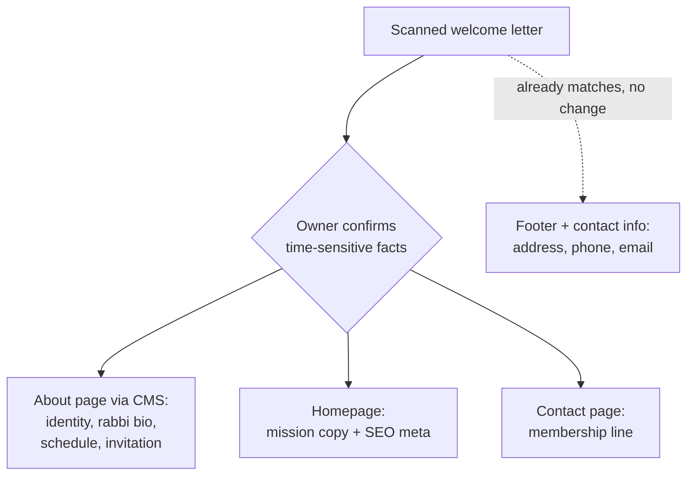

# Temple Description Content Integration - Plan

## Goal Capsule

- **Objective:** Publish the About page and enrich site-wide identity copy using the content of the congregation's scanned welcome letter (transcribed in Appendix A).
- **Product authority:** `_bmad-output/planning-artifacts/epics.md` Story 1.3 acceptance criteria (welcome message, values/mission, Rabbi and leadership info); `AGENTS.md` hard rules (SSR EJS MPA, strict CSP, no new frontend tooling).
- **Open blockers:** none for planning. Owner confirmation of the letter's time-sensitive facts gates publishing, not planning (see Outstanding Questions).

---

## Product Contract

### Summary

Turn the scanned welcome letter into live site content: rewrite and publish the draft About page through the existing pages CMS — congregation identity, Rabbi Tunick bio, worship schedule, and membership invitation — and thread the letter's identity facts into the homepage mission copy, SEO metadata, and the contact page. Every letter-derived fact that can go stale passes an owner-confirmation check before it goes public.

### Problem Frame

The site has almost no real content about who the congregation is. The About page exists only as an unpublished placeholder draft with generic mission boilerplate, so `/about` — the target of the homepage's "New Here? Learn More" call to action — returns 404. Story 1.3's acceptance criteria require a welcome message, core values and mission, and "information about the Rabbi and community leadership"; none of that exists anywhere in the codebase (no mention of Rabbi Tunick, the Shoals community, or the congregation's 100-year history). The homepage mission statement and SEO description are generic ("a warm, inclusive Jewish community") and name no denomination or regional identity, which weakens local search for the exact people the site serves.

The scanned welcome letter is the first authoritative, congregation-voiced source for this content. It is undated, so its time-sensitive facts may lag reality — that risk shapes the governance requirements below.

### Key Decisions

- **Distribute facts to their existing surfaces, not one About-page dump.** The About page carries the narrative; the homepage mission and SEO metadata carry the identity one-liner; the contact page carries the membership line. Facts land where visitors already look, and the letter's contact details (address, phone, email) already match what the footer and contact page display — those need no change.
- **Content enters through the existing CMS and existing copy locations — no new schema.** The pages CMS (sanitized HTML, version snapshots, admin/rabbi editing) is purpose-built for exactly this. A centralized "temple facts" store was considered and deferred (see Scope Boundaries).
- **The standing worship schedule lives as About-page prose, not as event rows.** The events system has no recurrence support — each service event is created individually — and the homepage countdown and header label already derive from whatever events exist. Prose carries "every Friday at 7:00pm / Saturday 9:30am Torah study" durably; automating recurring events is deferred.
- **The letter is source material, not ground truth.** It is undated (internal evidence puts it at 2013 or later); the president's name, service pattern, and rabbi arrangement require owner confirmation before publish. Facts that can't be confirmed ship in timeless phrasing or not at all.
- **No affiliation claims beyond what the letter says.** "A Reform Jewish congregation in practice" supports identity copy, but it does not confirm the footer's placeholder "Affiliated with the Union for Reform Judaism" — that stays an owner item, out of scope here.

### Actors

- A1. Visitor / prospective member — the letter's addressed audience; reads About, homepage, contact.
- A2. Admin or Rabbi editor — enters, publishes, and maintains the CMS content.
- A3. Site owner (congregation leadership) — confirms currency of time-sensitive facts before publish.

### Requirements

**About page (primary home for the letter)**

- R1. The About page opens with a welcome message and presents the congregation's identity in its own voice: Reform in practice, inclusive of Jewish families of all denominations and interfaith families, part of the Shoals community for well over 100 years, naming Florence, Muscle Shoals, Sheffield, and Tuscumbia.
- R2. The About page includes a Rabbi Nancy Tunick section: Nashville-based rabbi, cantorial soloist, and composer; with the congregation since 2000, its spiritual leader since 2008, ordained July 2013; congregations previously served. This satisfies the Story 1.3 criterion "information about the Rabbi and community leadership."
- R3. The About page states the standing worship pattern as prose — Friday evening services at 7:00pm, roughly alternating rabbi-led and lay-led; Saturday 9:30am Torah study joined by others from the Shoals area — and closes with the letter's invitation to attend.
- R4. The About page carries the membership contact: inquiries to the congregation president at info@florencetemple.org.
- R5. The About page is published (live at `/about`) once its content passes the R10 confirmation; until then it remains an unpublished draft.
- R6. The About page includes a photo of the temple building with descriptive alt text; if no owner-supplied original is available at publish time, publish without the photo rather than using the low-resolution scan crop.

**Homepage and site metadata**

- R7. The homepage mission copy reflects the letter's identity — inclusive of all denominations and interfaith families, rooted in the Shoals — within its current one-short-paragraph shape.
- R8. Homepage and About page titles/meta descriptions name the Reform identity and Florence / Shoals, AL locality so local search can find the congregation.

**Contact page**

- R9. The contact page adds the membership line: membership and general inquiries go to the congregation president via info@florencetemple.org, showing a personal name only if owner-confirmed current.

**Content governance**

- R10. Every time-sensitive letter fact — president's name, service times and cadence, the rabbi's current arrangement — is owner-confirmed before publish; unconfirmed facts are omitted or phrased timelessly.
- R11. Authored CMS HTML uses only the sanitizer's allowed tags (`p`, `h2`, `h3`, `strong`, `em`, `u`, `a`, `ul`, `ol`, `li`, `img` — note `br` is not allowed) so saving through the admin editor strips nothing.

### Key Flows

- F1. Content publish flow
  - **Trigger:** enriched About content drafted from the letter transcription.
  - **Steps:** A3 confirms the R10 facts; A2 enters the content in the admin page editor (sanitized and version-snapshotted on save); A2 publishes; A1 sees the page live.
  - **Outcome:** `/about` stops returning 404 and satisfies Story 1.3's acceptance criteria.
  - **Covers:** R1–R6, R10, R11.

### Acceptance Examples

- AE1. **Covers R5, R10.** Given the About draft is ready but the owner has not confirmed the president's name, when publish is considered, then the page either stays draft or ships with the membership line phrased without a personal name.
- AE2. **Covers R11.** Given the drafted About HTML uses only allowed tags, when it is saved through the admin editor, then the rendered page shows the full content with no stripped elements.
- AE3. **Covers R3.** Given no upcoming service events exist in the database, when a visitor reads the About page, then the standing schedule is still fully visible as prose.

### Scope Boundaries

**Deferred for later**

- A centralized "temple facts" store (one admin-editable source for address, schedule, contact, identity line feeding footer, pages, and SEO). It would eliminate copy drift across surfaces, but adds schema and plumbing this content drop doesn't need.
- Recurring-event automation for the weekly services. Event rows stay hand-entered and power the homepage countdown independently of this work.
- A dedicated history or timeline page — the letter gives one sentence of history; not enough source material yet.

**Outside this work's scope**

- Resolving the footer trust-cue placeholders (URJ affiliation, EIN) — already flagged as an owner item in the layout; the letter does not settle either.
- Visual redesign of the About page or homepage layout.
- Committing the scanned JPEG to the repository — it is a personal document; the transcription in Appendix A is the durable copy.

### Dependencies / Assumptions

- The transcription in Appendix A is the complete, accurate extraction of the scan.
- The letter is assumed possibly stale (undated; internal evidence 2013 or later) — the reason R10 exists.
- An admin or rabbi account exists to enter content (`npm run create-admin` bootstraps one).
- An original building photo must come from the owner; the scan's embedded photo is a poor-quality fallback deliberately rejected in R6.
- The seeded placeholder 'about' draft carries nothing worth preserving; overwriting it is safe, and CMS versioning snapshots it anyway.

### Outstanding Questions

**Deferred to Planning**

- Whether the About content lands via admin-editor entry, a seed update, or a new migration — planning decides within the migration bootstrap constraints (`migrations/000_*`–`006_*` must not change for existing databases).
- Whether the homepage mission/SEO copy edit stays an in-place controller-string change or is worth a small extraction — planning's call; the requirement is only that the copy changes.

**Resolve before publish (does not block planning)**

- Owner confirms: current president (letter: Traci Welch), the service pattern (weekly Friday 7:00pm; alternating rabbi-led/lay-led), the Saturday 9:30am Torah study, and Rabbi Tunick's current role.

### Sources / Research

- Source document: user-provided scan "Temple Bnai Israel Description.jpeg" (outside the repo); full transcription in Appendix A.
- Pages CMS schema and seeded draft: `migrations/001_create_static_pages.sql`; publish-gated 404: `src/routes/about.js`; editor and versioning: `src/views/admin/pages/edit.ejs`, `src/controllers/pageController.js`.
- Homepage mission and SEO strings: `src/controllers/homeController.js`.
- Footer placeholders and address block: `src/views/layout.ejs`; contact details: `src/views/contact.ejs`.
- Sanitizer allowlist: `src/utils/sanitizeHtml.js`.
- Events have no recurrence; header service label derives from `EventService.getNextService()` at request time: `src/services/EventService.js`, `src/server.js`.
- Story 1.3 acceptance criteria: `_bmad-output/planning-artifacts/epics.md`.

---

## Appendix

### Appendix A — Letter transcription

> **Temple B'nai Israel — Florence, AL**
> 201 E. Hawthorne, Florence Alabama 35630 / 256-764-9242 / www.florencetemple.org
>
> *(photo of the temple building exterior)*
>
> **Greetings from Temple B'nai Israel to our Visitors and Guests**
>
> Temple B'nai Israel, a Reform Jewish congregation in practice, but inclusive of Jewish families of all denominations as well as interfaith families, has been a part of the Shoals Community for well over 100 years. The Shoals Community encompasses the cities of Florence, Muscle Shoals, Sheffield and Tuscumbia, Alabama, including surrounding communities.
>
> Our Rabbi, Nancy Tunick, is a Nashville, Tennessee-based Rabbi, cantorial soloist and composer who has served congregations in Philadelphia, PA; Meridian, MS; Jacksonville, FL and currently serves as our Rabbi and cantorial soloist. Rabbi Tunick began serving Temple B'nai Israel as cantorial soloist and composer in 2000 and became our congregation's spiritual leader in 2008. She was ordained as a Rabbi in July 2013.
>
> We hold services every Friday evening at 7:00pm. Approximately every other week, Rabbi Tunick travels from Nashville to lead us in worship. On those Friday nights when Rabbi Tunick cannot be with us, services are led by various lay leaders within the congregation. In addition, every Saturday morning at 9:30am, a group of members, joined by others from the Shoals area, meets to study Torah.
>
> We welcome anyone who would like to get to know us better and we invite you to join us for our Friday evening services and our Saturday morning Torah study.
>
> For membership or other information please contact President Traci Welch at info@florencetemple.org

### Appendix B — Fact inventory

| Letter fact | Current site state | Destination |
|---|---|---|
| Reform in practice; inclusive of all denominations and interfaith families | Homepage says only "warm, inclusive"; no denomination named anywhere | R1 (About), R7 (homepage), R8 (SEO) |
| Part of the Shoals community for well over 100 years; Florence, Muscle Shoals, Sheffield, Tuscumbia | Absent | R1 (About), R8 (SEO) |
| Rabbi Nancy Tunick bio (Nashville-based; cantorial soloist/composer; served Philadelphia, Meridian, Jacksonville; here since 2000; leader 2008; ordained July 2013) | Absent — no rabbi content in the codebase | R2 (About) |
| Friday services 7:00pm; alternating rabbi-led / lay-led | Absent as copy; events DB has no standing schedule and no recurrence support | R3 (About prose) |
| Saturday 9:30am Torah study, open to the Shoals area | Absent | R3 (About prose) |
| Welcome / invitation to visitors and guests | Seeded draft has generic boilerplate, unpublished | R1, R3 (About) |
| Membership contact: President Traci Welch | Absent | R4 (About), R9 (contact) — gated by R10 |
| info@florencetemple.org | Live on contact page and footer | Matches — no change |
| 201 E. Hawthorne, Florence AL 35630 | Live in footer, contact page, and structured data | Matches — no change |
| 256-764-9242 | Live on contact page | Matches — no change |
| Building photo | No building imagery on the site | R6 (About) — needs owner-supplied original |
